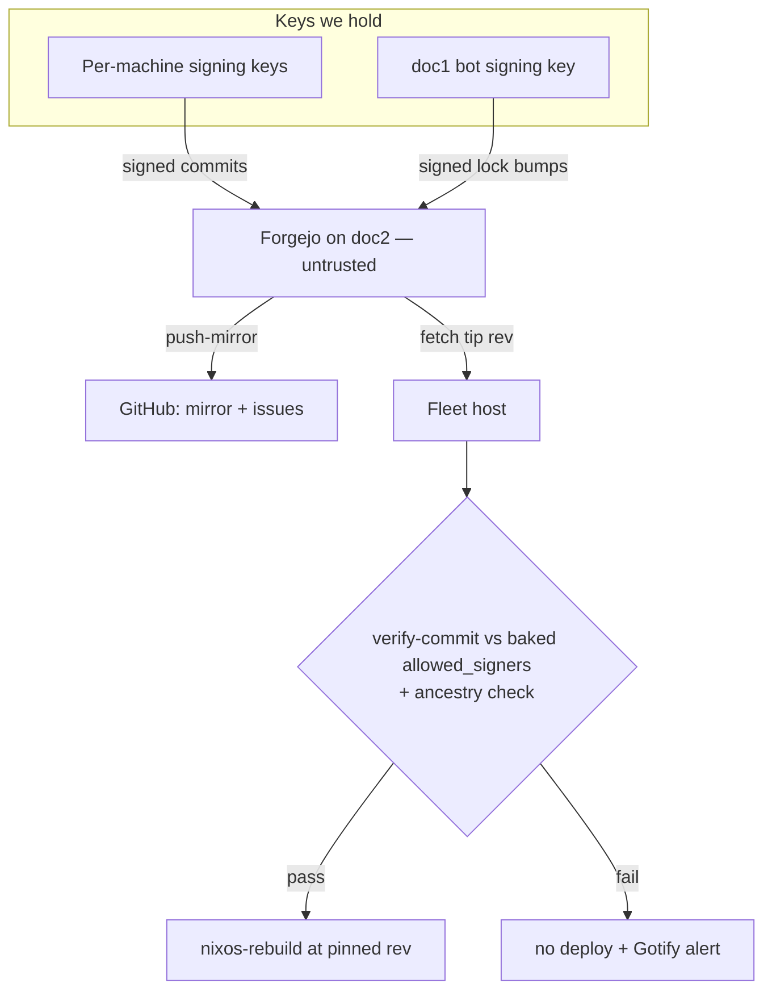

# Signed Fleet Deploys + Forgejo Cutover — Requirements

## Summary

Fleet hosts deploy only commits signed by keys we hold, verified on-host before every rebuild. The config repo's source of truth moves from GitHub to the self-hosted Forgejo on doc2, with GitHub demoted to a push-mirror that also keeps hosting issues. Together these close #235's "anyone who can push to master owns the fleet within 24h" pivot without re-anchoring fleet trust to doc2.

---

## Problem Frame

Every fleet host runs `system.autoUpgrade` nightly against tip-of-master of `github:abl030/nixosconfig`; doc1's rolling-flake-update bot pushes lock bumps to the same branch. Push access to master is therefore RCE on every host within 24 hours.

Today push access means: abl030's interactive `gh` OAuth token (`repo` scope on **all** owned repos plus `workflow`), readable by any abl030 process on several machines; the GitHub account itself; or GitHub the platform. Nothing is signed; master has no protection.

Server-side enforcement can't fix this. GitHub signs commits created via its web UI and GraphQL `createCommitOnBranch` with its own web-flow key, and those count as "Verified" — so a require-signed-commits rule still lets a stolen token push deployable commits. The only control that holds is each host verifying signatures against a key list we control before deploying.

Forgejo has been live on doc2 (`git.ablz.au`) since the #223 v0, but the flake cutover was deferred. Cutting over *without* host-side verification would be a regression: doc2 is the most container-dense host in the fleet, and making it the trusted code root would recreate the lateral-movement path #270 just closed. With verification, the forge is untrusted infrastructure and can safely live there.

---

## Key Decisions

- **Host-side signature verification is the security control; the forge is untrusted.** GitHub rulesets and branch protection are bypassable by design (web-flow-signed API commits) and are not part of this work.
- **Verification lands before the cutover.** It is forge-agnostic, so it deploys fleet-wide while still pointing at GitHub, proving itself before anything moves.
- **Per-machine signing-only keys.** Each pushing machine gets a dedicated ed25519 signing key; the doc1 bot gets its own, separate from the personal doc1 key, so bot commits are independently attributable and revocable.
- **`allowed_signers` is read from the currently running closure, never from the fetched tree** — otherwise an attacker ships their own key list alongside their commit.
- **Anti-rollback:** a verified rev must descend from the currently deployed rev, so a replayed old-but-signed commit can't downgrade the fleet.
- **Issues stay on GitHub.** `gh`-based agent workflows are load-bearing; the push-mirror keeps issue↔code references meaningful. Code sovereignty is the security fix; issue sovereignty is out of scope.
- **Accepted residuals,** documented rather than papered over: doc1-as-abl030 compromise remains fleet-write (autonomous agent pushes are a feature); flake *inputs* (nixpkgs et al.) remain an unverified nightly supply chain; a compromised dev machine signs with that machine's key.

---

## Requirements

**Signing**

- R1. Every machine that pushes to the config repo (epimetheus, framework, wsl, doc1) signs commits by default with a dedicated ed25519 signing-only key, generated locally and never authorized for SSH access anywhere.
- R2. The rolling-flake-update bot signs with its own key on doc1, and its committer identity maps to an `allowed_signers` entry.
- R3. The `allowed_signers` list (public halves) is committed in-repo; adding or rotating a key is a signed commit plus one deploy cycle to propagate.

**Verification**

- R4. Before any switch, a host verifies the target rev's signature against the `allowed_signers` file baked into its currently running closure.
- R5. The verified rev must be a descendant of the currently deployed rev.
- R6. The build is pinned to the exact verified rev — no re-resolution between verify and build.
- R7. The nightly auto-update and interactive deploys share one verify-then-switch path, and the deploy runbook (CLAUDE.md, service-deploy skill) moves to it.
- R8. Signature or ancestry failure fails closed (no deploy) and alerts via Gotify; an unreachable forge skips gracefully, matching today's reachability-gate semantics.

**Cutover**

- R9. `system.autoUpgrade.flake` on all hosts and the bot's push origin move to the Forgejo repo; dev-machine checkouts re-point their remotes.
- R10. GitHub becomes a Forgejo push-mirror authenticated by a fine-grained PAT scoped to Contents: RW on this repo only.
- R11. The bot pushes as a dedicated Forgejo machine account with write access to only this repo; its token lives in sops on doc1.
- R12. Rollout is phased: verification fleet-wide against GitHub first, then one canary host on Forgejo through at least one full nightly cycle, then the fleet and the bot; GitHub stays a hot fallback for at least 30 days.
- R13. Hosts fetch `nixosconfig` from Forgejo anonymously: `REQUIRE_SIGNIN_VIEW` flips off instance-wide and the repo becomes public on the instance; all other repos stay private via per-repo visibility. No per-host read credentials.

**Operations**

- R14. The GitHub-specific pre-update gates (`api.github.com` probe, PAT refresh) are adapted to the new origin.
- R15. A break-glass path is documented: deploying from a local checkout when the forge or verification tooling is broken.

---

## Acceptance Examples

- AE1. **Tampered tip.** **Covers R4, R8.** Given an unsigned or wrong-key commit at the forge tip, when a host's update window fires, then no deploy happens, the host stays on its current generation, and a Gotify alert names the verification failure.
- AE2. **Replay.** **Covers R5.** Given the forge serves an older, validly signed rev as tip, when a host verifies, then the ancestry check refuses the deploy.
- AE3. **Forge down.** **Covers R8.** Given `git.ablz.au` is unreachable at a host's update window, when the gate probe fails, then the host skips the night quietly — skip, not failure.
- AE4. **Normal night.** **Covers R2, R6, R9–R11.** The bot bumps the lock, signs, pushes to Forgejo; the mirror updates GitHub; every host verifies and deploys the same pinned rev.
- AE5. **Stolen GitHub credential.** **Covers R4.** Given an attacker holds any GitHub token or the account, when they create commits (git push, web UI, or GraphQL), then post-cutover no host fetches from GitHub, and pre-cutover their commits fail verification (web-flow key is not in `allowed_signers`).

---

## Success Criteria

- No GitHub credential, token, or account compromise can cause any fleet host to deploy attacker code.
- Tampering with Forgejo state on doc2 cannot cause deploys on other hosts — the forge is untrusted.
- One full post-cutover nightly cycle (bot bump → mirror → fleet-wide verified deploy) completes green.

---

## Scope Boundaries

- Issues, PRs, and the wiki workflow stay on GitHub.
- Flake input supply chain (nixpkgs, community flakes) is unaddressed — signing covers the config repo only.
- Private agent-repo inputs (`vinsight-mcp`, `cellar-manager`) keep the existing GitHub PAT netrc mechanism unchanged.
- No Forgejo Actions / CI runner (still deferred per #223 v0).
- No GitHub branch-protection or ruleset work.
- doc1 user-level compromise stays fleet-write by design; record it as accepted residual in the wiki rather than adding approval gates.

---

## Dependencies / Assumptions

- Forgejo v0 is live on doc2 (`modules/nixos/services/forgejo.nix`, `git.ablz.au`), SQLite, state on virtiofs, nightly dumps swept by Kopia.
- The repo is public on GitHub today, so anonymous read on Forgejo (R13) leaks nothing new; the `REQUIRE_SIGNIN_VIEW` flip is part of the cutover work.
- `system.autoUpgrade` currently tarball-fetches `github:`; verification requires git fetches, so the fetch transport changes shape during planning.
- Ancestry checks (R5) need commit history on-host — shallow-clone-only approaches won't satisfy R5.

---

## Outstanding Questions

**Deferred to planning**

- Canary host choice (igpu suggested — low blast radius, exercises both nightly update and tailscale-share paths).
- Dev-machine push transport to Forgejo: SSH on :2222 vs HTTPS token.
- Verify mechanics: clone cache location per host, full vs treeless clone for ancestry, where the verified-rev marker lives.
- Bot committer email so signatures map cleanly to the bot's `allowed_signers` entry (current: `acme@ablz.au`).

---

## Sources

- #235 (fleet-RCE pivot — this doc's origin), #232 (umbrella audit), #223 (forge selection + Forgejo v0), #270 (SSH bastion model the cutover must not regress).
- `modules/nixos/autoupdate/update.nix` (nightly smartUpgrade path, reachability gate, PAT refresh), `modules/nixos/ci/rolling-flake-update.nix` + `scripts/rolling_flake_update.sh` (bot pipeline), `modules/nixos/services/forgejo.nix` (live v0 config).
- `docs/brainstorms/2026-04-30-forgejo-v0-requirements.md` (deferred-cutover rationale this doc resurrects).
- GitHub signs web-UI and GraphQL `createCommitOnBranch` commits with its web-flow key — the bypass that makes server-side signed-commit enforcement insufficient as a security boundary.
