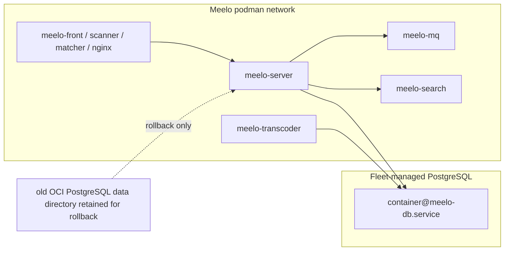

# fix: Isolate Meelo PostgreSQL from upstream OCI image

## Summary

Move Meelo's PostgreSQL runtime from the bundled OCI database container into the fleet-managed `mk-pg-container` pattern, while keeping non-database Meelo containers on their current upstream cadence. The cutover should preserve the old OCI database directory until verification succeeds, then retire the duplicate database secret and stale runtime path.

---

## Problem Frame

The origin requirements narrowed issue #230 to PostgreSQL only: Meelo can keep following upstream app/support images, but database major-version ownership must become explicit and controlled by the fleet (see origin: `docs/brainstorms/2026-05-13-meelo-database-isolation-requirements.md`).

---

## Requirements

- R1. Meelo runs against fleet-managed PostgreSQL instead of Meelo's upstream OCI database image.
- R2. Routine upstream Meelo image updates cannot change the PostgreSQL major version serving Meelo's persistent state.
- R3. The bundled PostgreSQL OCI container is removed from active runtime after migration succeeds.
- R4. Existing Meelo library state, metadata, and database-backed configuration survive migration.
- R5. The migration has a rollback or recovery path until the new database-backed runtime is verified.
- R6. The public Meelo service returns to normal operation after the database move.
- R7. Non-database Meelo containers keep their current upstream image cadence unless a separate concrete failure appears.
- R8. The work does not introduce routine digest-refresh or manual image-upgrade work for non-database Meelo containers.
- R9. New database credentials and access paths follow the current least-privilege PostgreSQL pattern.

**Origin acceptance examples:** AE1 (PostgreSQL major stays unchanged across upstream app updates), AE2 (no active database OCI container after verified migration), AE3 (recoverable failed migration), AE4 (no non-database digest-refresh workflow).

---

## Scope Boundaries

- Do not pin all Meelo OCI images by digest as part of this plan.
- Do not move RabbitMQ, Meilisearch, frontend, scanner, matcher, transcoder, or nginx to nixpkgs services.
- Do not create a reusable fleet-wide OCI image pinning policy.
- Do not replace upstream Meelo containers with native Nix packages.
- Do not take ownership of routine non-database image upgrades.
- Do not treat RabbitMQ or Meilisearch persistence risk as part of this issue unless a separate concrete failure is found.
- Do not perform an unrelated PostgreSQL major upgrade after extraction; any future major bump is its own intentional database maintenance task.

### Deferred to Follow-Up Work

- Remove the old OCI PostgreSQL data directory only after the rollback window has been explicitly closed in the implementation handoff.

---

## Context & Research

### Relevant Code and Patterns

- `modules/nixos/services/meelo.nix` currently declares `podman-meelo-db.service`, `virtualisation.oci-containers.containers.meelo-db`, and database dependencies from `meelo-server` and `meelo-transcoder`.
- `hosts/proxmox-vm/configuration.nix` enables Meelo with `dataDir = "/mnt/virtio/meelo"`, `mediaDir = "/mnt/virtio/Music"`, and `port = 5001`.
- `modules/nixos/lib/mk-pg-container.nix` provides the required nspawn PostgreSQL pattern, with `scram-sha-256` TCP auth, a required `passwordFile`, and host-number-derived `192.168.100.x` addressing.
- `.claude/rules/nixos-service-modules.md` documents current PostgreSQL rules: no TCP `trust`, use a narrow 0444 pgpass secret, and add `restartTriggers` against the host-side `container@<svc>-db.service` unit when systemd dependencies can cascade-stop consumers.
- `modules/nixos/services/jellyfin.nix` is the closest OCI consumer pattern: an OCI container loads its normal env file plus a later pgpass env file, points at the nspawn DB host, and uses `systemd.services.podman-<name>` dependencies on the DB container.
- `modules/nixos/services/atuin.nix` and `modules/nixos/services/discogs.nix` show how to avoid putting database passwords in Nix-evaluated strings by constructing DSNs at runtime or loading them from `EnvironmentFile`.
- `secrets/meelo.env` currently contains database, RabbitMQ, Meilisearch, API, JWT, and scrobbler settings. Database credentials should move into a narrower Meelo pgpass secret, but the old values may need to remain temporarily during rollback.

### Institutional Learnings

- The #232 PostgreSQL auth audit found that `trust` over the nspawn TCP path lets any OCI container pivot to PostgreSQL superuser via host-side source rewriting. `mk-pg-container` now enforces the safer pattern.
- The `restartTriggers` gotcha in `mk-pg-container.nix` is directly relevant: long-running Meelo OCI services that `Requires=` the DB container need to trigger from the host-side container unit derivation, not the inner container toplevel.
- The repo has no separate unit test suite for NixOS service modules; validation is via Nix evaluation/build, deployment, service health, and runtime logs.

### External References

- PostgreSQL major-version migration guidance: https://www.postgresql.org/docs/17/upgrading.html
- Upstream Meelo compose file uses `DATABASE_URL` for the server and `PGUSER` / `PGPASSWORD` / `PGDATABASE` / `PGHOST` / `PGPORT` for the transcoder: https://github.com/Arthi-chaud/Meelo/blob/c29556536ff7a7b4ba5ddb831ab8ddc6aec1d9f9/docker-compose.prod.yml
- Upstream Meelo `.env.example` documents the database, queue, Meilisearch, API, and internal path variables: https://github.com/Arthi-chaud/Meelo/blob/c29556536ff7a7b4ba5ddb831ab8ddc6aec1d9f9/.env.example

---

## Key Technical Decisions

- Use `mk-pg-container` for Meelo PostgreSQL: this is the established fleet pattern and satisfies R1, R2, and R9 without introducing a new DB management surface.
- Use hostNum 8 unless implementation discovers a new allocation before editing: existing active allocations are 1-7; old Forgejo planning mentions 8 historically, but Forgejo did not consume it.
- Do not reuse the old OCI cluster directory as the new nspawn parent during cutover: keep the old directory intact for rollback, initialize the nspawn database under a separate Meelo-owned PostgreSQL parent, and clean up later.
- Match or safely advance from the source PostgreSQL major during extraction: implementation must verify the current source major first and must not restore a newer-source logical dump into an older target major.
- Split database credentials into a narrow Meelo pgpass secret: load that secret only into the nspawn DB and the Meelo consumers that actually connect to PostgreSQL, with the pgpass file taking precedence over any temporary stale database keys in the broader Meelo env.
- Keep non-database images unchanged: RabbitMQ, Meilisearch, Meelo app images, transcoder, and nginx stay outside the active change unless required to keep existing behavior working.

---

## Open Questions

### Resolved During Planning

- **Should all Meelo images be pinned?** No. The origin requirements explicitly narrowed scope to PostgreSQL and rejected routine image nursing for non-database containers.
- **Should RabbitMQ or Meilisearch move to nixpkgs services?** No. They are out of scope for this issue unless a separate concrete failure appears.
- **Should the old OCI database directory be overwritten in place?** No. Preserve it during migration so rollback does not depend on recreating the old data directory from backup.
- **How should Meelo connect after PostgreSQL moves off the podman network?** Use the nspawn DB host address from `mk-pg-container`; existing fleet rules document the container-to-nspawn source rewrite and auth model.

### Deferred to Implementation

- **Exact source PostgreSQL major and target `pgPackage`:** verify from the running database or data directory before selecting the target package.
- **Exact dump/restore method:** choose after confirming source major and cluster health; logical dump/restore is the expected shape, but the implementation should validate compatibility before destructive changes.
- **Rollback window length:** keep the old directory and duplicate database secret until the implementer verifies Meelo and records the chosen cleanup point.

---

## High-Level Technical Design

> *This illustrates the intended approach and is directional guidance for review, not implementation specification. The implementing agent should treat it as context, not code to reproduce.*

---

## Implementation Units

### U1. Preflight Database Discovery and Rollback Runbook

**Goal:** Establish the exact source database shape and write the migration/rollback runbook before changing runtime wiring.

**Requirements:** R4, R5, R6, R9; AE3

**Dependencies:** None

**Files:**
- Create: `docs/wiki/services/meelo.md`
- Read: `modules/nixos/services/meelo.nix`
- Read: `secrets/meelo.env`

**Approach:**
- Document the current runtime topology: bundled OCI PostgreSQL, data directory location, server/transcoder database consumers, and existing public health endpoint.
- Record the preflight checks the implementation must perform: source PostgreSQL major, database name, database user, dump viability, current Meelo health, and the old directory/backup retention point.
- Define rollback at the outcome level: return the code and secrets to the OCI database runtime while the old data directory is still intact.
- Keep command-level choreography out of the plan body; the runbook can include exact operator commands once implementation has verified the live source state.

**Patterns to follow:**
- `docs/wiki/services/jellyfin.md` for service-specific operational context.
- `.claude/rules/nixos-service-modules.md` for least-privilege database notes.

**Test scenarios:**
- Test expectation: none -- this unit creates operational documentation and records preflight facts rather than changing service behavior.

**Verification:**
- The wiki page identifies source major/version verification, backup/rollback expectations, and the conditions that must be true before removing the old OCI DB runtime.

---

### U2. Add Fleet-Managed PostgreSQL Wiring

**Goal:** Add an nspawn PostgreSQL instance for Meelo and wire the Meelo PostgreSQL consumers to depend on it.

**Requirements:** R1, R2, R5, R6, R9; AE1, AE2

**Dependencies:** U1

**Files:**
- Modify: `modules/nixos/services/meelo.nix`
- Read: `modules/nixos/lib/mk-pg-container.nix`
- Read: `.claude/rules/nixos-service-modules.md`

**Approach:**
- Import `mk-pg-container` in the Meelo module with a unique host number and a Meelo-specific pgpass secret.
- Use a new nspawn PostgreSQL data parent during cutover so the existing OCI PostgreSQL data directory remains available for rollback.
- Add the nspawn `containers.meelo-db` entry and corresponding tmpfiles for the new PostgreSQL parent.
- Remove the bundled database from the active OCI container set and from the podman image tracking list.
- Replace OCI `dependsOn` database coupling for Meelo server/transcoder with systemd ordering against `container@meelo-db.service`.
- Add `restartTriggers` for the long-running Meelo consumers that require the DB container, using the host-side container unit derivation.

**Patterns to follow:**
- `modules/nixos/services/jellyfin.nix` for OCI-to-nspawn DB wiring.
- `modules/nixos/services/discogs.nix` for `restartTriggers` against `config.systemd.units."container@<svc>-db.service".unit`.
- `modules/nixos/lib/mk-pg-container.nix` header comments for auth and cascade-stop behavior.

**Test scenarios:**
- Integration: Nix evaluation shows `container@meelo-db.service` exists and the old `podman-meelo-db.service` is no longer part of active Meelo startup.
- Integration: Covers AE1. A Meelo app image update changes app containers without changing the selected PostgreSQL package or nspawn DB major.
- Error path: If the DB container unit is restarted during a rebuild, dependent Meelo DB consumers are brought back rather than left cascade-stopped.

**Verification:**
- The proxmox-vm NixOS configuration builds successfully.
- The generated systemd graph includes DB ordering for Meelo server/transcoder and no active OCI database service.

---

### U3. Split and Wire Database Secrets

**Goal:** Move Meelo PostgreSQL credentials into a narrow pgpass secret and keep database passwords out of Nix-evaluated strings.

**Requirements:** R5, R6, R8, R9; AE3, AE4

**Dependencies:** U2

**Files:**
- Create: `secrets/hosts/proxmox-vm/meelo-pgpass.env`
- Modify: `secrets/meelo.env`
- Modify: `modules/nixos/services/meelo.nix`

**Approach:**
- Use the `sops-decrypt` workflow during implementation to create the host-specific Meelo pgpass file.
- Include the aliases Meelo actually consumes: canonical PostgreSQL password fields, libpq-style fields for the transcoder, and the server database URL if Meelo still requires a single URL.
- Load the pgpass secret after the broad Meelo env file for the server so database values override any temporary stale values.
- Load only the database secret into the transcoder if implementation confirms it needs no broader Meelo secret.
- Keep or remove duplicate database keys in `secrets/meelo.env` according to rollback state: temporary duplication is acceptable during the rollback window, but final cleanup should remove database credentials from the broad env once the old OCI path is retired.
- Do not split RabbitMQ, Meilisearch, API, JWT, or scrobbler secrets as part of this plan.

**Patterns to follow:**
- `modules/nixos/services/jellyfin.nix` for pgpass loaded after the main env file.
- `modules/nixos/services/atuin.nix` and `modules/nixos/services/discogs.nix` for avoiding secret interpolation into Nix store paths.
- `modules/nixos/common/secrets.nix` for host-specific secret resolution.

**Test scenarios:**
- Integration: Covers AE4. Non-database containers continue using their existing image tags and do not require digest refreshes or new upgrade steps.
- Integration: Server/transcoder receive database credentials from the narrow pgpass secret, not from Nix-evaluated strings.
- Error path: If the broad Meelo env still contains temporary database keys during rollback, the later pgpass env wins for the new runtime.

**Verification:**
- No PostgreSQL password or full database URL appears in Nix-generated plaintext.
- The new pgpass secret is host-scoped to `proxmox-vm` and readable by the nspawn pattern as mode 0444.

---

### U4. Execute Database Migration and Runtime Cutover

**Goal:** Move the existing Meelo database state into the fleet-managed PostgreSQL instance and bring Meelo back on the new runtime.

**Requirements:** R1, R3, R4, R5, R6; AE2, AE3

**Dependencies:** U1, U2, U3

**Files:**
- Modify: `docs/wiki/services/meelo.md`
- Operational target: `hosts/proxmox-vm/configuration.nix`

**Approach:**
- Follow the repo deployment safety rules: verify the active hostname before any local switch, and use the repo's remote-deploy pattern if implementation is run from a different host.
- Take a logical database dump from the old OCI PostgreSQL source after confirming source major and database health.
- Stop or quiesce Meelo writers during the cutover so the dump represents the final pre-migration state.
- Bring up the nspawn PostgreSQL target, restore the dump, and only then start the Meelo consumers against the new DB.
- Preserve the old OCI data directory and any dump artifacts until verification succeeds and the rollback window is closed.
- Record the actual migration facts in the wiki page: source major, target major, verification outcome, backup location, and cleanup date.

**Patterns to follow:**
- PostgreSQL official upgrade guidance for logical dump/restore across major versions.
- Existing `mk-pg-container` consumers for operational expectations around DB startup and consumer restart behavior.

**Test scenarios:**
- Happy path: Covers AE2. After cutover, Meelo starts against the fleet-managed DB and no active OCI DB container is required.
- Happy path: Covers R4. Existing Meelo library metadata and configuration remain visible in the UI/API after migration.
- Error path: Covers AE3. If restore or startup verification fails, the old OCI data directory is still available for rollback.
- Integration: Server, scanner, matcher, front, nginx, and transcoder return to their previous service topology except for PostgreSQL location.

**Verification:**
- Meelo public health and UI checks pass through `https://meelo.ablz.au/`.
- Meelo server logs show successful database connectivity to the nspawn target.
- The old OCI database container is not active after successful verification.

---

### U5. Post-Migration Cleanup and Issue Handoff

**Goal:** Close the rollback window deliberately and leave future maintenance expectations unambiguous.

**Requirements:** R3, R5, R7, R8, R9; AE1, AE4

**Dependencies:** U4

**Files:**
- Modify: `docs/wiki/services/meelo.md`
- Modify: `secrets/meelo.env`
- Update: GitHub issue #230

**Approach:**
- Once the migrated runtime has been verified, remove duplicate database credentials from the broad Meelo env if they were kept only for rollback.
- Keep the non-database Meelo images unchanged and document that this was intentional, not an omission.
- Record the old OCI database directory cleanup decision in the wiki page before deleting or archiving it.
- Update issue #230 with the final status, migration facts, and any intentionally retained rollback artifact.

**Patterns to follow:**
- The origin requirements' explicit non-goals for non-database images.
- `.claude/rules/nixos-service-modules.md` least-privilege checklist.

**Test scenarios:**
- Integration: Covers AE4. Routine updates still use the existing non-database Meelo image cadence with no new digest-refresh process.
- Security/least privilege: Containers that do not need PostgreSQL no longer receive database credentials after rollback cleanup.
- Error path: If cleanup is deferred because rollback remains open, the issue or wiki explicitly names the retained artifact and reason.

**Verification:**
- Issue #230 reflects the implemented database-only scope.
- The wiki has enough operational detail for a future agent to identify the active DB, rollback artifact, and cleanup state.
- The broad Meelo env no longer carries database credentials once rollback is closed.

---

## System-Wide Impact

- **Service topology:** Meelo remains an OCI-based app stack, but PostgreSQL moves to an nspawn container managed by NixOS.
- **Secrets boundary:** The plan narrows database credential exposure without splitting unrelated Meelo secrets.
- **State lifecycle risks:** The highest-risk moment is cutover between the old OCI cluster and the restored nspawn target. Keeping the old data directory intact is the rollback control.
- **Update behavior:** Non-database image update behavior remains unchanged by design; PostgreSQL major changes become explicit Nix/package maintenance.
- **Host impact:** The active host is `proxmox-vm`; state lives on `/mnt/virtio/meelo` through the host config.
- **Unchanged invariants:** Public Meelo URL, media directory, RabbitMQ, Meilisearch, scanner, matcher, frontend, transcoder image cadence, and nginx routing remain logically unchanged.

---

## Risks & Dependencies

| Risk | Mitigation |
|------|------------|
| Source PostgreSQL major is newer than the default `mk-pg-container` package | Verify source major first; select a target package that does not require downgrade. |
| Dump is inconsistent because Meelo writes during export | Quiesce Meelo writers during the migration window and verify restore before cleanup. |
| Old and new PostgreSQL layouts collide on disk | Use a separate nspawn PostgreSQL parent during cutover and retain the old OCI directory as rollback state. |
| Systemd cascade-stop leaves Meelo consumers down after DB container changes | Add `restartTriggers` against the host-side `container@meelo-db.service` unit. |
| Database password leaks into `/nix/store` | Keep passwords in sops env files and construct any required URL at runtime or inside the secret file. |
| Rollback cleanup is forgotten | Record the retained old directory and cleanup status in `docs/wiki/services/meelo.md` and issue #230. |

---

## Documentation / Operational Notes

- Update `docs/wiki/services/meelo.md` during implementation; do not leave the migration state only in shell history.
- Use the `sops-decrypt` skill when editing encrypted secrets.
- Before any local `nixos-rebuild switch`, run `hostname` and use the actual host in the flake URI.
- If implementation is not running on `proxmox-vm`, follow the repo remote deployment rule: push first, then rebuild on the remote host from GitHub with `--refresh`.
- Avoid adding a one-off Uptime Kuma maintenance window; the existing monitor retry policy should absorb a short planned restart, and a longer outage should remain visible.

---

## Sources & References

- **Origin document:** [docs/brainstorms/2026-05-13-meelo-database-isolation-requirements.md](../brainstorms/2026-05-13-meelo-database-isolation-requirements.md)
- Related issue: #230
- Related precedent: #228
- Related security audit: #232
- Service module: `modules/nixos/services/meelo.nix`
- Database helper: `modules/nixos/lib/mk-pg-container.nix`
- Service rules: `.claude/rules/nixos-service-modules.md`
- PostgreSQL upgrade docs: https://www.postgresql.org/docs/17/upgrading.html
- Upstream Meelo compose: https://github.com/Arthi-chaud/Meelo/blob/c29556536ff7a7b4ba5ddb831ab8ddc6aec1d9f9/docker-compose.prod.yml
