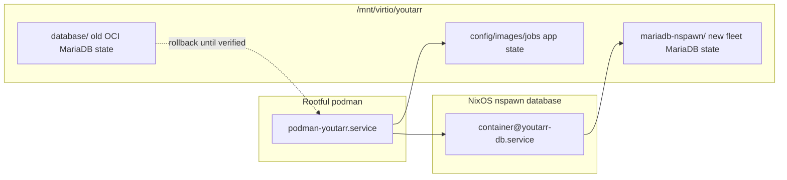

# fix: Own Youtarr MariaDB lifecycle

## Summary

Build a reusable isolated MariaDB helper, migrate Youtarr onto it with a logical dump/restore, and pin Youtarr's app image so routine rebuilds no longer inherit mutable database or app runtime changes from upstream defaults.

---

## Problem Frame

The origin requirements for issue #231 define the problem: Youtarr currently depends on an upstream bundled `mariadb:10.3` container for persistent database state, even though MariaDB 10.3 reached EOL on May 25, 2023 (see origin: `docs/brainstorms/2026-05-14-youtarr-mariadb-lifecycle-requirements.md`).

---

## Requirements

- R1. Youtarr runs against fleet-controlled MariaDB instead of upstream's bundled `mariadb:10.3` container.
- R2. The new database owner uses an isolated per-service pattern, not a shared host-level MariaDB instance.
- R3. The database pattern is reusable for future MariaDB/MySQL-backed services without hardcoding Youtarr assumptions.
- R4. The bundled Youtarr MariaDB OCI container is removed from active runtime after successful migration.
- R5. Existing Youtarr database state survives the migration.
- R6. The migration keeps a rollback or recovery path until the external-database runtime is verified.
- R7. The public Youtarr service returns to normal operation after the database move.
- R8. Post-migration cleanup avoids two live database owners for the same Youtarr state.
- R9. New database credentials are not hardcoded plaintext defaults in the service module.
- R10. The new database access path follows the repo's least-privilege and blast-radius rules.
- R11. Routine Youtarr app updates cannot change the MariaDB runtime that owns persistent state.
- R12. Mutable image behavior for Youtarr is narrowed without creating a fleet-wide OCI image policy.
- R13. Youtarr itself remains an OCI application container for this work.
- R14. The work does not introduce broad manual digest maintenance for unrelated dependencies.

**Origin actors:** A1 (operator or implementation agent), A2 (Youtarr application container), A3 (isolated MariaDB service)

**Origin flows:** F1 (database ownership migration), F2 (post-migration cleanup)

**Origin acceptance examples:** AE1 (database runtime stays fleet-controlled across app updates), AE2 (failed migration is recoverable), AE3 (compromise blast radius is bounded), AE4 (future MariaDB services have a starting pattern), AE5 (Youtarr-specific image hardening does not become fleet-wide image governance)

---

## Scope Boundaries

- Do not use a newer MariaDB OCI container as the final database ownership model.
- Do not use one shared host-level MariaDB instance for multiple services.
- Do not replace the Youtarr application container with a nixpkgs package or custom native service.
- Do not create a general policy for every `:latest` image in the fleet.
- Do not require broad manual digest maintenance for all Youtarr-adjacent images.
- Do not make an upstream Youtarr PR required for local completion.
- Do not use this migration as an excuse to redesign Youtarr auth, media paths, local proxy wiring, monitoring, or NFS watchdog behavior.

### Deferred to Follow-Up Work

- Consider an upstream Youtarr PR or issue after the local migration lands, documenting that upstream's default compose still pins an EOL MariaDB release.
- Consider MariaDB 11.4 or a later LTS as a future database maintenance task. The first migration should use MariaDB 10.11 to minimize the jump from 10.3 while still landing on a maintained LTS.

---

## Context & Research

### Relevant Code and Patterns

- `modules/nixos/services/youtarr.nix` currently defines `podman-youtarr.service`, `podman-youtarr-db.service`, hardcoded database credentials, `mariadb:10.3`, `dialmaster/youtarr:latest`, and `pull = "newer"` for both containers.
- `hosts/doc2/configuration.nix` enables Youtarr with `dataDir = "/mnt/virtio/youtarr"`, so the migration target and old database directory live under doc2's virtiofs-backed service state.
- `modules/nixos/lib/mk-pg-container.nix` is the pattern to mirror: one isolated nspawn database per service, deterministic host/container addresses from `hostNum`, required sops-managed password file, local socket superuser access for ops, and TCP auth only for the service user.
- `modules/nixos/services/meelo.nix` is the closest recent database-extraction example: it preserves the old data directory during migration, uses a narrow pgpass secret, layers that secret after broader environment files, and adds `restartTriggers` against the host-side nspawn unit.
- `modules/nixos/services/jellyfin.nix` shows OCI consumer-to-nspawn database wiring with a generated DB host address and environment-file layering.
- `.claude/rules/nixos-service-modules.md` documents least-privilege rules, restart-trigger rules, DNS-first networking, monitoring, and the expectation that service module changes get a privilege and blast-radius audit.
- `modules/nixos/homelab/podman.nix` implements the fleet's OCI pull/restart timer, so digest pinning and mutable image choices must be reflected both in the container definition and in the image registry list.

### Institutional Learnings

- Issue #232 retired PostgreSQL TCP `trust` after verifying that OCI containers could pivot through host-side source rewriting. MariaDB must not repeat that shape with broad `%` grants, root TCP access, or shared host-level credentials.
- The `restartTriggers` gotcha from `mk-pg-container.nix` applies here too: if Youtarr requires the nspawn DB unit, the app unit must restart when the host-side container unit changes so rebuilds do not leave it cascade-stopped.
- This repo has no separate NixOS service unit test suite. Validation comes from Nix formatting, Nix evaluation/build, deployment, service health, logs, and runtime data checks.

### External References

- MariaDB Foundation maintenance policy: MariaDB 10.3 EOL was May 25, 2023; MariaDB 10.11 is maintained until February 16, 2028.
- MariaDB 10.11 release notes: current locked nixpkgs package is 10.11.15, and 10.11 is a long-term maintenance release.
- MariaDB upgrade guidance: MariaDB documents 10.3.x to 10.11.x as a supported major-version upgrade path and recommends taking a backup and running `mariadb-upgrade` after major upgrades.
- Upstream Youtarr `docker-compose.external-db.yml` supports `DB_HOST`, `DB_PORT`, `DB_USER`, `DB_PASSWORD`, and `DB_NAME`, and adds host-reachability support for external database mode.
- Local nixpkgs confirms `pkgs.mariadb_1011.version = 10.11.15` and `pkgs.mariadb_114.version = 11.4.9` in the current flake.

---

## Key Technical Decisions

- Use MariaDB 10.11 for the first fleet-owned Youtarr database: it is maintained in the current flake, officially LTS until February 2028, and is a smaller compatibility jump from 10.3 than 11.4.
- Add `mk-mariadb-container.nix` instead of using `services.mysql` directly on doc2: the requirements explicitly prefer per-service isolation and future reuse over a shared host-level database.
- Mirror the `mk-pg-container` address and dependency model: deterministic `hostNum` addressing, private nspawn network, host-side veth access for OCI consumers, and restart triggers for dependent app units.
- Use logical dump/restore, not in-place physical data-dir reuse: this preserves the existing `${dataDir}/database` directory for rollback and avoids making the cutover destructive before verification.
- Grant MariaDB access only to the Youtarr database user from the host-side veth source, not to root and not from `%`: this carries the #232 least-privilege lesson into the MariaDB helper.
- Keep a local socket ops path inside the nspawn container: operators should be able to enter the database container with `machinectl` for recovery without exposing superuser TCP access.
- Pin the Youtarr app image by digest as the narrow image-hardening step: the database runtime is moving to nixpkgs, and the remaining mutable `dialmaster/youtarr:latest` image should stop changing outside an intentional update.

---

## Open Questions

### Resolved During Planning

- **Which MariaDB version should be the first target?** MariaDB 10.11, because the current flake has 10.11.15 and MariaDB documents 10.11 as maintained until February 16, 2028.
- **Should the helper be reusable or Youtarr-only?** Reusable, but only at the same narrow level as `mk-pg-container`: one service database, one service user, one password file, optional settings/hooks where needed.
- **Should the migration reuse the old database directory?** No. Keep the old OCI directory intact until verification closes the rollback window.
- **Should Youtarr app image pinning be part of this plan?** Yes. The origin issue and requirements identify mutable image behavior as part of this service's current risk, but only Youtarr-specific hardening is in scope.

### Deferred to Implementation

- **Exact source data state:** verify the running MariaDB 10.3 patch version, database name, table count, and dump health before changing runtime wiring.
- **Exact Youtarr image digest:** inspect the current upstream image at implementation time and pin the digest that is actually deployed or intentionally selected.
- **Exact migration commands:** write them in `docs/wiki/services/youtarr.md` after confirming the live source state and target service names.
- **Rollback window length:** keep the old database directory until Youtarr has passed migration verification and at least one normal service restart/rebuild cycle.

---

## High-Level Technical Design

> *This illustrates the intended approach and is directional guidance for review, not implementation specification. The implementing agent should treat it as context, not code to reproduce.*

---

## Implementation Units

### U1. Add Isolated MariaDB Helper

**Goal:** Create a reusable nspawn MariaDB helper that mirrors the PostgreSQL isolation pattern while using MariaDB's auth and lifecycle model.

**Requirements:** R1, R2, R3, R9, R10, R11; AE3, AE4

**Dependencies:** None

**Files:**
- Create: `modules/nixos/lib/mk-mariadb-container.nix`
- Modify: `.claude/rules/nixos-service-modules.md`
- Test: no dedicated test file; validate through Nix evaluation/build of a consuming service

**Approach:**
- Shape the helper like `mk-pg-container`: inputs for `pkgs`, `name`, `hostNum`, `dataDir`, `passwordFile`, optional package/settings/hooks, and returned `containerConfig`, `dbHost`, `dbPort`, `hostAddress`, and `localAddress`.
- Default to `pkgs.mariadb_1011`, with an override so future services can intentionally choose a newer maintained series.
- Run `services.mysql` inside the nspawn container instead of inventing a custom MariaDB systemd service.
- Bind MariaDB state under a helper-owned subdirectory, not under the old Youtarr OCI `database/` directory.
- Bindmount the sops-managed dotenv file read-only into the container and fail setup if the expected password key is missing.
- Create a service database and service user with database-local privileges only, scoped to the host-side veth address used by OCI consumers.
- Preserve local socket administrative access inside the nspawn container, but avoid root or service-user TCP access from broad hosts.
- Carry over the nspawn network hygiene from the PostgreSQL helper: allow MariaDB's TCP port only inside the private container network, disable host resolv.conf inheritance, and enable resolved inside the container.
- Document hostNum allocation and the MariaDB-specific auth model next to the PostgreSQL rule so future agents do not reintroduce broad grants.

**Patterns to follow:**
- `modules/nixos/lib/mk-pg-container.nix` for helper shape, hostNum addressing, required password file, DNS handling, and restart-trigger warning.
- NixOS `services.mysql` module for MariaDB service startup and state directory behavior.
- `.claude/rules/nixos-service-modules.md` for least-privilege and service-module documentation style.

**Test scenarios:**
- Happy path: instantiating the helper for a service produces an autostarting private-network nspawn container with MariaDB 10.11, deterministic host/container addresses, and port 3306 open only inside the isolated container network.
- Security: Covers AE3. The generated database setup grants only the named service database to the named service user from the host-side veth address; there is no `%` service grant and no TCP superuser path.
- Error path: if the password file is missing or lacks the expected password variable, database setup fails loudly instead of creating a blank/default password.
- Integration: a consuming module can reference `dbHost` and `dbPort` without hardcoding fleet LAN IPs.

**Verification:**
- A doc2 system build that uses the helper evaluates successfully.
- The helper documentation names the MariaDB threat model and points future agents away from shared host DBs, broad TCP grants, and hardcoded passwords.

---

### U2. Wire Youtarr to Fleet-Owned MariaDB

**Goal:** Replace the active bundled Youtarr database container with the new isolated MariaDB service and point the app container at external database mode.

**Requirements:** R1, R2, R4, R7, R8, R10, R11, R13; AE1, AE3

**Dependencies:** U1, U3

**Files:**
- Modify: `modules/nixos/services/youtarr.nix`
- Read: `hosts/doc2/configuration.nix`
- Test: no dedicated test file; validate through doc2 Nix evaluation/build

**Approach:**
- Instantiate `mk-mariadb-container` for `youtarr` with the next free hostNum after current PostgreSQL allocations; current research indicates hostNum 9, but implementation must re-check before editing.
- Store new MariaDB state under a new helper-owned parent such as `${cfg.dataDir}/mariadb-nspawn`, leaving `${cfg.dataDir}/database` intact for rollback.
- Remove the active `youtarr-db` OCI container definition and its `homelab.podman.containers` entry after migration wiring is ready.
- Point the Youtarr app container at the helper's `dbHost`/`dbPort` and the `youtarr` database/user via environment-file values.
- Replace OCI `dependsOn = ["youtarr-db"]` with systemd ordering against `container@youtarr-db.service`.
- Add `restartTriggers` for `podman-youtarr.service` using the host-side nspawn unit derivation and the database secret path.
- Remove the old `tc.log` repair hook from active runtime once the old MariaDB container is no longer started; keep any rollback notes in the wiki instead of active code.
- Remove the custom podman network if it no longer serves more than the single app container, unless implementation finds Youtarr still needs it for an existing behavior.

**Patterns to follow:**
- `modules/nixos/services/meelo.nix` for a recent DB extraction that keeps old DB state out of the new nspawn path.
- `modules/nixos/services/jellyfin.nix` for OCI container database environment and nspawn dependency wiring.
- `modules/nixos/lib/mk-pg-container.nix` restart-trigger guidance.

**Test scenarios:**
- Integration: Covers AE1. After evaluation, the generated configuration contains `container@youtarr-db.service` and no active `podman-youtarr-db.service`.
- Integration: Youtarr's DB host and port resolve to the nspawn helper output, not to `youtarr-db` on a podman network.
- Error path: if the nspawn DB container unit restarts during rebuild, `podman-youtarr.service` is brought back rather than remaining cascade-stopped.
- Regression: local proxy, monitoring, NFS watchdog, media mount, and app state volume wiring remain equivalent to the pre-migration service.

**Verification:**
- The doc2 NixOS configuration builds.
- Generated service dependencies show Youtarr ordered after and requiring the nspawn database container.
- No active OCI database container remains in Youtarr's normal runtime path after cutover.

---

### U3. Split Youtarr Database Secrets

**Goal:** Replace hardcoded Youtarr database defaults with a narrow sops-managed credential that feeds both MariaDB setup and the app container.

**Requirements:** R5, R6, R9, R10; AE2, AE3

**Dependencies:** U1

**Files:**
- Create: `secrets/hosts/doc2/youtarr-db.env`
- Modify: `modules/nixos/services/youtarr.nix`
- Read: `secrets/.sops.yaml`
- Test: no dedicated test file; validate through sops resolution and doc2 build

**Approach:**
- Use the `sops-decrypt` workflow during implementation to create a doc2-scoped dotenv secret.
- Include a single generated database password under the aliases needed by both sides, such as the helper's MariaDB password variable and Youtarr's `DB_PASSWORD`.
- Include non-secret DB connection aliases in the module or the env file consistently; prefer keeping host/port/database/user derived from Nix where they are not secrets, and password-only values in sops unless Youtarr's consumer shape makes one env file simpler.
- Load the database secret into the Youtarr app container after any static environment values so the sops value wins.
- Bindmount the same secret into the MariaDB nspawn container for service-user password setup.
- Do not add RabbitMQ, auth, API, or unrelated app secrets; this unit is database-only.

**Patterns to follow:**
- `modules/nixos/services/meelo.nix` for database secret layering after a broad env file.
- `modules/nixos/services/immich.nix`, `paperless.nix`, and `mealie.nix` for service-specific pgpass aliases and `EnvironmentFile` append behavior.
- `modules/nixos/common/secrets.nix` for host-specific secret resolution.

**Test scenarios:**
- Happy path: a doc2 build resolves `youtarr-db.env` from `secrets/hosts/doc2/` and passes the same encrypted password to the database helper and app consumer.
- Security: Covers AE3. The Youtarr Nix module no longer contains hardcoded database passwords or default root credentials.
- Error path: if the secret is absent, the build or database setup fails clearly rather than silently using `youtarr` as a password.
- Rollback: Covers AE2. If rollback requires the old OCI database during the retention window, the runbook identifies whether the old hardcoded credentials are still needed or how to restore them.

**Verification:**
- No plaintext Youtarr database password remains in `modules/nixos/services/youtarr.nix`.
- The secret is encrypted under the repo's existing age recipients and resolves for doc2.

---

### U4. Document and Perform Database Migration

**Goal:** Preserve existing Youtarr state while moving from MariaDB 10.3 OCI storage to MariaDB 10.11 nspawn storage.

**Requirements:** R4, R5, R6, R7, R8; F1, F2; AE2

**Dependencies:** U1, U2, U3

**Files:**
- Create: `docs/wiki/services/youtarr.md`
- Read: `modules/nixos/services/youtarr.nix`
- Test: no dedicated test file; validate through migration checks and service health

**Approach:**
- Write a Youtarr wiki page before cutover that records current topology, old database path, new database path, migration assumptions, rollback conditions, and verification checks.
- Verify the live source database state before touching runtime wiring: actual MariaDB patch version, database name, user, dump health, table count, and current public service health.
- Stop writes to Youtarr during the cutover window, take a logical dump from the old MariaDB 10.3 container, and keep the old `${cfg.dataDir}/database` directory unchanged.
- Restore the dump into the new MariaDB 10.11 nspawn service, then run the MariaDB upgrade/check step appropriate for the target version.
- Verify database-level state before starting the app: expected database exists, expected user can authenticate from the app path, and table count or row-level sanity checks match the preflight record.
- Start Youtarr against the new database and verify the UI, health/HTTP response, persisted jobs/configuration, and a normal service restart.
- Keep the rollback section outcome-based in the plan, with exact commands captured in the wiki after implementation verifies live names and paths.

**Patterns to follow:**
- `docs/wiki/services/meelo.md` for service-specific migration discoveries and closeout notes.
- `docs/wiki/services/kopia.md` for preserving realized outcomes and corrections discovered during execution.
- MariaDB upgrade guidance for backup-first major upgrades and post-upgrade table/system checks.

**Test scenarios:**
- Happy path: Covers F1. A logical dump from the old database restores into the new MariaDB 10.11 database, and Youtarr starts with existing app state visible.
- Error path: Covers AE2. If restore or app verification fails, the old OCI database directory remains available and the wiki explains the rollback condition.
- Integration: Covers F2. After successful verification, only one database owner is active and the old database artifacts are retained only as rollback data.
- Regression: persisted Youtarr configuration, images/jobs directories, and downloaded media path continue to mount as before.

**Verification:**
- The wiki contains preflight facts, migration results, rollback status, and post-cutover verification evidence.
- Youtarr is reachable through `https://youtarr.ablz.au/` and uses the new MariaDB service.
- The old database container is not active after cutover verification.

---

### U5. Pin Youtarr App Image Narrowly

**Goal:** Remove the remaining mutable Youtarr app runtime from routine updates without creating a broad image-governance program.

**Requirements:** R11, R12, R13, R14; AE1, AE5

**Dependencies:** U2

**Files:**
- Modify: `modules/nixos/services/youtarr.nix`
- Modify: `docs/wiki/services/youtarr.md`
- Test: no dedicated test file; validate through Nix evaluation and image inspection during implementation

**Approach:**
- Inspect upstream tags/digests at implementation time; if there is no stable release tag suitable for this deployment, pin the current intended `dialmaster/youtarr` image by digest.
- Keep the image decision local to Youtarr and document the manual upgrade path in the Youtarr wiki.
- Align `virtualisation.oci-containers.containers.youtarr.image` and `homelab.podman.containers` so the fleet updater does not pull an unpinned `:latest` image.
- Remove or neutralize `pull = "newer"` for the digest-pinned app image if it would imply automatic app upgrades.
- Do not pin or create policy for unrelated services in this issue.

**Patterns to follow:**
- `modules/nixos/homelab/podman.nix` for how image references drive the daily pull/restart timer.
- `docs/nixos-oci-containers-research.md` for the historical reason `"newer"` was chosen over `"always"` when mutable tags are intentionally used.

**Test scenarios:**
- Happy path: Covers AE5. The Youtarr app image reference is no longer a bare mutable `:latest` tag.
- Regression: `homelab.podman.containers` still tracks the same image reference as the OCI container definition.
- Scope: no unrelated service image references are changed.

**Verification:**
- A future routine rebuild or podman update cannot silently move Youtarr to a different app image digest.
- The wiki records how to intentionally update Youtarr later.

---

### U6. Validate, Deploy, and Close Out Issue #231

**Goal:** Prove the configuration and live service are healthy, then update the issue trail with what shipped and what remains.

**Requirements:** R1-R14; AE1-AE5

**Dependencies:** U1, U2, U3, U4, U5

**Files:**
- Modify: `docs/wiki/services/youtarr.md`
- Read: `AGENTS.md`
- Test: no dedicated test file; validate through formatter, lint/eval/build, deployment, service health, and logs

**Approach:**
- Format and lint the Nix changes according to repo convention.
- Evaluate/build the doc2 configuration before deployment.
- Follow the repo's remote-deploy rule: push first, then rebuild doc2 from GitHub with `--refresh`; do not deploy with `--target-host`.
- Verify systemd state for the app and database services, Youtarr HTTP health through the public URL, and logs around database connection startup.
- Verify the old DB container is inactive and not reintroduced by a rebuild.
- Update issue #231 with the final architecture, migration evidence, rollback status, image pin decision, and any explicit external blocker.
- Close #231 only after the service is verified and the change has been pushed.

**Patterns to follow:**
- `AGENTS.md` deploy and session completion rules.
- `modules/nixos/services/uptime-kuma.nix` monitor conventions for interpreting service health without adding one-off maintenance windows.
- Prior issue-linked closeouts in `docs/brainstorms/2026-05-13-kopia-harden-backup-integrity-requirements.md` for documenting realized deviations.

**Test scenarios:**
- Integration: Covers AE1. After a rebuild, Youtarr still points at the fleet-owned MariaDB service and no EOL MariaDB OCI container starts.
- Integration: Covers AE2. If deployment verification fails before cleanup, rollback uses the preserved old database state.
- Security: Covers AE3. Database credentials are sops-managed, service-scoped, and do not grant broad MariaDB access.
- Future reuse: Covers AE4. The helper and service-module docs are sufficient for another MariaDB-backed service to reuse the pattern.
- Scope: Covers AE5. The issue closeout explicitly says this was Youtarr-specific hardening, not a fleet-wide image policy.

**Verification:**
- The deployed doc2 system reports Youtarr and `container@youtarr-db.service` healthy.
- `https://youtarr.ablz.au/` returns normally after migration.
- GitHub issue #231 is updated or closed with commit and deployment context.

---

## System-Wide Impact

- **Interaction graph:** Youtarr changes from one app OCI container plus one database OCI container on a podman network to one app OCI container plus one nspawn MariaDB container on deterministic private-network addressing.
- **Error propagation:** Database startup failures should fail Youtarr startup visibly through systemd ordering and logs, not fall back to old hardcoded defaults.
- **State lifecycle risks:** The old database directory and new database directory must not both be live writers. The old directory is rollback state only after cutover.
- **Credential surface:** Database credentials move from Nix module literals to a doc2-scoped sops dotenv file consumed by both MariaDB setup and the app container.
- **Updater behavior:** The database runtime exits the OCI updater entirely; the app image becomes digest-pinned so routine updates cannot silently move it.
- **Unchanged invariants:** Youtarr remains hosted on doc2, served at `youtarr.ablz.au`, backed by the same app state directories and media path, and monitored through the existing Uptime Kuma entry.

---

## Risks & Dependencies

| Risk | Mitigation |
|------|------------|
| MariaDB 10.3 dump does not restore cleanly into 10.11 | Verify source health first, use logical dump/restore, run post-upgrade checks, and keep the old database directory intact for rollback. |
| MariaDB helper accidentally grants too much access | Scope grants to the service database and host-side veth source; document this in `.claude/rules/nixos-service-modules.md`; avoid `%` and TCP superuser grants. |
| Rebuild cascade-stops Youtarr after DB container changes | Add `restartTriggers` to `podman-youtarr.service` against the host-side nspawn unit derivation and secret path. |
| Digest pin freezes Youtarr app indefinitely | Document intentional update procedure in `docs/wiki/services/youtarr.md`; keep this as service-local ownership, not fleet-wide policy. |
| Cutover leaves two active databases | Remove the active OCI DB unit and verify only the nspawn DB is running before closeout; keep the old directory as passive rollback state only. |
| The upstream Youtarr image changes its DB env contract | Use upstream external-db compose as the baseline, verify env variables during implementation, and capture deviations in the wiki. |

---

## Documentation / Operational Notes

- Create `docs/wiki/services/youtarr.md` during implementation and keep it updated with the actual migration facts, not just the intended plan.
- Add a pointer in `modules/nixos/services/youtarr.nix` to the wiki when documenting migration-sensitive choices such as digest pinning or preserved rollback state.
- Update `.claude/rules/nixos-service-modules.md` so future agents know when to use `mk-mariadb-container.nix` and how its privilege model differs from PostgreSQL.
- Do not add a one-off Kuma maintenance window for the migration; use normal deployment timing and verify afterward unless implementation finds a concrete reason.
- If implementation discovers that the issue's original EOL date is still repeated elsewhere, correct it to May 25, 2023 with the MariaDB maintenance-policy reference.

---

## Sources & References

- **Origin document:** `docs/brainstorms/2026-05-14-youtarr-mariadb-lifecycle-requirements.md`
- **GitHub issue:** #231 (`youtarr: own the MariaDB lifecycle`)
- **Related local pattern:** `modules/nixos/lib/mk-pg-container.nix`
- **Related local extraction:** `modules/nixos/services/meelo.nix`
- **Current Youtarr module:** `modules/nixos/services/youtarr.nix`
- **Service module rules:** `.claude/rules/nixos-service-modules.md`
- **MariaDB maintenance policy:** https://mariadb.org/about/security-policy/
- **MariaDB 10.11 release notes:** https://mariadb.com/kb/en/changes-improvements-in-mariadb-1011/
- **MariaDB major upgrade guidance:** https://mariadb.com/kb/en/upgrading-between-major-mariadb-versions/
- **mariadb-upgrade docs:** https://mariadb.com/docs/server/clients-and-utilities/deployment-tools/mariadb-upgrade
- **Upstream Youtarr external DB compose:** https://raw.githubusercontent.com/DialmasterOrg/Youtarr/main/docker-compose.external-db.yml
