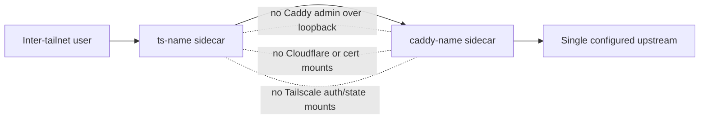

# fix: Harden tailscaleShare sidecar boundary

## Summary

Harden the shared `tailscaleShare` module by disabling Caddy's admin API, reducing Caddy's container authority, and verifying both active shares without changing the per-service Tailscale node plus Caddy/FQDN/certificate model.

---

## Problem Frame

Runtime verification corrected the original issue #232 premise: Caddy does not inherit `CAP_NET_ADMIN`, but the Tailscale sidecar can reach Caddy's localhost admin API through the shared network namespace. The plan preserves the existing inter-tailnet pinhole pattern while removing that pivot and tightening Caddy's runtime posture.

---

## Requirements

- R1. `tailscaleShare` must continue to expose one configured upstream service per instance, not a host-wide reverse proxy or the whole VM.
- R2. Each instance must keep its dedicated Tailscale node identity and FQDN.
- R3. Each instance must keep the repo-owned certificate and DNS automation model.
- R4. Existing active shares for Overseerr on doc2 and Jellyfin on igpu must remain externally reachable after hardening.
- R5. The requirements and issue language must treat the verified risk as shared-loopback Caddy admin exposure plus weak Caddy runtime hardening, not as inherited `NET_ADMIN`.
- R6. The Tailscale sidecar must not be able to reconfigure Caddy through Caddy's localhost admin API.
- R7. Tailscale and Caddy sidecars must keep separate state, secret, and mount authority.
- R8. The Tailscale sidecar must not gain Caddy's Cloudflare token, Caddy data, Caddy config, or certificates through normal mounts or environment.
- R9. The Caddy sidecar must not gain Tailscale auth keys, Tailscale state, or Tailscale control sockets through normal mounts or environment.
- R10. Caddy must run with the smallest practical capability set for HTTPS reverse proxying inside the current sharing model.
- R11. Caddy must avoid root and privilege escalation where the active image and bind-port needs permit it.
- R12. Tailscale may keep the capabilities required for the dedicated tailnet node, but those capabilities must remain scoped to the Tailscale sidecar.
- R13. Deployment verification must cover every active `tailscaleShare` instance, currently Overseerr on doc2 and Jellyfin on igpu.
- R14. Verification must prove service reachability, Caddy admin API non-reachability from the Tailscale sidecar, capability posture, `no-new-privileges` posture, process identity, mount separation, and secret separation.
- R15. Service-module rules and issue #232 must be updated so future agents understand the corrected finding and the intended hardening model.

**Origin actors:** A1 Operator, A2 Shared-service user, A3 Tailscale sidecar, A4 Caddy sidecar, A5 Upstream service, A6 Implementation agent.

**Origin flows:** F1 Inter-tailnet service access, F2 Tailscale sidecar compromise containment, F3 Caddy sidecar compromise containment, F4 Runtime verification.

**Origin acceptance examples:** AE1 service reachability, AE2 Caddy admin non-reachability, AE3 mount/env separation, AE4 reduced runtime authority, AE5 dual-host verification, AE6 corrected issue/docs language.

---

## Scope Boundaries

- Do not replace `tailscaleShare` with Tailscale Serve, Tailscale Funnel, or another exposure product.
- Do not expose the host proxy or the whole VM over Tailscale.
- Do not remove Caddy, Cloudflare DNS challenge, owned FQDNs, or repo-managed certificate plumbing.
- Do not combine this with the separate Tier 4 image-pinning work for `tailscale:latest` or `caddy-cloudflare:latest`.
- Do not redesign individual upstream services such as Overseerr or Jellyfin.
- Do not grant Caddy access to Tailscale state as a shortcut.
- Do not grant Tailscale access to Caddy state or Cloudflare material as a shortcut.

---

## Context & Research

### Relevant Code and Patterns

- `modules/nixos/services/tailscale-share.nix` owns the whole pattern: Tailscale sidecar, Caddy sidecar, Cloudflare DNS sync, tmpfiles state, and auth-key secret wiring.
- Active instances are `homelab.tailscaleShare.overseerr` in `hosts/doc2/configuration.nix` and `homelab.tailscaleShare.jellyfin` in `modules/nixos/services/jellyfin.nix`.
- `modules/nixos/services/youtarr.nix` and `modules/nixos/services/tdarr-node.nix` show the recent local pattern for explicit service identities, ownership migration through tmpfiles, and deploy-time runtime verification.
- `modules/nixos/services/overseerr.nix` and `modules/nixos/services/gotify-server.nix` show static system-user/service-state ownership patterns for service data.
- `.claude/rules/nixos-service-modules.md` already documents `tailscaleShare`, but its anti-pattern text still carries the disproven inherited-`NET_ADMIN` framing and needs correction.

### Institutional Learnings

- Issue #232 is the active least-privilege ledger; do not close it when this item is handled.
- `docs/wiki/services/jellyfin.md` documents the current inter-tailnet Jellyfin share and should continue to describe the model accurately after hardening.
- `docs/wiki/infrastructure/media-filesystem.md` references `tailscaleShare` state under Jellyfin's data root; ownership changes must not break that layout.

### Verified Runtime Facts

- Live doc2 showed `ts-overseerr` retains `CAP_NET_ADMIN`, while `caddy-overseerr` does not. Caddy still runs as uid 0 with default container capabilities and `NoNewPrivs: 0`.
- From `ts-overseerr`, `http://127.0.0.1:2019/config/` returned Caddy configuration because the sidecars share the same network namespace.
- Caddy v2.11.3 in the active image has `/usr/bin/caddy cap_net_bind_service=ep`, but `/proc/sys/net/ipv4/ip_unprivileged_port_start` is `1024`; non-root low-port binding must be tested rather than assumed.
- The active Caddy image did not expose a named `caddy` user in `/etc/passwd`. Existing doc2 Caddy state was owned by numeric `980:977`; existing igpu Caddy state was still `root:root`.
- Runtime mount/env inspection showed the intended split already exists: Tailscale has TS auth/state, Caddy has Cloudflare/Caddy state, and neither sidecar had the other's secrets through normal mounts or environment.

### External References

- Caddy global options docs: `admin off` disables the admin endpoint, but config changes then require stopping and starting the server instead of using `caddy reload`.
- Caddy global options docs: the default admin address is `localhost:2019`, matching the verified shared-loopback exposure.
- Podman run docs: `--security-opt=no-new-privileges` prevents gaining additional privileges through `execve`, including setuid/setgid and file capabilities.
- Podman run docs: `--cap-drop` drops Linux capabilities and capability additions should be reviewed for necessity.

---

## Key Technical Decisions

- Disable Caddy admin for this module: `tailscaleShare` uses immutable generated Caddyfiles and systemd/Podman restarts, so it does not need live config mutation through Caddy's admin API.
- Harden Caddy before redesigning networking: preserving the shared namespace keeps the dedicated Tailscale node/FQDN/cert behavior intact while addressing the verified pivot.
- Use a hardening ladder for Caddy runtime authority: first target non-root plus no-new-privileges and minimal low-port authority; if that fails at runtime, preserve `admin off` and document the smallest justified fallback.
- Keep Tailscale privileges scoped to Tailscale: the Tailscale sidecar may still need `NET_ADMIN` and `/dev/net/tun`, but those should not imply Caddy authority or shared secrets.
- Record live verification evidence in docs and issue #232 because this finding was already corrected once by runtime proof.

---

## Open Questions

### Resolved During Planning

- Should the module shape be replaced? No. The origin requirements explicitly preserve per-service Tailscale node plus Caddy/FQDN/cert plumbing.
- Is inherited `NET_ADMIN` the active bug? No. Runtime verification showed Caddy lacks `CAP_NET_ADMIN`; the active bug is shared-loopback access to Caddy admin plus weak Caddy runtime posture.
- Is `admin off` a viable direction? Yes. Caddy documents it as the supported way to disable the admin endpoint, with the tradeoff that reloads require stop/start. That matches the NixOS OCI-container deployment model.

### Deferred to Implementation

- Exact non-root Caddy UID/GID: the active image and existing state suggest a numeric image-owned data identity, but implementation should verify on both active hosts before finalizing.
- Exact low-port binding mechanism: implementation should test the least-privilege combination that lets non-root Caddy bind 80/443, then document any fallback.
- Whether Tailscale can drop anything beyond the current shape: implementation can probe, but the plan does not require redesigning Tailscale's sidecar authority.

---

## High-Level Technical Design

> *This illustrates the intended approach and is directional guidance for review, not implementation specification. The implementing agent should treat it as context, not code to reproduce.*

The intended final state keeps the shared network namespace for service routing, but removes Caddy's local admin control plane from that namespace and tightens Caddy's process authority. Tailscale and Caddy continue to have separate mount and secret domains.

---

## Implementation Units

### U1. Disable Caddy Admin in Generated Shares

**Goal:** Remove the verified Tailscale-to-Caddy admin API pivot while preserving Caddy's FQDN, TLS automation, and reverse-proxy behavior.

**Requirements:** R1, R2, R3, R4, R5, R6, R13, R14; F1, F2; AE1, AE2.

**Dependencies:** None.

**Files:**
- Modify: `modules/nixos/services/tailscale-share.nix`
- Modify: `.claude/rules/nixos-service-modules.md`
- Test: no dedicated test file; validate through generated Caddyfile inspection, host builds, and runtime probes.

**Approach:**
- Add the supported Caddy global admin-disable setting to the generated Caddyfile for every `tailscaleShare` instance.
- Preserve the existing global Cloudflare DNS challenge setting and per-site reverse proxy behavior.
- Update module/rules comments so the reason is shared-loopback admin exposure, not inherited `NET_ADMIN`.
- Keep restart-based config updates as the expected lifecycle; do not add Caddy admin sockets or reload plumbing in this unit.

**Patterns to follow:**
- `mkCaddyFile` in `modules/nixos/services/tailscale-share.nix`.
- The issue/rules correction language already captured in `docs/brainstorms/2026-05-14-tailscale-share-boundary-hardening-requirements.md`.

**Test scenarios:**
- Covers AE1. Happy path: generated Caddyfile still contains the FQDN block and reverse-proxies to the configured upstream.
- Covers AE2. Error path: from the Tailscale sidecar, probing Caddy's former localhost admin endpoint no longer returns configuration.
- Integration: after deploy, both `overseer.ablz.au` and `jellyfinn.ablz.au` still return the intended service response through the share.
- Regression: Caddy logs no longer report a localhost admin endpoint starting for these sidecars.

**Verification:**
- doc2 and igpu builds evaluate the generated Caddyfile successfully.
- Live Caddy sidecars start and serve traffic.
- Tailscale sidecars cannot read or mutate Caddy config through localhost admin.

---

### U2. Harden Caddy Runtime Identity and Capabilities

**Goal:** Reduce Caddy's runtime authority while keeping HTTPS on the Tailscale share reachable.

**Requirements:** R10, R11, R12, R13, R14; F3, F4; AE4, AE5.

**Dependencies:** U1.

**Files:**
- Modify: `modules/nixos/services/tailscale-share.nix`
- Test: no dedicated test file; validate through generated Podman scripts, host builds, and runtime capability/process inspection.

**Approach:**
- Introduce an explicit Caddy runtime identity for `tailscaleShare` sidecars and align `caddy-data`/`caddy-config` ownership with that identity.
- Add a recursive ownership migration for existing Caddy state so current cert/config data remains writable after dropping root, explicitly covering doc2's numeric-owned state and igpu's current root-owned state.
- Add `no-new-privileges` for Caddy.
- Drop default Caddy capabilities and add back only the authority proven necessary for binding HTTPS/HTTP inside the shared Tailscale namespace. Account for the interaction between `no-new-privileges`, file capabilities on `/usr/bin/caddy`, and low-port binding.
- If non-root plus minimal low-port authority fails in runtime verification, keep `admin off`, retain the smallest working runtime exception, and document the reason in the same work item.

**Patterns to follow:**
- Static service identity and tmpfiles ownership migration in `modules/nixos/services/youtarr.nix`.
- OCI `--user` pattern in `modules/nixos/services/jellyfin.nix`.
- The existing Caddy state directory split in `modules/nixos/services/tailscale-share.nix`.

**Test scenarios:**
- Covers AE4. Happy path: Caddy process runs as the dedicated non-root numeric identity if the active image permits it.
- Covers AE4. Capability path: Caddy's effective/bounding capability set is reduced to the smallest working set, and `NoNewPrivs` is enabled.
- Integration: Caddy can still write needed certificate/config state after the ownership migration.
- Error path: if the first non-root/minimal-capability attempt cannot bind low ports or write state, the implementation records the observed blocker and applies the smallest working fallback without restoring the admin API.

**Verification:**
- Generated Podman script shows explicit Caddy `--user`, capability drop/add posture, and `no-new-privileges`.
- Runtime process inspection on both hosts shows the intended identity, capability set, and `NoNewPrivs`.
- Caddy state directories are owned by the runtime identity and service cert state survives restart.

---

### U3. Preserve and Verify Sidecar Secret and Mount Separation

**Goal:** Make the existing secret/mount separation explicit and verify it did not regress while runtime hardening changed users and ownership.

**Requirements:** R7, R8, R9, R13, R14; F2, F3, F4; AE3, AE5.

**Dependencies:** U1, U2.

**Files:**
- Modify: `modules/nixos/services/tailscale-share.nix`
- Test: no dedicated test file; validate through container inspect and runtime env/mount probes.

**Approach:**
- Keep the Tailscale auth-key secret attached only to `ts-*`.
- Keep the Cloudflare token attached only to `caddy-*` and DNS sync.
- Keep Tailscale state, Caddy data, and Caddy config as separate bind mounts.
- Tighten comments near secrets and volumes so future changes preserve the separation deliberately.
- Verify both containers from both active instances rather than assuming module-level config is enough.

**Patterns to follow:**
- Existing `environmentFiles` and `volumes` split in `modules/nixos/services/tailscale-share.nix`.
- Secret boundary guidance in `.claude/rules/nixos-service-modules.md`.

**Test scenarios:**
- Covers AE3. Tailscale sidecar env/mount inspection shows Tailscale auth/state only, with no Cloudflare token, Caddy data, Caddy config, or certificate material.
- Covers AE3. Caddy sidecar env/mount inspection shows Cloudflare/Caddy material only, with no Tailscale auth key, Tailscale state, or Tailscale control socket.
- Integration: DNS sync can still read the Cloudflare token and update the share record without broadening either container's environment.

**Verification:**
- Runtime env/mount probes pass for `ts-overseerr`, `caddy-overseerr`, `ts-jellyfin`, and `caddy-jellyfin`.
- The module comments and rules docs describe the boundary clearly enough to audit future changes.

---

### U4. Deploy and Verify Both Active Shares

**Goal:** Prove the hardened shared module works on every host currently using it.

**Requirements:** R4, R13, R14; F1, F4; AE1, AE2, AE3, AE4, AE5.

**Dependencies:** U1, U2, U3.

**Files:**
- Modify: `docs/wiki/services/jellyfin.md`
- Create: `docs/wiki/services/tailscale-share.md`
- Test: no dedicated test file; validate through doc2 and igpu builds plus live deploy verification.

**Approach:**
- Build both affected NixOS configurations before deployment.
- Deploy doc2 and igpu using the repo's remote-deploy rule: push first, then have each host rebuild from GitHub.
- Verify service reachability through the public share FQDNs.
- Verify Caddy admin non-reachability from each Tailscale sidecar.
- Verify capability posture, `NoNewPrivs`, process identity, mount separation, and secret separation for all four sidecars.
- Record concise evidence in the wiki so future agents do not have to rediscover the runtime facts.

**Patterns to follow:**
- Verification evidence style in `docs/wiki/services/youtarr.md` and `docs/wiki/services/tdarr-node.md`.
- Deployment rules in `AGENTS.md`.
- Current Jellyfin inter-tailnet notes in `docs/wiki/services/jellyfin.md`.

**Test scenarios:**
- Covers AE1. Overseerr share remains reachable through `overseer.ablz.au`.
- Covers AE1. Jellyfin share remains reachable through `jellyfinn.ablz.au`.
- Covers AE2. Each Tailscale sidecar cannot fetch or mutate Caddy admin config.
- Covers AE3. Each sidecar only sees its intended mounts and environment.
- Covers AE4. Runtime identity/capability/no-new-privileges posture matches the chosen hardening target or documented fallback.
- Covers AE5. Both hosts have no failed units related to these shares after deploy.

**Verification:**
- doc2 and igpu builds pass.
- Live service checks pass for both share FQDNs.
- Runtime hardening evidence is recorded in docs.

---

### U5. Update Issue and Rules Ledger

**Goal:** Keep the least-privilege ledger and agent-facing rules accurate after the fix lands.

**Requirements:** R5, R15; AE6.

**Dependencies:** U4.

**Files:**
- Modify: `.claude/rules/nixos-service-modules.md`
- Modify: `docs/wiki/services/tailscale-share.md`
- External: GitHub issue #232.

**Approach:**
- Replace any remaining inherited-`NET_ADMIN` language with the verified shared-loopback/admin-API framing.
- Add checklist guidance for `tailscaleShare` sidecar hardening: Caddy admin disabled, Caddy hardened, state/env separation preserved, active shares runtime-verified.
- Comment on #232 with commit, hosts, verification evidence, and any justified fallback.
- Check off the Tier 2 item only after live deploy verification passes; do not close #232.

**Patterns to follow:**
- The Youtarr/Tdarr #232 evidence comment style from 2026-05-14.
- Anti-pattern and checklist structure in `.claude/rules/nixos-service-modules.md`.

**Test scenarios:**
- Covers AE6. Future-agent documentation no longer claims Caddy inherits `NET_ADMIN`.
- Covers AE6. The issue update distinguishes corrected finding, final fix, verification evidence, and remaining unrelated #232 work.

**Verification:**
- #232 remains open.
- Tier 2 item has accurate completion status only if runtime verification passes.
- Agent-facing rules point to the corrected model.

---

## System-Wide Impact

- **Interaction graph:** The same four runtime containers remain for the two active shares: `ts-overseerr`, `caddy-overseerr`, `ts-jellyfin`, and `caddy-jellyfin`. Traffic still enters through the per-service Tailscale node and exits to the configured upstream through Caddy.
- **Error propagation:** Caddy admin disablement should fail fast at startup if the generated Caddyfile is invalid. Runtime hardening failures should surface as container start failures, low-port bind failures, certificate storage write failures, or external 502/connection failures.
- **State lifecycle risks:** Ownership changes can make existing Caddy certificate/config state unwritable if tmpfiles migration is wrong. Deployment must verify certificate state survives restart before considering the work done.
- **API surface parity:** `homelab.tailscaleShare` options and existing caller declarations should remain unchanged. Public FQDNs remain unchanged.
- **Integration coverage:** Nix builds prove generated units, but only live runtime checks prove Caddy admin non-reachability, low-port binding, cert writes, and sidecar namespace/secret boundaries.
- **Unchanged invariants:** The module still provides per-application sharing, dedicated Tailscale node identity, Cloudflare DNS sync, Caddy TLS termination, and host-upstream proxying through `host.docker.internal`.

---

## Risks & Dependencies

| Risk | Mitigation |
|------|------------|
| Disabling Caddy admin breaks an expected reload path | The module uses generated Caddyfiles and container restarts; verify restart-based config is sufficient and do not introduce reload dependencies. |
| Non-root Caddy cannot bind 80/443 | Test the least-privilege low-port binding posture during implementation; if needed, use the smallest documented capability/sysctl fallback while keeping admin disabled. |
| Existing cert/config state becomes unwritable | Align tmpfiles ownership with the final Caddy runtime identity and verify renew/storage write capability after deploy. |
| Caddy hardening differs between doc2 and igpu due existing ownership | Verify both active hosts and migrate both state directories. |
| Tailscale privilege reduction breaks tailnet connectivity | Treat further Tailscale reduction as opportunistic; do not block the core Caddy boundary fix on redesigning Tailscale's container authority. |
| Issue #232 gets closed accidentally | Keep the issue open; only update/check off the Tier 2 item after verified deployment. |

---

## Documentation / Operational Notes

- Add a dedicated `docs/wiki/services/tailscale-share.md` page with the corrected risk, final hardening shape, and verification evidence.
- Update `docs/wiki/services/jellyfin.md` only where it describes inter-tailnet share behavior or state ownership.
- Update `.claude/rules/nixos-service-modules.md` so future agents do not repeat the inherited-`NET_ADMIN` claim.
- Record the final deployment evidence in issue #232 and leave unrelated Tier 1/Tier 3/Tier 4 items open.

---

## Sources & References

- **Origin document:** [docs/brainstorms/2026-05-14-tailscale-share-boundary-hardening-requirements.md](../brainstorms/2026-05-14-tailscale-share-boundary-hardening-requirements.md)
- Related code: `modules/nixos/services/tailscale-share.nix`
- Active share: `hosts/doc2/configuration.nix`
- Active share: `modules/nixos/services/jellyfin.nix`
- Rules doc: `.claude/rules/nixos-service-modules.md`
- Related issue: #232
- Caddy global options: https://caddyserver.com/docs/caddyfile/options
- Podman run options: https://docs.podman.io/en/stable/markdown/podman-run.1.html
