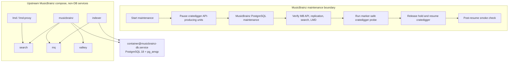

# MusicBrainz PostgreSQL Isolation and Cratedigger Maintenance Boundary Plan

> Superseded on 2026-05-14 by `docs/brainstorms/2026-05-14-cratedigger-local-metadata-api-boundary-requirements.md`.
> The newer scope removes Lidarr/LMD as active requirements and adds Discogs API as an equal hard gate for cratedigger.

## Summary

Move the MusicBrainz PostgreSQL database out of the upstream compose-owned database image lifecycle and into a fleet-managed `mk-pg-container` boundary, while keeping the rest of the MusicBrainz upstream compose stack for the application, indexer, search, message queue, and cache services.

Treat MusicBrainz and cratedigger as one operational maintenance boundary. Before any MusicBrainz database maintenance that can interrupt API correctness or availability, pause the cratedigger units that generate MusicBrainz API traffic. Resume them only after MusicBrainz API, replication, search/index, LMD, and a marker-safe cratedigger consumption probe have passed; then run a bounded post-resume cratedigger smoke check.

The plan deliberately does not add a cratedigger throttle mode and does not replace the full MusicBrainz compose stack.

## Problem Frame

The current MusicBrainz module still lets upstream `metabrainz/musicbrainz-docker` decide the lifecycle of the PostgreSQL database image. That has already broken the mirror once: upstream moved to a PostgreSQL 18 path, and the pinned prebuilt database image did not contain `pg_amqp.so`, so this repo had to pin the input and override the database build path.

The current workaround keeps MusicBrainz alive, but it leaves the risky boundary unchanged:

- PostgreSQL major-version movement is still coupled to a routine upstream compose/image update.
- The module still carries hardcoded database credentials in Nix-visible compose overrides.
- The local LMD cache initialization shells into `musicbrainz-db-1`, so it assumes the upstream compose database remains the active database owner.
- Cratedigger is not a separate operational concern here. Its timer currently runs very aggressively and its web/importer/pipeline paths call the local MusicBrainz mirror directly, so leaving it up during database maintenance can create avoidable API load and misleading failures.

The fix is to make the database a normal NixOS service boundary, then make cratedigger quiescence part of the same maintenance workflow.

## Goals

- MusicBrainz PostgreSQL is managed by this flake, not by an upstream compose database image.
- PostgreSQL major-version changes happen intentionally through this repo.
- The `pg_amqp` extension needed by MusicBrainz is built and versioned in this repo.
- The upstream compose stack remains the source for non-database MusicBrainz services.
- Cratedigger API-producing units are stopped and held during MusicBrainz database maintenance.
- Cratedigger is resumed only after MusicBrainz verification and a marker-safe cratedigger-style probe pass; a bounded cratedigger smoke check follows resume.
- The old compose database data is preserved until cutover and rollback are no longer needed.
- The final steady state removes the temporary upstream pin/workaround that was added for issue #228.

## Non-Goals

- Rewriting the entire MusicBrainz compose stack as native NixOS services.
- Adding cratedigger backpressure, throttling, or partial maintenance behavior.
- Replacing the cratedigger PostgreSQL or Redis boundaries.
- Solving every upstream image-pinning concern outside the database lifecycle risk.
- Deleting legacy MusicBrainz database data during the first cutover.
- Changing external MusicBrainz mirror users beyond the service dependency and maintenance behavior required here.

## Requirements Traceability

This plan implements the requirements from the brainstorm document:

- **R1-R3:** MusicBrainz PostgreSQL leaves the upstream compose DB lifecycle and uses an explicit fleet-owned PostgreSQL major version, extension set, and runtime settings.
- **R4:** Existing MusicBrainz state is migrated where practical, or rebuilt only when classified as safe to regenerate.
- **R5-R8:** Cratedigger API-producing automation, workers, and UI paths are paused and held during MusicBrainz database maintenance, and the coupling is documented for future operators.
- **R9:** Rollback remains available until the fleet-managed database is verified.
- **R10:** Verification covers MusicBrainz API, replication readiness, search/index, LMD, and cratedigger consumption.
- **R11:** The upstream MusicBrainz input returns to normal tracking after the database lifecycle risk is removed.
- **R12:** The solution preserves the fleet's least-privilege PostgreSQL posture.
- **R13:** Non-database MusicBrainz services keep their upstream compose lifecycle unless a narrow database-extraction adjustment is required.

## Current State

Relevant local files:

- `modules/nixos/services/musicbrainz.nix`
- `modules/nixos/services/cratedigger.nix`
- `modules/nixos/lib/mk-pg-container.nix`
- `.claude/rules/nixos-service-modules.md`
- `flake.nix`
- `flake.lock`

Current MusicBrainz behavior:

- `musicbrainz.nix` starts upstream `docker-compose.yml` with `podman compose`.
- The upstream compose file defines `db`, `musicbrainz`, `indexer`, `search`, `mq`, and `valkey`.
- The local override currently forces `POSTGRES_USER="abc"` and `POSTGRES_PASSWORD="abc"` into the compose environment.
- The local override currently changes the upstream DB build path from `build/postgres-prebuilt` to `build/postgres` because the prebuilt image lacks `pg_amqp.so`.
- `lmCacheInitStep` currently runs `psql` inside `musicbrainz-db-1`.
- Replication and reindex jobs execute inside the upstream MusicBrainz/indexer containers.
- The mirror database is large, re-downloadable mirror state. Its new nspawn PostgreSQL data path should stay under the existing MusicBrainz mirror storage, not under the backed-up service data path.

Current cratedigger behavior:

- `cratedigger.nix` wraps `inputs.cratedigger-src.nixosModules.default`.
- Cratedigger has a fleet-managed PostgreSQL container already, using `mk-pg-container` host number 5.
- The upstream cratedigger timer is very frequent (`OnUnitInactiveSec = "1s"` in the current input).
- Cratedigger code paths call the local MusicBrainz mirror at `http://192.168.1.35:5200/ws/2`.
- API-producing units are `cratedigger.timer`, `cratedigger.service`, `cratedigger-importer.service`, `cratedigger-import-preview-worker.service`, and `cratedigger-web.service`.
- `redis-cratedigger.service` and `cratedigger-db-migrate.service` do not need to be stopped by default unless implementation research finds they generate MusicBrainz API traffic.

## Research Notes

### Local Patterns

- `mk-pg-container` is the preferred PostgreSQL boundary for NixOS services in this repo.
- Existing service database host numbers are 1 through 9, so MusicBrainz should use host number 10 unless implementation finds a new allocation before editing.
- `meelo.nix` is the closest existing PostgreSQL extraction pattern:
  - narrow pgpass secret
  - explicit PostgreSQL package selection
  - nspawn database service dependency wiring
  - restart triggers tied to the database container unit
  - old database path preservation during migration
- The service-module least-privilege rule flags hardcoded database passwords in Nix attrsets as an anti-pattern.

### Upstream MusicBrainz Constraints

- Upstream `musicbrainz` and `indexer` containers read:
  - `MUSICBRAINZ_POSTGRES_SERVER`
  - `MUSICBRAINZ_POSTGRES_READONLY_SERVER`
  - `POSTGRES_USER`
  - `POSTGRES_PASSWORD`
- Upstream defaults expect the PostgreSQL service to be named `db`, but the host can be overridden through environment.
- Upstream database name is `musicbrainz_db`.
- LMD uses a separate `lm_cache_db` database in the current module.
- Upstream `build/postgres/Dockerfile` builds `pg_amqp` from `mwiencek/pg_amqp` at commit `51497ac687f16989adff7729a303f9258706f663`.
- Nixpkgs in this checkout has PostgreSQL 18 available, but does not expose `pg_amqp` in the PostgreSQL extension package sets checked during research.

### Compose Compatibility Risk

The module currently uses `podman compose` with the Nixpkgs `docker-compose` provider. The implementation should not assume modern Compose reset/replace semantics will work until the generated merged config is checked locally.

The preferred design is still to keep the upstream compose file for non-database services, then add an external-database override. If the provider cannot cleanly remove the upstream `db` dependency, use a minimal compatibility shim for the compose service named `db` so the compose graph remains valid without running an upstream PostgreSQL owner or using the old `pghome` volume.

The shim must not be a PostgreSQL database and must not own data. Its only acceptable purpose is compose graph compatibility or readiness compatibility while all real database connections go to the fleet-managed PostgreSQL container.

### External References

- Docker Compose merge behavior: https://docs.docker.com/reference/compose-file/merge/
- PostgreSQL upgrade guidance: https://www.postgresql.org/docs/current/upgrading.html
- MusicBrainz Docker upstream: https://github.com/metabrainz/musicbrainz-docker
- `pg_amqp` upstream: https://github.com/mwiencek/pg_amqp

## Technical Design

### Database Boundary

Add a MusicBrainz PostgreSQL boundary using `mk-pg-container`:

- service name: `musicbrainz`
- host number: `10`, unless implementation research finds a newly allocated number
- PostgreSQL package: `pkgs.postgresql_18`, matching the current upstream direction and the available Nixpkgs package
- data directory parent: `${cfg.mirrorDir}/postgres-nspawn`, so the large mirror database keeps the same backup posture as the current MusicBrainz mirror state
- required databases:
  - `musicbrainz_db`
  - `lm_cache_db`
- user: `musicbrainz`
- authentication: `scram-sha-256` through the existing `mk-pg-container` private network pattern
- listen address: private nspawn address only
- password source: a narrow SOPS env/pgpass secret, not a Nix-store literal

The implementation should create a local `pg_amqp` extension derivation coupled to the selected PostgreSQL package and the upstream commit currently used by MusicBrainz Docker. That extension must be available in the database container and listed in PostgreSQL preload settings.

Library availability is not enough by itself. The cutover path must also ensure the `pg_amqp` database extension object exists in `musicbrainz_db` and that the MusicBrainz indexer AMQP triggers are installed. A dump/restore path may preserve those objects; a fresh import/rebuild path must run or port the upstream `create-amqp-extension` and `setup-amqp-triggers` behavior idempotently.

### Compose Boundary

Keep the upstream compose file as the base for MusicBrainz application services. Add local overrides that:

- point `musicbrainz` and `indexer` at the fleet-managed PostgreSQL host
- point LMD at `lm_cache_db` on the fleet-managed PostgreSQL host after identifying the required `blampe/lidarr.metadata` database configuration keys
- set the readonly PostgreSQL server to the same host unless a readonly split is introduced later
- provide `POSTGRES_USER` as non-secret config
- provide `POSTGRES_PASSWORD` only from a narrow secret file or runtime-combined env file
- remove the active upstream PostgreSQL database owner from the runtime path
- remove the old `dbBuildOverride` once the external DB path is proven
- update LMD cache initialization to connect to `lm_cache_db` on the fleet-managed database

The implementation must check the rendered compose config before relying on service removal or dependency replacement. If dependency replacement is not supported cleanly, use the compatibility-shim approach described above.

### Maintenance Guard

Add a first-class maintenance guard rather than a cratedigger application throttle.

Use two separate state artifacts with different lifetimes:

- `musicbrainz-db-maintenance-hold`: runtime hold present during active MusicBrainz database maintenance. It blocks cratedigger API-producing units, MusicBrainz application restarts, replication jobs, reindex jobs, and the podman update path for this stack unless a maintenance helper explicitly bypasses it.
- `musicbrainz-db-cutover-approved`: explicit cutover/rebuild approval marker that allows the new external-database MusicBrainz start path after an operator has chosen dump/restore or rebuild/import.

The maintenance hold should have three properties:

- It stops the cratedigger units that can generate MusicBrainz API traffic when MusicBrainz DB maintenance starts.
- It prevents those units from being restarted by timers, rebuilds, or accidental operator starts while the hold is present.
- It also prevents `musicbrainz.service`, replication jobs, reindex jobs, and automated podman update handling from racing dump/restore or rebuild/import work.

The likely implementation shape is:

- a hold file owned by systemd/runtime state, such as a `StateDirectory` or `/run` marker
- `ExecCondition` or equivalent unit-level checks added to guarded cratedigger and MusicBrainz units
- a MusicBrainz maintenance-start helper that creates the hold and stops:
  - `cratedigger.timer`
  - `cratedigger.service`
  - `cratedigger-importer.service`
  - `cratedigger-import-preview-worker.service`
  - `cratedigger-web.service`
- the same helper should stop or hold MusicBrainz application/replication/reindex/update entry points that can race the database work
- a marker-safe `musicbrainz-cratedigger-probe` helper that can run a bounded read-only cratedigger-style metadata/API check without starting the guarded cratedigger timer, web service, importer, or workers
- a maintenance-finish helper that verifies MusicBrainz, runs the marker-safe cratedigger probe, removes the hold, starts the appropriate cratedigger units again, and then runs a bounded post-resume smoke check

Keep `redis-cratedigger.service`, `cratedigger-db-migrate.service`, and the cratedigger PostgreSQL container outside the pause set unless implementation confirms one of them calls MusicBrainz.

### Migration Safety

Add a migration gate before any external-database MusicBrainz start path is enabled, so the new stack cannot silently start against an empty external database when legacy compose database data exists and no migration/rebuild decision has been recorded.

The gate should distinguish these states:

- legacy compose DB exists, no `musicbrainz-db-cutover-approved`: refuse to start and explain the required cutover step
- external DB initialized and verified: allow normal start
- operator-selected rebuild from upstream dumps: allow only after `musicbrainz-db-cutover-approved` or an equivalent documented action
- rollback path selected: preserve legacy compose DB data and use the old module state until the rollback is complete

The exact data transfer path depends on the live database state at implementation time. The plan allows either:

- dump/restore from the old compose database into the fleet-managed database, if the old database is healthy enough and the major-version path is supported
- rebuild/initial import from upstream MusicBrainz data plus replication catch-up, if that is safer than trying to salvage the old compose database

The old compose database volume/data directory must remain untouched until runtime verification and rollback confidence are complete.

## Implementation Units

### Unit 1: Add MusicBrainz PostgreSQL and `pg_amqp` Package Boundary

**Goal:** Define the fleet-owned PostgreSQL service boundary MusicBrainz will use.

**Files:**

- `modules/nixos/services/musicbrainz.nix`
- `modules/nixos/lib/mk-pg-container.nix` (read-only reference unless helper changes are unavoidable)
- optional new package helper if inline packaging is too noisy for `musicbrainz.nix`
- SOPS secret metadata files, if a new narrow MusicBrainz pgpass/env secret is needed

**Work:**

- Instantiate `mk-pg-container` for MusicBrainz with host number 10.
- Set the PostgreSQL data directory parent to `${cfg.mirrorDir}/postgres-nspawn`, preserving the existing "large mirror state, not backed up" posture.
- Add tmpfiles/state handling for the new nspawn database parent and document the legacy `pghome`/`pgdata` paths that must be retained for rollback.
- Use PostgreSQL 18 unless implementation confirms the live upstream source requires a different supported major.
- Create or wire a local `pg_amqp` extension derivation from the upstream ref used by MusicBrainz Docker.
- Add the extension to the database container and configure `shared_preload_libraries` for `pg_amqp.so`.
- Create `musicbrainz_db` and `lm_cache_db` with ownership granted to the MusicBrainz DB user.
- Add a narrow secret for the database password and remove the hardcoded `abc` credential path from the new runtime.

**Validation:**

- Nix evaluation sees a `container@musicbrainz-db.service`.
- The selected PostgreSQL package and `pg_amqp` extension build together.
- The new database path is under `mirrorDir`, not under the backed-up service data directory.
- The resulting database service does not allow TCP trust and does not expose PostgreSQL beyond the private nspawn boundary.
- No database password appears in the Nix store or generated compose files.

### Unit 2: Point MusicBrainz Compose Services at the External Database

**Goal:** Keep upstream compose for non-database services while removing the upstream PostgreSQL owner from the active runtime path.

**Files:**

- `modules/nixos/services/musicbrainz.nix`
- `flake.nix` and `flake.lock` later in this unit or in Unit 5, depending on cutover confidence

**Work:**

- Add the migration gate before enabling any external-database start path.
- Add a compose override that points `musicbrainz` and `indexer` at the nspawn PostgreSQL host.
- Identify and wire LMD's database settings to `lm_cache_db` on the nspawn PostgreSQL host, including any required `depends_on: db` changes.
- Load database password material from the narrow secret into only the services that need it.
- Replace `lmCacheInitStep` so it initializes `lm_cache_db` through the fleet-managed database instead of `podman exec musicbrainz-db-1`.
- Add an idempotent post-restore/import step for the `pg_amqp` extension object and MusicBrainz AMQP trigger setup when a fresh import/rebuild path is used.
- Add service ordering so MusicBrainz starts after the database container is ready.
- Add restart triggers so MusicBrainz application services restart when the database container unit changes.
- Remove or bypass the upstream database volume from active runtime.
- Validate whether the compose provider can remove or replace the upstream `db` service and `depends_on` entries. If it cannot, add the minimal compatibility shim.

**Validation:**

- The rendered compose config points database clients at the fleet-managed database host.
- LMD is explicitly wired to `lm_cache_db` on the fleet-managed database and does not depend on a PostgreSQL-compatible compose `db` service.
- Fresh import/rebuild has an explicit AMQP extension-object and trigger-install step, while dump/restore confirms whether those objects were preserved.
- No active `musicbrainz-db-1` PostgreSQL container owns MusicBrainz data in steady state.
- MusicBrainz application, indexer, search, MQ, Valkey, and LMD still have their required environment and volume bindings.
- The previous `dbBuildOverride` is no longer required for steady-state operation.

### Unit 3: Add Cratedigger Maintenance Pause and Hold

**Goal:** Make cratedigger quiescence an enforceable part of MusicBrainz maintenance.

**Files:**

- `modules/nixos/services/cratedigger.nix`
- `modules/nixos/services/musicbrainz.nix`
- `docs/wiki/services/musicbrainz.md` or another service wiki page if one already exists

**Work:**

- Add the `musicbrainz-db-maintenance-hold` runtime hold shared between the MusicBrainz maintenance helpers and guarded unit conditions.
- Keep `musicbrainz-db-cutover-approved` separate from the runtime hold; it controls external database startup, not cratedigger pause/resume.
- Add unit-level guards to the API-producing cratedigger units:
  - `cratedigger.timer`
  - `cratedigger.service`
  - `cratedigger-importer.service`
  - `cratedigger-import-preview-worker.service`
  - `cratedigger-web.service`
- Add unit-level guards or equivalent hold checks to `musicbrainz.service`, replication jobs, reindex jobs, and the podman update path for this stack so they cannot race database maintenance.
- Add maintenance-start behavior that creates the hold and stops the guarded units.
- Add a marker-safe `musicbrainz-cratedigger-probe` helper for a bounded read-only cratedigger-style metadata/API check.
- Add maintenance-finish behavior that runs MusicBrainz verification and the marker-safe probe, removes the hold, restarts the appropriate cratedigger units, then runs a bounded post-resume smoke check.
- Document the pause/resume semantics in the service wiki.
- Leave cratedigger's PostgreSQL, Redis, and migration services alone unless implementation confirms MusicBrainz API traffic from one of them.

**Validation:**

- With the hold present, the cratedigger timer and API-producing units do not start.
- A rebuild, podman update, or manual service start cannot accidentally resume cratedigger or restart MusicBrainz application jobs while the hold remains.
- The marker-safe probe can exercise a read-only cratedigger consumption path without starting guarded cratedigger units.
- With the hold removed, cratedigger resumes normal scheduled and long-running service behavior and passes a bounded smoke check.
- Cratedigger stateful services that do not hit MusicBrainz remain available.

### Unit 4: Add Migration and Rollback Runbook

**Goal:** Make cutover operationally explicit and reversible.

**Files:**

- `docs/wiki/services/musicbrainz.md`
- `modules/nixos/services/musicbrainz.nix`
- GitHub issue #228 comments during execution

**Work:**

- Document the cutover sequence:
  - enter MusicBrainz maintenance
  - confirm cratedigger API-producing units are stopped and held
  - verify current MusicBrainz source PostgreSQL major and current old DB state
  - choose dump/restore or rebuild/import based on the live state
  - create `musicbrainz-db-cutover-approved` only after that decision is recorded
  - initialize the external PostgreSQL database
  - create or verify the `pg_amqp` extension object and MusicBrainz AMQP trigger setup
  - start MusicBrainz against the external database
  - verify MusicBrainz API, replication, search/index, and LMD while the hold is still present
  - run the marker-safe cratedigger consumption probe
  - resume cratedigger
  - run the bounded post-resume cratedigger smoke check
- Document rollback:
  - stop the external-DB MusicBrainz stack
  - preserve the failed external DB state for inspection
  - restore the previous compose DB runtime path from git/module rollback
  - keep cratedigger paused until the old MusicBrainz path is healthy
- Record the exact rollback commit or flake ref that still contains the old compose DB runtime and workaround before any upstream unpin/removal step.
- Record which legacy paths/volumes must not be deleted until the rollback window closes.

**Validation:**

- The runbook has a clear "do not proceed" state for legacy DB present and no cutover approval.
- The runbook names the distinct runtime hold and cutover approval artifacts and does not conflate their lifetimes.
- The rollback path does not require deleting legacy database data.
- The rollback path includes an exact commit or flake ref to deploy under pressure.
- Issue #228 has enough operational notes for a future session to know the current cutover state.

### Unit 5: Unpin Upstream and Remove Temporary Database Workarounds

**Goal:** Return MusicBrainz updates to normal once the database lifecycle risk has been removed.

**Files:**

- `flake.nix`
- `flake.lock`
- `modules/nixos/services/musicbrainz.nix`
- `docs/wiki/services/musicbrainz.md`
- issue #228

**Work:**

- Before changing the upstream pin, record the exact rollback commit or flake ref in the wiki and issue.
- Remove the temporary `musicbrainz-docker` pin introduced for issue #228 only after external-DB verification is complete and the rollback reference has been recorded. If rollback confidence is still low, defer unpinning until the rollback window closes.
- Remove the local `dbBuildOverride` and any prebuilt-vs-source DB image workaround that is no longer used.
- Keep non-database compose overrides that are required for local paths, LMD, LRCLIB images, tokens, and settings.
- Re-run evaluation and runtime checks after the input update.
- Update the wiki and issue with the final steady-state design.

**Validation:**

- Updating `musicbrainz-docker` no longer changes the PostgreSQL major or database image used by the active MusicBrainz database.
- A rollback reference exists before the old compose DB runtime is removed from the easy deployment path.
- MusicBrainz runtime checks pass after the input is unpinned.
- Cratedigger remains paused during any final MusicBrainz database maintenance and resumes after verification.

## Verification Plan

Because this is NixOS infrastructure, validation has two layers: build/evaluation validation and deployed runtime validation.

### Build and Evaluation

- Nix evaluation for the doc2 host succeeds.
- The MusicBrainz PostgreSQL container unit is generated.
- The `pg_amqp` extension derivation builds with the selected PostgreSQL package.
- Secret file references are runtime paths, not Nix-store password literals.
- Dead code from the old DB build override is removed once steady state is reached.

### Runtime While Maintenance Hold Is Present

Verify these before removing `musicbrainz-db-maintenance-hold`:

- MusicBrainz web/API responds on the local mirror endpoint.
- A representative `/ws/2` lookup succeeds.
- Replication status is readable and not obviously wedged.
- Search/index path works for a representative query.
- LMD path works, including `lm_cache_db` access.
- The marker-safe `musicbrainz-cratedigger-probe` can run a bounded read-only cratedigger-style metadata/API consumption path without starting guarded cratedigger units.

### Runtime After Releasing Maintenance Hold

Verify these after removing `musicbrainz-db-maintenance-hold`:

- Cratedigger timer and long-running units resume only after the hold is removed.
- A bounded post-resume cratedigger smoke check succeeds without sustained MusicBrainz API pressure.
- Any failed post-resume check recreates the hold or stops guarded cratedigger units before further debugging.

### Negative Checks

- No active upstream PostgreSQL compose database owns MusicBrainz state.
- Cratedigger API-producing units do not run while `musicbrainz-db-maintenance-hold` is present.
- MusicBrainz application, replication, reindex, and podman update paths do not race database work while the hold is present.
- A rebuild during maintenance does not accidentally restart cratedigger or MusicBrainz application jobs.
- The old MusicBrainz database data remains available for rollback until explicitly cleaned up later.

## Risks and Mitigations

| Risk | Impact | Mitigation |
| --- | --- | --- |
| `pg_amqp` fails to build against PostgreSQL 18 | MusicBrainz cannot start on the external database | Build the extension before cutover; keep old compose DB data untouched; only proceed after extension validation |
| `pg_amqp` library exists but DB extension object or AMQP triggers are missing | Replication/index/search paths fail after import or rebuild | Add an idempotent post-restore/import extension and trigger setup step; confirm dump/restore preserved these objects when using that path |
| New database path lands under backed-up service data | Backup load and retention change unexpectedly | Put the nspawn database under `${cfg.mirrorDir}/postgres-nspawn` and document backup posture |
| LMD remains pointed at compose `db` | MusicBrainz API may pass while LMD is broken | Explicitly wire LMD to `lm_cache_db` on the fleet-managed database and validate LMD separately |
| Compose provider cannot remove `db`/`depends_on` cleanly | External DB override becomes brittle | Validate rendered compose config; use a non-PostgreSQL compatibility shim if removal is not reliable |
| MusicBrainz starts against an empty external DB by accident | Mirror appears alive but is incomplete or corrupt | Add migration gate and explicit cutover approval before allowing external DB startup |
| Cratedigger restarts during maintenance | API load and misleading failures during DB work | Add unit-level guard, not just a manual stop command |
| MusicBrainz or podman update restarts during DB maintenance | Dump/restore or rebuild/import races the application | Gate MusicBrainz application, replication, reindex, and podman update paths with the same maintenance hold |
| DB password leaks into the Nix store | Secret exposure and least-privilege regression | Use narrow SOPS env/pgpass secret loaded at runtime |
| Old compose DB data is deleted too early | Rollback path lost | Preserve legacy data until verification and rollback window are complete |
| Upstream unpin removes the easy rollback state too early | Emergency rollback depends on memory or git archaeology | Record the exact rollback commit/flake ref before unpinning, or defer unpinning until the rollback window closes |
| Current upstream source major differs from assumed PostgreSQL 18 | Wrong major selected for fleet DB | Confirm live source and existing DB version before implementation cutover |

## Rollout Order

1. Add the external PostgreSQL package/container boundary under `mirrorDir` and build `pg_amqp`.
2. Add the migration gate and external-DB compose overrides while keeping old data untouched.
3. Add MusicBrainz/cratedigger maintenance hold, marker-safe probe, and pause/resume helpers.
4. Add the migration and rollback runbook.
5. Enter maintenance, create `musicbrainz-db-maintenance-hold`, and stop guarded units.
6. Choose dump/restore or rebuild/import; record the decision; create `musicbrainz-db-cutover-approved`; perform database cutover.
7. Verify MusicBrainz API, replication, search/index, LMD, AMQP extension/triggers, and marker-safe cratedigger probe while the hold is present.
8. Remove the hold, resume cratedigger, and run a bounded post-resume smoke check.
9. Record the exact rollback commit/flake ref, then unpin upstream MusicBrainz Docker and remove temporary DB build workarounds only when rollback confidence is sufficient.
10. Keep old DB data for the rollback window; clean it only in a later explicit cleanup after confidence is established.

## Open Questions for Implementation

- Is the live old compose database healthy enough for dump/restore, or is a fresh import plus replication catch-up safer?
- Does the current compose provider support clean removal/replacement of `depends_on: db`, or should the compatibility shim be used immediately?
- What exact runtime hold path best fits the existing service modules?
- Which LMD database environment/config keys must be set for `blampe/lidarr.metadata` to use `lm_cache_db` on the nspawn host?
- Which cratedigger code path is safest for a root-only marker-safe read-only probe?
- How long should the rollback preservation window be before old compose DB data is eligible for cleanup?

None of these questions change the core design. They should be answered during implementation before cutover.

## Acceptance Criteria

- MusicBrainz no longer uses an upstream compose PostgreSQL database as its active database owner.
- PostgreSQL major version is selected in `musicbrainz.nix` through this repo.
- The new MusicBrainz PostgreSQL data path is under the mirror storage path, with rollback retention documented.
- `pg_amqp` is built or otherwise provided by this repo for the selected PostgreSQL version.
- `pg_amqp` extension objects and MusicBrainz AMQP triggers are created or verified after restore/import.
- The hardcoded MusicBrainz database password path is removed from the active runtime.
- Cratedigger API-producing units are stopped and held during MusicBrainz database maintenance.
- MusicBrainz application/update jobs and cratedigger API-producing units are held during database maintenance.
- Cratedigger resumes only after documented MusicBrainz verification and marker-safe cratedigger probing succeeds.
- The temporary MusicBrainz Docker pin/workaround from issue #228 is removed after external DB cutover.
- Issue #228 is updated with the steady-state design and cutover result.
