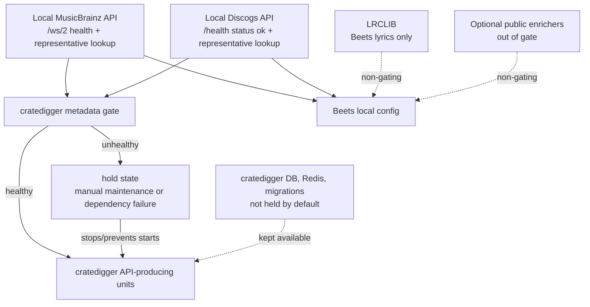
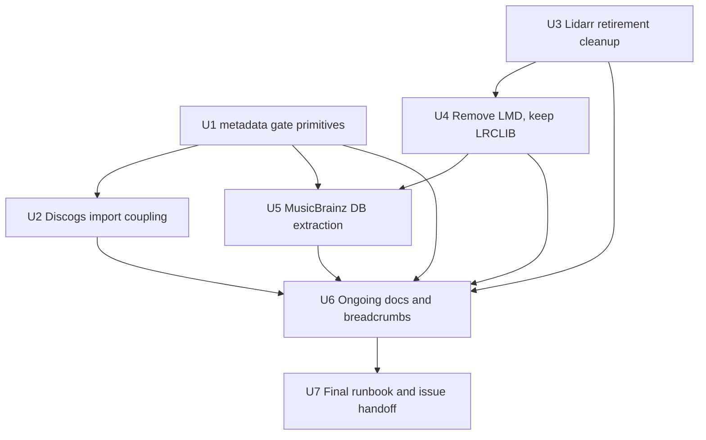

# Cratedigger Local Metadata API Boundary Plan

## Summary

Make cratedigger dependent on exactly two local metadata APIs: MusicBrainz and Discogs. The implementation should enforce that boundary at the service layer, couple Discogs imports and MusicBrainz maintenance to the same hold/resume flow, and remove the active Lidarr/LMD surfaces that made the previous issue #228 plan preserve retired behavior.

---

## Problem Frame

The old issue #228 plan still treated Lidarr/LMD as live requirements. Current repo state says otherwise: Beets and cratedigger use local MusicBrainz and local Discogs metadata, Beets uses local LRCLIB for lyrics, and optional public Beets enrichers are not cratedigger availability requirements.

---

## Requirements

**Cratedigger metadata API gate**
- R1. Cratedigger API-producing components must be held when the local MusicBrainz API is unhealthy or intentionally in maintenance. Origin: R1, F1, AE1.
- R2. Cratedigger API-producing components must be held when the local Discogs API is unhealthy, intentionally in maintenance, importing, empty, or reporting a non-healthy mirror state. Origin: R2, R6, F2, AE2.
- R3. The hold must cover scheduled automation, web UI paths, importer paths, preview paths, and workers when they can generate MusicBrainz or Discogs API traffic. Origin: R3, F1, F2.
- R4. Cratedigger must not resume until both local metadata API gates are clear and representative MusicBrainz-sourced and Discogs-sourced probes pass. Origin: R4, R5, AE3.

**Retired service cleanup**
- R5. Lidarr and LMD/Lidarr Metadata must be removed from active runtime, proxy, monitor, MCP-secret, current plan, and high-signal agent guidance surfaces unless implementation finds a real current non-Lidarr consumer. Origin: R11-R14, F3, AE6.

**Beets dependency shape**
- R6. LRCLIB may remain for Beets lyrics, but LRCLIB, iTunes, Amazon, albumart.org, Last.fm, and other optional enrichment sources must not gate cratedigger. Origin: R15-R17, F4, AE5.

**MusicBrainz database lifecycle**
- R7. MusicBrainz must still move off the upstream compose-owned PostgreSQL lifecycle to a fleet-managed database boundary, with PostgreSQL major version, extensions, authentication, and runtime settings owned by this repo. Origin: R7-R10, R18.
- R8. MusicBrainz cutover verification must target the live local API shape: `/ws/2` API health, search/index behavior, replication readiness, and cratedigger-style MusicBrainz consumption. LMD verification is not required. Origin: R10, AE4.

**Operational clarity**
- R9. The final operational boundary must be obvious to a future operator or agent: cratedigger is coupled to MusicBrainz API health and Discogs API health, not to Lidarr/LMD or optional public providers. Origin: R19.
- R10. Every touched service boundary must pass the repo's least-privilege posture: no broad DB trust, no unnecessary world-writable media paths, no hardcoded new LAN service URLs, no secret widening, no arbitrary root command surface in gate helpers, and no retained proxy/monitor/firewall exposure for retired services. Origin: R18 and `.claude/rules/nixos-service-modules.md`.

**Origin actors:** A1 operator/deployment agent, A2 cratedigger workflow, A3 local MusicBrainz API, A4 local Discogs API, A5 Beets.

**Origin flows:** F1 MusicBrainz API outage or maintenance, F2 Discogs API outage/import/maintenance, F3 retired Lidarr/LMD cleanup, F4 routine Beets and cratedigger operation.

**Origin acceptance examples:** AE1-AE6 are covered by R1-R9 and the unit test scenarios below.

---

## Scope Boundaries

- Do not gate cratedigger on LRCLIB.
- Do not gate cratedigger on iTunes, Amazon, albumart.org, Last.fm, Cover Art Archive reachability, or any other optional public Beets enrichment provider.
- Do not preserve Lidarr/LMD behavior for its own sake.
- Do not rewrite cratedigger's product workflow, search model, download strategy, or metadata ranking as part of this issue.
- Do not replace the full MusicBrainz compose stack with native NixOS services. The current scope is LMD removal plus PostgreSQL ownership extraction.
- Do not delete archived historical docs solely because they mention Lidarr. Update active config, current issue docs, wiki guidance, comments, and monitoring first.
- Do not create a general fleet-wide maintenance orchestration framework.

---

## Context & Research

### Relevant Code and Patterns

- `modules/nixos/services/cratedigger.nix` wraps `inputs.cratedigger-src.nixosModules.default`, owns the nspawn PostgreSQL boundary for cratedigger, and wires the API-producing units that need to be gated.
- The current cratedigger API-producing set is `cratedigger.timer`, `cratedigger.service`, `cratedigger-web.service`, `cratedigger-importer.service`, and `cratedigger-import-preview-worker.service`. `redis-cratedigger.service`, `cratedigger-db-migrate.service`, and `container@cratedigger-db.service` should stay outside the pause set unless implementation proves they call metadata APIs.
- The cratedigger source currently calls the local MusicBrainz mirror at `http://192.168.1.35:5200/ws/2` and the local Discogs mirror at `https://discogs.ablz.au`. Representative source paths include `album_source.py`, `web/mb.py`, and `web/discogs.py` in the cratedigger input.
- `modules/nixos/services/discogs.nix` already owns a fleet-managed PostgreSQL nspawn boundary and exposes a JSON-query monitor on `https://discogs.ablz.au/health`. The Discogs API returns `status = "ok"` only when the mirror is populated; `awaiting_import` must be treated as a hold condition.
- `modules/nixos/services/musicbrainz.nix` still includes LMD, LMD proxy, `lm_cache_db` init, `lmdPort`, an LMD monitor, and a PostgreSQL image-build workaround. Those are stale under the new requirements.
- `modules/home-manager/services/beets.nix` is the current Beets source of truth: local MusicBrainz, patched local Discogs, local LRCLIB for lyrics, and optional public artwork/genre enrichment outside the cratedigger gate.
- `modules/nixos/lib/mk-pg-container.nix` is the database pattern to follow: private nspawn networking, scram-sha-256 over TCP, password from SOPS, no broad trusted PostgreSQL access.
- Active Lidarr surfaces found during planning include `hosts/doc2/configuration.nix`, `modules/nixos/services/lidarr.nix`, `modules/nixos/services/default.nix`, `modules/nixos/profiles/base.nix`, `modules/nixos/services/mcp.nix`, `scripts/mcp-lidarr.sh`, `flake.nix`, `nix/overlay.nix`, `secrets/lidarr-mcp.env`, `modules/nixos/services/slskd.nix`, `modules/nixos/services/cratedigger.nix`, `modules/nixos/services/mounts/fuse.nix`, `CLAUDE.md`/`AGENTS.md`, and `docs/wiki/infrastructure/media-filesystem.md`.
- Least-privilege surfaces that need explicit review include the current slskd world-writable download behavior, new cratedigger gate helpers that can stop/start services, MusicBrainz PostgreSQL auth and secrets, compose DB removal, and retired Lidarr/LMD proxy, monitor, firewall, and MCP surfaces.

### Institutional Learnings

- This repo does not currently have `docs/solutions/`; no solution docs were available to carry forward.
- The `mk-pg-container` header documents the cascade-stop risk: long-running services that `Requires=` their nspawn database need restart triggers tied to `config.systemd.units."container@<name>-db.service".unit`.
- `.claude/rules/nixos-service-modules.md` and issue #232 require least-privilege review for any changes touching service boundaries, secrets, database access, network exposure, or shared paths.

### External References

- No external research was needed to choose the planning boundary. The relevant API contracts and service shapes are local repo code plus pinned source inputs. Implementation must still verify live upstream MusicBrainz/PostgreSQL reality before cutover.

---

## Key Technical Decisions

- Use a service-level cratedigger metadata gate, not an in-app throttle. Cratedigger's aggressive timer and long-running web/importer paths can generate metadata traffic independently, so systemd needs to hold and stop the units that create load.
- Treat MusicBrainz and Discogs as equal hard gates. A healthy MusicBrainz API does not release cratedigger while Discogs is down, importing, or empty, and vice versa.
- Define a stable gate helper interface in the cratedigger module for other modules to consume. Discogs and MusicBrainz should call the helper through read-only `config.homelab.services.cratedigger.metadataGate.*` command options rather than reimplementing state-file details.
- Combine start-time guards with an active watchdog/import-maintenance hold. `ExecCondition`-style checks prevent accidental starts, but long-running units also need to be stopped if either metadata API becomes unhealthy after they started.
- Keep hold reasons explicit and independently cleared. Planned reasons are `manual`, `dependency`, `discogs-import`, and `musicbrainz-maintenance`; each reason gets its own state file under the gate helper's systemd runtime directory, protected by a lock. Auto recovery may clear only `dependency`; successful Discogs import may clear only `discogs-import`; MusicBrainz maintenance-finish may clear only `musicbrainz-maintenance`; `manual` clears only through an operator release command. Cratedigger resumes only when no hold reasons remain and both API probes pass.
- Keep the gate helper authority narrow. The helper may manage only a fixed allowlist of cratedigger units and reason files, must not accept arbitrary unit names or shell fragments, and should use root-owned runtime/state directories with no group-writable hold state.
- Make Discogs import enter the same operational boundary before data is dropped or replaced. The existing `/health` state is useful, but the import unit should hold cratedigger before the API can briefly serve an incomplete or transitioning mirror.
- Remove active Lidarr and LMD surfaces before the MusicBrainz database extraction. That makes the database plan simpler: no `lm_cache_db`, no LMD proxy, no LMD verification, and no Lidarr-facing monitor or secret path to preserve.
- Retiring Lidarr should tighten, not just rename, shared-path permissions. Any world-writable slskd/download behavior that existed for Lidarr must be re-justified for the cratedigger/slskd boundary or replaced with a narrower group/ACL pattern.
- Keep LRCLIB in the MusicBrainz stack for Beets lyrics. It remains a local Beets dependency, but it is explicitly non-gating for cratedigger availability.
- Preserve old MusicBrainz database state through cutover. The implementation can choose dump/restore or rebuild/import based on live state, but it must not delete old `pgdata`/`pghome` data until rollback confidence exists.

---

## Open Questions

### Resolved During Planning

- Which cratedigger units are in the hold set? `cratedigger.timer`, `cratedigger.service`, `cratedigger-web.service`, `cratedigger-importer.service`, and `cratedigger-import-preview-worker.service`.
- Which cratedigger units stay outside the hold by default? `redis-cratedigger.service`, `cratedigger-db-migrate.service`, and `container@cratedigger-db.service`, because they are stateful plumbing rather than metadata API consumers.
- Which APIs gate cratedigger? Only local MusicBrainz `/ws/2` and local Discogs `discogs.ablz.au`.
- Should LMD still be verified during MusicBrainz cutover? No. LMD is retired with Lidarr.
- Should LRCLIB remain? Yes, for Beets lyrics only; it is not a cratedigger gate.

### Deferred to Implementation

- Exact MusicBrainz probe IDs and query strings: choose stable, low-cost probes from known-good local mirror data, then document them in the helper and wiki.
- Exact Discogs representative release ID: the Discogs source docs use `/api/releases/83182`, but implementation should verify that the current mirror contains the chosen ID.
- Exact slskd share path after Lidarr removal: verify the intended current share root before replacing the old Lidarr path with a neutral or Beets-aligned path.
- Exact rendered compose output for MusicBrainz DB extraction: implementation must inspect the generated config and make it match the U5 shim/validation criteria before cutover.
- Exact MusicBrainz migration path: choose dump/restore or rebuild/import from the U5 pre-cutover decision matrix based on live old DB health and PostgreSQL version reality at cutover time.
- Exact secret cleanup mechanics for `secrets/lidarr-mcp.env`: remove it only after all option, activation, wrapper, flake, and environment references are gone.

---

## High-Level Technical Design

> This illustrates the intended approach and is directional guidance for review, not implementation specification. The implementing agent should treat it as context, not code to reproduce.

| State | Cratedigger API-producing units | Gate reason |
| --- | --- | --- |
| MusicBrainz unhealthy | Held/stopped | Local `/ws/2` API or representative MB probe failed |
| Discogs unhealthy | Held/stopped | `/health` is not `ok`, API unavailable, or representative Discogs probe failed |
| Discogs import running | Held/stopped | Import can leave the mirror empty or transitioning |
| Both APIs healthy | Allowed only after probes pass | MusicBrainz and Discogs checks both clear |
| LRCLIB or public enrichment down | Not held solely for this | Non-gating by scope |

The gate helper should expose one stable interface for every module that needs to coordinate with cratedigger:

| Helper operation | Caller | Expected behavior |
| --- | --- | --- |
| `check` | start guards, watchdog, resume helper | Runs both local API health/probe checks with short timeouts and no state mutation. |
| `hold` | operator helper, Discogs import, MusicBrainz maintenance, watchdog | Creates or refreshes one reason-specific hold under the gate runtime directory, then stops guarded cratedigger units. |
| `release` | operator helper or owning maintenance/import helper | Removes only the caller's reason-specific hold. It does not resume cratedigger by itself. |
| `resume-if-clear` | Discogs import success, MusicBrainz maintenance finish, operator resume | Runs `check`, confirms no hold reasons remain, starts the guarded units, and leaves cratedigger stopped if either condition fails. |
| `status` | operators and docs | Reports active hold reasons and latest probe status without changing state. |

Least-privilege guardrails for that helper:

- Hold/release operations are root-only systemd service actions, not user-writable files or sudoers rules.
- The guarded unit list is fixed in the cratedigger module; callers cannot pass arbitrary systemd unit names.
- Probe endpoints come from module options or existing service config. New module code must not introduce hardcoded LAN host IPs for service-to-service URLs.
- The helper reads no secrets. It should use public local health/metadata endpoints and fixed unit names only.

---

## Implementation Units

### U1. Add cratedigger metadata gate primitives

**Goal:** Add the reusable hold, health-check, watchdog, and resume primitives that enforce "cratedigger runs only when local MusicBrainz and local Discogs are healthy."

**Requirements:** R1, R2, R3, R4, R6, R9; origin F1, F2, F4, AE1, AE2, AE3, AE5.
**Least-privilege coverage:** R10.

**Dependencies:** None.

**Files:**
- Modify: `modules/nixos/services/cratedigger.nix`
- Test: no dedicated test file exists for NixOS service modules; validate through doc2 NixOS evaluation and generated systemd unit inspection.

**Approach:**
- Add a single gate tool plus read-only `homelab.services.cratedigger.metadataGate.*` command options so other modules can call the same hold/resume/check interface.
- The gate tool owns all runtime state through its systemd runtime directory, uses a lock for state changes, and stores one hold file per reason: `manual`, `dependency`, `discogs-import`, and `musicbrainz-maintenance`.
- Keep hold files and helper scripts root-owned. Do not make hold state group-writable for convenience; expose read-only status through the helper instead.
- Use a fixed internal list of guarded cratedigger units. Do not let callers supply unit names, systemctl arguments, or command fragments.
- Add operations for:
  - checking MusicBrainz API availability and a representative `/ws/2` lookup
  - checking Discogs `/health` JSON status and a representative release/API lookup
  - entering hold state with a reason
  - releasing a single reason without resuming automatically
  - attempting resume only after both checks pass and no hold reasons remain
  - reporting current hold/probe status for operators
- Use short timeouts and low-frequency checks so the gate does not become a new API load source.
- Use endpoint options or existing service config for probes. Do not add new hardcoded LAN IP service URLs to Nix module code.
- Add start guards to the API-producing cratedigger units and timer.
- Add a watchdog/timer that stops already-running API-producing units if either metadata API becomes unhealthy after startup.
- Stop or disable the cratedigger timer while any hold reason exists so the current one-second cadence does not create log spam or repeated failed starts.
- Leave cratedigger PostgreSQL, Redis, and DB migration units outside the hold unless implementation proves metadata traffic from those units.

**Patterns to follow:**
- Secret and systemd wiring style in `modules/nixos/services/cratedigger.nix`.
- NixOS service boundary conventions from `modules/nixos/lib/mk-pg-container.nix`.
- Monitoring semantics from `modules/nixos/services/discogs.nix`.

**Test scenarios:**
- Covers AE1. Happy path: when MusicBrainz and Discogs probes pass, starting `cratedigger.timer` and the long-running cratedigger units is allowed.
- Covers AE1. Error path: when the MusicBrainz API check fails but Discogs is healthy, guarded cratedigger units do not start and already-running API-producing units are stopped.
- Covers AE2. Error path: when Discogs `/health` is reachable but reports a non-`ok` state, cratedigger remains held even if MusicBrainz is healthy.
- Covers AE3. Integration: after both APIs recover, resume clears only dependency-failure hold state, starts the expected cratedigger units, and records why the gate cleared.
- Covers AE5. Edge case: LRCLIB or optional public Beets enrichers failing does not create a cratedigger hold when MusicBrainz and Discogs are healthy.
- Error path: a manual maintenance hold is not auto-cleared by the watchdog when APIs happen to be healthy.
- Error path: a Discogs import hold and a MusicBrainz maintenance hold can coexist, and clearing one does not clear the other.
- Error path: the watchdog failing to contact one API due to timeout fails closed for cratedigger API-producing units without stopping cratedigger DB/Redis.
- Security path: non-root users cannot create, edit, or clear hold files directly; callers can only use the module-provided helper operations.
- Security path: invalid or unexpected hold reasons and unit names are rejected rather than interpolated into systemctl or shell commands.

**Verification:**
- Generated systemd units for the guarded set include the gate/hold condition.
- A simulated hold prevents manual starts, timer starts, and rebuild-triggered starts of the guarded cratedigger units.
- A simulated dependency failure stops the long-running API-producing units.
- Cratedigger DB, Redis, and migration units remain available while the metadata gate is held.
- The generated helper does not embed secrets, hardcoded new LAN IPs, or caller-controlled unit names.

---

### U2. Couple Discogs import and health states to cratedigger

**Goal:** Make Discogs import/maintenance an explicit member of the cratedigger metadata boundary, not just a passive monitor check.

**Requirements:** R2, R3, R4, R9; origin F2, AE2, AE3.
**Least-privilege coverage:** R10.

**Dependencies:** U1.

**Files:**
- Modify: `modules/nixos/services/discogs.nix`
- Read/consume: `modules/nixos/services/cratedigger.nix` metadata gate command options from U1
- Test: no dedicated test file exists for NixOS service modules; validate through doc2 NixOS evaluation and generated systemd unit inspection.

**Approach:**
- Make `discogs-import.service` enter a cratedigger metadata hold before import work begins.
- Use the U1 gate helper interface rather than touching hold state directly.
- Wrap import execution so `hold` runs before the importer, a failed importer leaves the `discogs-import` hold in place, and only a successful importer attempts `release` plus `resume-if-clear`.
- Do not add sudoers rules, writable state directories, or shared secrets to let Discogs coordinate with cratedigger. `discogs-import.service` is already a systemd-managed service and should call the fixed U1 helper command directly.
- On successful import, attempt the shared resume path only after `/health` reports `status = "ok"` and the representative Discogs probe passes.
- Keep the existing Uptime Kuma JSON-query monitor behavior because plain HTTP 200 is not sufficient for Discogs readiness.
- Avoid coupling cratedigger to dump-download progress or public Discogs availability beyond the local API's own healthy state.

**Patterns to follow:**
- Existing `discogs-import.service` retry and timeout handling in `modules/nixos/services/discogs.nix`.
- Existing Discogs monitor JSON status contract in `modules/nixos/services/discogs.nix`.

**Test scenarios:**
- Covers AE2. Integration: starting `discogs-import.service` creates a cratedigger metadata hold before the importer can drop/recreate tables.
- Covers AE2. Error path: if `discogs-import.service` fails and restarts later, cratedigger remains held between attempts.
- Covers AE3. Happy path: after a successful import, Discogs `/health` is `ok`, the representative Discogs lookup succeeds, MusicBrainz is healthy, and resume releases the dependency-failure hold.
- Error path: if Discogs `/health` remains `awaiting_import` after importer exit, resume does not run cratedigger.
- Security path: Discogs import integration does not require broadening `discogs-pgpass` permissions, sharing Discogs DB credentials with cratedigger, or granting a service user generic systemctl rights.

**Verification:**
- Generated `discogs-import.service` includes hold/resume integration.
- The Discogs monitor still checks JSON `status = "ok"`.
- Discogs import cannot leave cratedigger running against an empty or rebuilding mirror.
- Discogs and cratedigger secrets remain separate.

---

### U3. Retire active Lidarr runtime, MCP, and guidance surfaces

**Goal:** Remove Lidarr from active system configuration and agent-facing guidance so future work no longer preserves a retired service.

**Requirements:** R5, R9; origin F3, AE6.
**Least-privilege coverage:** R10.

**Dependencies:** None.

**Files:**
- Modify: `hosts/doc2/configuration.nix`
- Modify: `modules/nixos/services/default.nix`
- Modify: `modules/nixos/profiles/base.nix`
- Modify: `modules/nixos/services/mcp.nix`
- Modify: `modules/nixos/services/slskd.nix`
- Modify: `modules/nixos/services/cratedigger.nix`
- Modify: `modules/nixos/services/mounts/fuse.nix`
- Modify: `nix/overlay.nix`
- Modify: `flake.nix`
- Modify: `flake.lock`
- Modify: `CLAUDE.md` (also updates `AGENTS.md` via symlink)
- Modify: `docs/wiki/infrastructure/media-filesystem.md`
- Delete: `modules/nixos/services/lidarr.nix` if no remaining active references require the wrapper
- Delete: `scripts/mcp-lidarr.sh`
- Delete: `secrets/lidarr-mcp.env` after all references are removed
- Test: no dedicated test file exists for NixOS service modules; validate through doc2/fleet NixOS evaluation plus repository search for active Lidarr references.

**Approach:**
- Remove `homelab.services.lidarr` enablement from doc2 and remove any active `lidarr.ablz.au` proxy/monitor owned by the Lidarr module.
- Remove the Lidarr service module import and delete the wrapper if there are no remaining active host references.
- Remove the Lidarr MCP option, base default enablement, activation secret handling, environment variable export, script wrapper, flake input, overlay package, and lock entry.
- Replace comments and option descriptions that say slskd/cratedigger/music paths are shared with Lidarr.
- Verify the current intended Soulseek share path before replacing the old Lidarr library path in doc2 slskd config.
- Replace or justify the current `slskd` world-writable download behavior. With Lidarr gone, prefer a narrower shared group/ACL between `slskd` and cratedigger over `UMask = "0000"`; keep world-writable permissions only if implementation records a concrete reason and bounded path.
- Removing Lidarr must remove its proxy, monitor, MCP secret export, and flake/overlay package surfaces rather than leaving disabled-but-still-provisioned credentials or endpoints.
- Keep historical docs such as `docs/lidarr-migration-plan.md`, `docs/fix-lmd-lidarr-compatibility.md`, and `docs/beads-archive.md` unless they are being linked as active guidance. If touched, mark them historical rather than rewriting them into current plans.

**Patterns to follow:**
- Service index cleanup in `modules/nixos/services/default.nix`.
- MCP option/activation pattern in `modules/nixos/services/mcp.nix`.
- Flake input and overlay package removal patterns around other MCP inputs.

**Test scenarios:**
- Covers AE6. Happy path: a repo search after cleanup finds no active doc2 Lidarr enablement, no Lidarr local proxy/monitor, and no Lidarr MCP secret provisioning.
- Covers AE6. Integration: evaluating doc2 does not produce `lidarr.service`, `LIDARR_MCP_ENV_FILE`, or a Lidarr Uptime Kuma monitor.
- Edge case: historical docs can still mention Lidarr without being imported or presented as current active guidance.
- Error path: removing `lidarr-mcp` from flake inputs does not break overlays or packages for the remaining MCP wrappers.
- Security path: slskd/cratedigger download path permissions are no broader than required for those two services, and any retained world-writable path is called out with a reason.

**Verification:**
- Active host config no longer enables Lidarr.
- Base MCP defaults no longer include Lidarr.
- The flake has no active `lidarr-mcp` input or overlay reference.
- Agent-facing current docs describe doc2's music stack without Lidarr as a live dependency.
- No Lidarr secret is decrypted during activation after cleanup.
- Shared music/download paths touched by this work no longer cite Lidarr as a reason for broad write access.

---

### U4. Remove LMD from MusicBrainz while preserving LRCLIB

**Goal:** Delete the active LMD/Lidarr Metadata runtime and proxy while keeping MusicBrainz API and LRCLIB behavior needed by Beets.

**Requirements:** R5, R6, R8, R9; origin F3, F4, AE4, AE5, AE6.
**Least-privilege coverage:** R10.

**Dependencies:** U3.

**Files:**
- Modify: `modules/nixos/services/musicbrainz.nix`
- Modify: `secrets/musicbrainz.env` if implementation confirms it contains only retired LMD keys that can be safely removed
- Test: no dedicated test file exists for NixOS service modules; validate through doc2 NixOS evaluation and rendered compose config inspection.

**Approach:**
- Remove `lmdProxyConf`, LMD proxy service definition, LMD service definition, LMD Redis service if it has no non-LMD consumer, `lmdPort`, LMD monitor, LMD firewall port, `lmdconfig` volume/tmpfiles, `lmCacheInitSql`, `lmCacheInitStep`, and restart triggers for LMD assets.
- Keep LRCLIB image build, LRCLIB compose service, LRCLIB data volume, LRCLIB monitor, and `lrclibPort`.
- Rename option descriptions and service descriptions from "MusicBrainz Mirror + LMD + LRCLIB" to the actual steady state.
- Ensure MusicBrainz compose startup no longer shells into `musicbrainz-db-1` for `lm_cache_db`.
- Clean unused LMD environment variables from the runtime env file only after confirming no remaining service reads them. Do not widen `secrets/musicbrainz.env`; if a remaining consumer needs shared DB credentials, split them into a narrow pgpass-style secret instead.

**Patterns to follow:**
- Current LRCLIB build and compose override in `modules/nixos/services/musicbrainz.nix`.
- Existing monitoring monitor shape in `modules/nixos/services/musicbrainz.nix`.

**Test scenarios:**
- Covers AE4. Happy path: MusicBrainz starts without LMD/LMD proxy and cutover verification does not require an LMD URL.
- Covers AE5. Happy path: LRCLIB remains reachable for Beets lyrics but does not appear in the cratedigger gate.
- Covers AE6. Integration: generated compose files do not include `lmd`, `lmd-proxy`, `lm_cache_db`, or LMD Redis when no other consumer needs them.
- Error path: removing LMD does not remove or break LRCLIB volume, image loading, port exposure, or monitor.
- Security path: LMD removal also removes its firewall/proxy/monitor exposure and retired third-party API secrets from the active runtime path.

**Verification:**
- Generated MusicBrainz compose config has no LMD services and still has LRCLIB.
- Firewall ports include MusicBrainz and LRCLIB, not LMD.
- Uptime Kuma monitor config no longer includes "LMD (Lidarr Metadata)".
- MusicBrainz runtime no longer initializes `lm_cache_db`.
- No retired LMD-only secrets are required to start the remaining MusicBrainz/LRCLIB stack.

---

### U5. Move MusicBrainz PostgreSQL to a fleet-managed boundary

**Goal:** Complete the original issue #228 database lifecycle fix, simplified by the removal of LMD.

**Requirements:** R1, R4, R7, R8, R9; origin F1, AE1, AE3, AE4.
**Least-privilege coverage:** R10.

**Dependencies:** U1, U4.

**Files:**
- Modify: `modules/nixos/services/musicbrainz.nix`
- Read-only reference unless helper changes are unavoidable: `modules/nixos/lib/mk-pg-container.nix`
- Create: `nix/pkgs/musicbrainz-pg-amqp.nix`
- Modify: `nix/overlay.nix`
- Modify: `flake.nix`
- Modify: `flake.lock`
- Create: `secrets/hosts/doc2/musicbrainz-pgpass.env` if implementation needs a new narrow PostgreSQL password secret
- Test: no dedicated test file exists for NixOS service modules; validate through doc2 NixOS evaluation, generated compose config inspection, and deployed service checks during implementation.

**Approach:**
- Instantiate `mk-pg-container` with `name = "musicbrainz"`, an unused host number expected to be 10, `dataDir = "${cfg.mirrorDir}/postgres-nspawn"`, and `extraDatabases = ["musicbrainz_db"]`.
- Accept the helper-created primary database named `musicbrainz` as unused plumbing unless implementation chooses to extend `mk-pg-container` with a deliberate `primaryDatabaseName` option. The required application database is `musicbrainz_db`, owned by user `musicbrainz`.
- Put the large PostgreSQL data under `${cfg.mirrorDir}/postgres-nspawn/postgres`, matching the current backup posture for re-downloadable mirror data.
- Use PostgreSQL 18 if that still matches the live upstream direction at implementation time; otherwise choose deliberately and document why.
- Provide `pg_amqp` for the selected PostgreSQL package by carrying forward the upstream MusicBrainz Docker source ref: `mwiencek/pg_amqp` commit `51497ac687f16989adff7729a303f9258706f663`. Put the derivation in `nix/pkgs/musicbrainz-pg-amqp.nix`, wire it through `nix/overlay.nix` or a direct module import, add it to the PostgreSQL container extension set, and configure `shared_preload_libraries = "pg_amqp.so"`.
- Verify both the `pg_amqp` library and the database-level extension object/AMQP trigger setup in `musicbrainz_db`. Dump/restore may preserve them; rebuild/import must run or port the upstream `admin/create-amqp-extension` and trigger setup idempotently.
- Create only the `musicbrainz_db` application database beyond the helper-created primary database; do not create `lm_cache_db`.
- Replace hardcoded `abc` database credentials with a narrow SOPS pgpass-style secret. The file should contain only database password material needed by the nspawn database and MusicBrainz clients, use the helper-required `0444` mode only for the narrow pgpass file, and keep any wider MusicBrainz env file at the stricter permissions its remaining contents require.
- Point MusicBrainz and indexer compose services at the nspawn PostgreSQL host through `MUSICBRAINZ_POSTGRES_SERVER`, `MUSICBRAINZ_POSTGRES_READONLY_SERVER`, `POSTGRES_USER = "musicbrainz"`, and a runtime-only password source. The upstream app and indexer already expect database name `musicbrainz_db`.
- Keep PostgreSQL TCP auth on the `mk-pg-container` scram-sha-256 path. Do not add `trust`, host-level PostgreSQL, podman bridge access, or superuser TCP access for convenience.
- Add restart triggers to long-running MusicBrainz services that `Requires=` the new database container, following the `mk-pg-container` cascade-stop rule.
- Replace the upstream compose `db` service with a non-PostgreSQL compatibility shim by default; do not leave a compose-owned PostgreSQL data owner in steady state. The shim may keep the service name `db` only to satisfy upstream `depends_on` lists.
- The rendered compose config must show that `db` has no PostgreSQL command/build context, no `pghome` or `pgdata` volume ownership, no `5432` exposure used by clients, and no active data path. If the compose provider cannot express that with reset/override semantics, implementation should switch to a generated non-DB compose subset rather than running a real upstream `db`.
- Remove the temporary `dbBuildOverride` only after rendered config and runtime verification prove the external DB path owns MusicBrainz state.
- Add a cutover gate so a new external-DB MusicBrainz start path cannot silently start against an empty database while legacy compose DB data exists and no migration/rebuild decision has been recorded. Use a systemd `StateDirectory` named `musicbrainz-cutover` with an `external-db-approved.json` marker that records the chosen path, source state, rollback ref, old data locations, and new data location.
- Preserve legacy `${cfg.mirrorDir}/pgdata` and `${cfg.mirrorDir}/pghome` until rollback confidence exists.
- Unpin `musicbrainz-docker` only after the fleet-managed database path is verified and the old image workaround is no longer needed.

**Pre-cutover decision matrix:**

| Live state before cutover | Path | Required gate/rollback posture |
| --- | --- | --- |
| Old compose DB starts cleanly, version path is dump/restore-safe, and `pg_amqp` extension objects/triggers can be preserved or recreated | Dump/restore into `musicbrainz_db` on the nspawn DB | Enter `musicbrainz-maintenance` hold first; record old data paths, new data path, dump timestamp, and rollback flake ref before approval. |
| Old compose DB is unhealthy, dump/restore is riskier than rebuild, or cross-version behavior is uncertain | Rebuild/import from MusicBrainz dumps and replication catch-up | Enter `musicbrainz-maintenance` hold first; record that legacy data is retained for rollback and that rebuild/import is the deliberate path. |
| `pg_amqp` package, preload, extension object, or trigger setup fails validation | Do not cut over | Keep cratedigger held only if maintenance already began; leave old compose DB data untouched and do not create the approval marker. |
| Rendered compose config still contains an active PostgreSQL `db` owner | Do not cut over | Fix the override/shim or switch to generated non-DB compose subset before starting MusicBrainz against the external DB. |

**Patterns to follow:**
- `modules/nixos/lib/mk-pg-container.nix` for private PostgreSQL boundaries.
- Existing PostgreSQL consumers such as `modules/nixos/services/discogs.nix` and `modules/nixos/services/cratedigger.nix`.
- The old issue #228 plan's database research, excluding every LMD-specific requirement.

**Test scenarios:**
- Covers AE1. Integration: entering MusicBrainz DB maintenance holds cratedigger API-producing units before database work starts.
- Covers AE3. Happy path: after external DB cutover, MusicBrainz `/ws/2` health, representative MusicBrainz lookup, Discogs health/probe, and cratedigger resume all pass in order.
- Covers AE4. Happy path: MusicBrainz cutover verification succeeds without LMD or `lm_cache_db`.
- Integration: the generated nspawn database has user `musicbrainz`, an application database `musicbrainz_db`, and no required LMD database.
- Integration: rendered compose config uses the nspawn host for MusicBrainz/indexer database clients and contains no active PostgreSQL-owning `db` service.
- Error path: if legacy DB data exists but no migration/rebuild approval marker exists, MusicBrainz refuses the new external-DB start path with a clear operator-facing failure.
- Error path: if `pg_amqp` cannot build or load for the selected PostgreSQL package, cutover stops before legacy compose DB data is modified.
- Security path: generated config does not expose a database password in the Nix store, compose files, or world-readable generated unit text.
- Security path: PostgreSQL rejects unauthenticated TCP access and remains reachable only through the private nspawn address plus authenticated service user.
- Security path: the wider MusicBrainz env secret is not made `0444` merely to share a database password.

**Verification:**
- A `container@musicbrainz-db.service` is generated with private nspawn networking and authenticated PostgreSQL access.
- Generated compose config points MusicBrainz database clients at the fleet-managed database.
- No active upstream compose PostgreSQL owner is required in steady state.
- MusicBrainz API, search/index, and replication readiness checks pass before cratedigger is resumed.
- Updating `musicbrainz-docker` no longer changes the PostgreSQL major version that owns local persistent state.
- DB-dependent long-running services have restart triggers tied to `config.systemd.units."container@musicbrainz-db.service".unit`.

---

### U6. Update ongoing docs and breadcrumbs

**Goal:** Keep active agent-facing guidance aligned as each service boundary changes, so implementation does not leave misleading Lidarr/LMD breadcrumbs behind.

**Requirements:** R5, R6, R8, R9; origin F1-F4, AE1-AE6.

**Dependencies:** The relevant implementation unit for each doc edit. U6 runs alongside U1-U5 rather than waiting for all of them.

**Files:**
- Create or modify: `docs/wiki/services/cratedigger.md`
- Create or modify: `docs/wiki/services/musicbrainz.md`
- Create or modify: `docs/wiki/services/discogs.md`
- Modify: `docs/wiki/infrastructure/media-filesystem.md`
- Modify: `CLAUDE.md` (also updates `AGENTS.md` via symlink)
- Test: no automated test file; documentation validation is repo search plus consistency review against the implemented service modules.

**Approach:**
- Add or update docs as the related implementation unit lands, not only at the end.
- Document the final gate in one place: cratedigger is down when MusicBrainz API or Discogs API is down, importing, or in maintenance.
- Document what is not a gate: LRCLIB and optional public Beets enrichment providers.
- Document the hold/resume semantics, including manual maintenance hold versus dependency-failure hold.
- Document the Discogs import interaction and the meaning of Discogs `/health` states.
- Update current agent-facing guidance so doc2 is no longer described as hosting active Lidarr.
- Add breadcrumbs from service modules to the wiki where doing so prevents future context drift.

**Patterns to follow:**
- Existing service wiki style in `docs/wiki/services/`.
- Repo instruction to update the wiki as operational research is discovered.

**Test scenarios:**
- Covers AE6. Happy path: a future agent reading active docs sees MusicBrainz API and Discogs API as the cratedigger gates, with Lidarr/LMD described only as retired/historical.
- Covers AE5. Happy path: docs state that LRCLIB and optional public providers do not hold cratedigger.
- Integration: issue #228 links the final plan and records the actual cutover state, including whether old MusicBrainz DB data is still retained.

**Verification:**
- Repo search confirms no active docs or module comments describe Lidarr/LMD as current requirements.
- Wiki pages agree on the operational boundary.
- Historical docs remain distinguishable from current guidance.

---

### U7. Finalize runbook and issue handoff

**Goal:** Record the actual deployed/cutover state once U1-U6 have landed, including the exact hold helpers, MusicBrainz migration path, rollback posture, and issue #228 handoff.

**Requirements:** R7, R8, R9; origin F1-F3, AE1-AE4, AE6.

**Dependencies:** U1, U2, U3, U4, U5, U6.

**Files:**
- Modify: `docs/wiki/services/cratedigger.md`
- Modify: `docs/wiki/services/musicbrainz.md`
- Modify: `docs/wiki/services/discogs.md`
- Test: no automated test file; final validation is consistency review against implemented service modules and issue #228.

**Approach:**
- Document the concrete gate helper operations, hold reasons, and clearing rules after implementation names them.
- Document the MusicBrainz database cutover result: dump/restore or rebuild/import, old data retained, new data path, rollback flake ref, and whether the rollback window is still open.
- Document rendered compose validation results for the external DB path, including whether a shim or generated non-DB compose subset was used.
- Update issue #228 with the implemented steady state and any remaining explicit blockers. Do not create sibling follow-up issues for in-scope items unless a true blocker is discovered.

**Patterns to follow:**
- Existing service wiki style in `docs/wiki/services/`.
- Repo instruction to update GitHub issues for non-trivial task tracking.

**Test scenarios:**
- Covers AE3. Happy path: issue #228 and service wiki pages agree on how cratedigger is resumed after both metadata APIs recover.
- Covers AE4. Happy path: MusicBrainz cutover docs do not mention LMD as a verification target.
- Error path: if U5 could not complete cutover, the issue and wiki state the named blocker rather than implying the external DB boundary is complete.

**Verification:**
- Issue #228 links the final plan and records the current cutover state.
- Docs name any retained rollback data and the condition for later cleanup.
- A future operator can identify the gate commands and current MusicBrainz DB owner without reading git history.

---

## System-Wide Impact

- **Interaction graph:** Cratedigger now depends on MusicBrainz API and Discogs API health before scheduled, web, importer, preview, and worker entry points may run. Discogs import and MusicBrainz DB maintenance feed into the same hold/resume boundary.
- **Error propagation:** Metadata API failures should fail closed for cratedigger API-producing units, while leaving cratedigger storage services available for inspection and migration.
- **State lifecycle risks:** Manual maintenance holds and automatic dependency-failure holds need separate state so automatic recovery does not undo intentional operator maintenance.
- **API surface parity:** Web UI, scheduled timer, importer, and preview worker must all observe the same gate. A gate applied only to `cratedigger.service` is incomplete.
- **Integration coverage:** Unit generation/evaluation is not enough for the final work. Deployment verification must include live MusicBrainz and Discogs probes, Discogs import behavior, cratedigger hold/resume behavior, and MusicBrainz DB cutover checks.
- **Privilege and exposure:** The work reduces retired Lidarr/LMD exposure and must not replace it with a broader cratedigger/MusicBrainz surface. New helpers use fixed unit allowlists, new DB access stays authenticated and private, and shared download permissions should become narrower after Lidarr is removed.
- **Unchanged invariants:** Beets keeps using local MusicBrainz, local Discogs, and local LRCLIB. Optional Beets enrichment failures remain outside cratedigger availability. Cratedigger PostgreSQL and Redis are not part of the metadata API gate.

---

## Risks & Dependencies

| Risk | Mitigation |
| --- | --- |
| Gate only checks start conditions and misses already-running web/importer traffic | Add a watchdog/import-maintenance stop path for long-running API-producing units. |
| Watchdog creates new metadata load | Use low-frequency probes, short timeouts, and representative reads rather than broad searches. |
| Auto-resume clears intentional maintenance | Track manual maintenance hold separately from dependency-failure hold. |
| Discogs `/health` returns HTTP 200 while empty | Parse JSON `status` and require `ok`; keep the existing Kuma JSON-query pattern. |
| Discogs import drops/recreates tables before cratedigger is stopped | Enter the hold before import begins, not after health changes. |
| Cratedigger gate helper becomes a generic root control surface | Use a fixed unit allowlist, root-owned state, validated reason names, and no caller-provided command fragments. |
| Removing Lidarr breaks an unseen active dependency | Run repo-wide reference searches and evaluate all relevant hosts after removing module/input/secret surfaces. |
| Old slskd share path still points at a Lidarr directory | Verify current intended music share root during implementation and update doc2 config/comments together. |
| Retired Lidarr world-writable download assumptions survive under a new comment | Replace `UMask = "0000"` with narrower slskd/cratedigger access unless implementation documents a concrete bounded exception. |
| LMD removal accidentally removes LRCLIB or Beets lyrics behavior | Keep LRCLIB as a separate compose/service concern and test it independently from LMD. |
| MusicBrainz external DB starts empty by accident | Add a cutover approval/migration gate and preserve old compose DB data for rollback. |
| `pg_amqp` package or extension setup fails on selected PostgreSQL | Build/load extension before cutover; do not modify legacy DB data until extension validation passes. |
| Database password leaks into Nix store or generated compose files | Use narrow SOPS/runtime secret loading, following existing nspawn DB patterns. |
| Narrow pgpass secret becomes a vehicle for unrelated MusicBrainz secrets | Keep the pgpass file limited to database password material and keep wider app env files at stricter permissions. |
| Upstream unpin removes rollback clarity | Record rollback commit/flake ref and keep old data until the new boundary is verified. |

---

## Rollout Order

1. Implement U1 so cratedigger can be held independently of the larger cleanup.
2. Implement U2 so Discogs import and health states participate in the same gate.
3. Implement U3 to remove active Lidarr runtime, MCP, flake, and guidance surfaces.
4. Implement U4 to remove LMD/LMD proxy while preserving LRCLIB.
5. Implement U5 to extract MusicBrainz PostgreSQL with the simpler no-LMD database shape.
6. Implement U6 alongside U1-U5 as service behavior changes.
7. Implement U7 after runtime verification, with final docs and issue updates.

---

## Acceptance Criteria

- Cratedigger API-producing units cannot start and do not keep running when local MusicBrainz API is unhealthy.
- Cratedigger API-producing units cannot start and do not keep running when local Discogs API is unhealthy, importing, empty, or `awaiting_import`.
- Cratedigger resumes only after both local metadata APIs and representative probes pass.
- Cratedigger metadata gate helpers expose only fixed operations and fixed unit allowlists; they do not accept arbitrary units, commands, or user-writable hold state.
- LRCLIB and optional public Beets enrichment failures do not hold cratedigger.
- Doc2 no longer enables Lidarr or exposes Lidarr proxy/monitor surfaces.
- Lidarr MCP secret provisioning, wrapper script, flake input, overlay package, and base default are removed.
- slskd/cratedigger shared download permissions are narrowed after Lidarr removal, or any retained world-writable behavior is explicitly justified and bounded.
- MusicBrainz no longer runs LMD/LMD proxy or initializes `lm_cache_db`.
- MusicBrainz keeps LRCLIB for Beets lyrics.
- MusicBrainz PostgreSQL is fleet-managed through an authenticated nspawn boundary, not an upstream compose-owned database image.
- MusicBrainz database credentials use a narrow runtime secret, not hardcoded Nix strings or a widened multi-secret env file.
- MusicBrainz DB clients have restart triggers for the nspawn DB container and do not use TCP `trust`.
- Current docs, comments, and issue #228 describe the active boundary as MusicBrainz API + Discogs API.

---

## Sources & References

- **Origin document:** `docs/brainstorms/2026-05-14-cratedigger-local-metadata-api-boundary-requirements.md`
- Superseded plan: `docs/plans/2026-05-14-004-fix-musicbrainz-cratedigger-maintenance-plan.md`
- Related issue: #228
- Related code: `modules/nixos/services/cratedigger.nix`
- Related code: `modules/nixos/services/discogs.nix`
- Related code: `modules/nixos/services/musicbrainz.nix`
- Related code: `modules/home-manager/services/beets.nix`
- Related code: `modules/nixos/lib/mk-pg-container.nix`
- Related guidance: `.claude/rules/nixos-service-modules.md`
