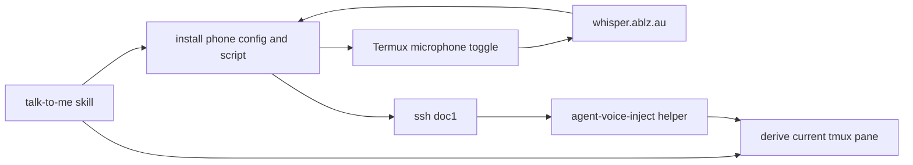

# feat: Add handsfree voice input to talk-to-me

## Summary

Extend the existing `talk-to-me` voice mode so the agent can bootstrap handsfree input as well as output: detect the current tmux pane, install/update a narrow Termux recorder script on the phone, transcribe through the existing Whisper endpoint, and paste the resulting text back into the active agent pane.

---

## Problem Frame

The current voice mode solves assistant output but not user input. The user still has to start and stop Android keyboard dictation and sometimes tap Enter, which is too distracting while driving or running. Because the user already runs agent sessions in tmux to view them from the phone, the input path can use the active tmux pane as the session sink instead of building a custom Android app, terminal emulator, or server-side agent controller.

---

## Requirements

**Session binding**

- R1. The skill must derive and surface the active tmux pane when the agent session is running inside tmux.
- R2. The setup must fail clearly for input bootstrap when the agent is not running in tmux, while preserving output-only voice mode where useful.
- R3. The input target must be specific to the current pane, not a broad "latest terminal" or shell-history guess.

**Phone-side capture**

- R4. The phone-side implementation must use existing Termux capabilities for v0, not a custom APK.
- R5. The phone trigger must behave as a toggle: first activation starts recording, second activation stops, transcribes, and submits.
- R6. Recording must have a maximum duration so stale or accidental captures cannot run indefinitely.
- R7. The script must give lightweight status feedback suitable for driving, preferably vibration/notification rather than long spoken prompts.

**Transcription and injection**

- R8. Audio must be sent to the existing tailnet-only Whisper endpoint with the default robust model.
- R9. Transcribed text must be injected into the exact registered tmux pane and submitted with Enter.
- R10. Injection must handle apostrophes, quotes, shell metacharacters, and whitespace safely.
- R11. Empty or failed transcriptions must not submit blank prompts to the agent.

**Skill integration**

- R12. The `talk-to-me` skill must be the operator-facing entry point; it should set up output TTS and input bootstrap in one run when possible.
- R13. The skill must leave enough diagnostics that the user can tell whether output, input, or both are live.
- R14. The implementation may include a tiny sideloaded trigger APK only as a thin button-to-Termux bridge; Android Auto remains out of scope.

**Least privilege**

- R15. The v0 design must not add an unauthenticated `/input` HTTP endpoint.
- R16. The phone's ability to inject input must be bounded to the configured tmux target as much as practical for the spike.
- R17. Any future broadening of phone access, HTTP input, or Android accessibility permissions must be treated as a separate least-privilege decision.

---

## Scope Boundaries

- Do not build a custom terminal or SSH client.
- Do not attempt to publish anything to Play Store.
- Do not attempt to make this a real Android Auto app.
- Do not require replacing the existing `claude-voice` SSE output bridge.
- Do not add always-on background microphone capture.
- Do not assume Tasker, AutoVoice, MacroDroid, or Automate is installed; detect trigger tooling and make the script usable without it for bench testing.
- Do not require Bluetooth headset media-button interception to call the MVP complete; Android may route those buttons to the active music app.

---

## Key Technical Decisions

- **Use tmux as the input sink:** The user already runs phone-visible agent sessions in tmux, so pane injection is the smallest reliable bridge between phone text and the active agent UI.
- **Keep v0 on Termux scripts:** Termux already has microphone recording, curl, SSH, vibration, and notification helpers on the phone. A script is faster to validate and easier to change than an APK.
- **Install helpers from the skill:** The skill can derive the current pane and push session-specific config to the phone, so the user does not need to manually edit hostnames, pane ids, or Whisper settings.
- **Inject via buffer/paste, not shell-quoted keystrokes:** Speech text can contain quotes and shell metacharacters. The server-side helper should read transcript text on stdin, load it into a tmux buffer, paste it into the pane, then send Enter.
- **Use SSH for v0 instead of HTTP input:** Existing phone-to-doc1 SSH avoids introducing a new authenticated web endpoint. If this proves useful, a tighter forced-command SSH key or tokened local input endpoint can be planned separately.
- **Treat hardware-button binding as a thin trigger layer:** The core recorder/transcribe/inject script should work from manual invocation first. The sideloaded trigger app, Tasker/AutoVoice/media-button binding, or a dedicated BLE button is then only a way to call that same script.

---

## High-Level Technical Design

The setup is session-oriented. Each time voice mode starts, the skill discovers the current tmux target and writes that target into phone-side config. The phone trigger does not need to discover the agent; it only records, transcribes, and sends text to the registered sink.

---

## Implementation Units

### U1. Add tmux Target Detection to the Voice Skill

**Goal:** Make the active agent pane an explicit runtime artifact that the skill can show and pass to phone-side input setup.

**Requirements:** R1, R2, R3, R12, R13.

**Files:**

- Modify: `.claude/skills/talk-to-me/SKILL.md`
- Add: `.claude/skills/talk-to-me/scripts/agent-voice-detect-tmux.sh`
- Test: no dedicated unit test; verify through tmux and non-tmux shell scenarios.

**Approach:**

- Detect whether `$TMUX` is present and `tmux display-message` can resolve `#{session_name}:#{window_index}.#{pane_index}`.
- Also capture useful diagnostics such as pane tty and current command for human-readable confirmation.
- If tmux detection fails, keep the current output-mode bootstrap available but clearly mark handsfree input as unavailable.
- Include a troubleshooting path that lists candidate panes with `tmux list-panes -a` when the current shell is not itself inside tmux.

**Test scenarios:**

- In a tmux-backed agent session, detection returns the current target and command.
- Outside tmux, the skill does not guess; it reports that input bootstrap requires tmux.
- With multiple tmux sessions, the skill binds to the current pane rather than the first or most recent pane.

### U2. Add a Narrow Server-Side tmux Injection Helper

**Goal:** Provide one safe command the phone can call over SSH to paste stdin into the registered pane and press Enter.

**Requirements:** R9, R10, R11, R15, R16.

**Files:**

- Add: `.claude/skills/talk-to-me/scripts/agent-voice-inject.sh`
- Modify: `.claude/skills/talk-to-me/SKILL.md`
- Test: no dedicated unit test; verify with local tmux panes and text containing shell metacharacters.

**Approach:**

- Accept the target pane as an argument or config value supplied by the skill.
- Validate that the target matches a conservative tmux target pattern and exists before reading input.
- Read transcript text from stdin.
- Reject empty input after trimming whitespace.
- Load the text into a named tmux buffer, paste that buffer into the target pane, then send Enter.
- Prefer whitespace normalization for v0 so dictated text becomes a single prompt unless a later command grammar deliberately supports multiline input.

**Test scenarios:**

- Text containing apostrophes, quotes, dollar signs, semicolons, and backticks is pasted as literal text.
- Empty stdin exits without sending Enter.
- A missing or invalid pane exits non-zero and does not paste anywhere else.
- A normal sentence appears in the agent prompt and submits exactly once.

### U3. Add the Phone-Side Termux Toggle Script

**Goal:** Turn a hardware-button or shortcut invocation into record/stop/transcribe/inject behavior.

**Requirements:** R4, R5, R6, R7, R8, R9, R11.

**Files:**

- Add: `.claude/skills/talk-to-me/scripts/agent-voice-input-termux.sh`
- Modify: `.claude/skills/talk-to-me/SKILL.md`
- Test: no dedicated unit test; verify on the phone through SSH and manual Termux invocation.

**Approach:**

- Store phone-side state under a narrow Termux-owned directory, for example the current recording path and whether capture is active.
- On first invocation, start `termux-microphone-record` with a bounded duration and a Whisper-compatible format.
- On second invocation, stop recording, POST the audio to `https://whisper.ablz.au/v1/audio/transcriptions` with model `large`, extract `.text`, and SSH the text to the injection helper on doc1.
- Use vibration or notification feedback for "recording started", "sent", and "failed" states.
- Recover from stale state by checking Termux microphone status or clearing the state file when no recording is active.

**Test scenarios:**

- First invocation starts recording and records the file path in state.
- Second invocation stops recording, transcribes, and injects the text.
- If Whisper is unreachable, the script reports failure and does not inject stale text.
- If the recording limit expires before the second trigger, the next invocation recovers and either submits the completed audio or resets cleanly.
- If SSH injection fails, the transcript is preserved locally for retry/debugging.

### U4. Teach the Skill to Install and Refresh Phone Config

**Goal:** Let the agent do the mechanical setup each session so the user does not manually edit the phone.

**Requirements:** R12, R13, R16.

**Files:**

- Modify: `.claude/skills/talk-to-me/SKILL.md`
- Add or modify scripts under: `.claude/skills/talk-to-me/scripts/`
- Test: no dedicated unit test; verify over SSH to the phone.

**Approach:**

- Keep the existing phone TTS bootstrap unchanged.
- After tmux detection, push the Termux script and config to the phone with the current target, doc1 SSH alias, Whisper URL, and model.
- Push or refresh the server-side injection helper on doc1 if it is missing or outdated.
- Run a dependency check on the phone for `termux-microphone-record`, `curl`, `jq`, `ssh`, and optional feedback commands.
- Report a short status summary: output subscriber status, input target, phone script path, and missing trigger-app state if relevant.

**Test scenarios:**

- Running the skill twice refreshes scripts/config without duplicating services or stale state.
- If the phone is offline, output registration fails as it does today and input setup is not falsely reported as live.
- If a Termux dependency is missing, the skill names the missing command and leaves output mode behavior unchanged.
- If the tmux target changes between sessions, the phone config updates to the new target.

### U5. Add Trigger Binding Guidance, Tiny APK, and Bench Verification

**Goal:** Make the first usable trigger path clear without locking the design to one unreliable Android media-button route.

**Requirements:** R5, R7, R13, R14.

**Files:**

- Modify: `.claude/skills/talk-to-me/SKILL.md`
- Modify: `docs/wiki/claude-code/handsfree-android-voice-input.md`
- Add: `tools/agent-voice-trigger-android/`
- Test: no dedicated unit test; verify manual invocation and at least one installed trigger path when available.

**Approach:**

- Define a bench test that invokes the Termux script directly over SSH or from Termux before involving hardware buttons.
- Detect whether likely trigger apps are installed. On the checked phone, no Tasker/AutoVoice/MacroDroid/Automate package was observed, so do not assume one.
- Document the intended binding as "call the Termux script from a trigger surface"; the core behavior remains independent of the trigger app.
- Keep the APK intentionally small: app button, foreground media listener, optional accessibility key-filter experiment, and Termux RUN_COMMAND dispatch only.
- Record that Bluetooth headset media buttons may still be owned by the active music app and are not a reliable MVP success criterion.

**Test scenarios:**

- Manual trigger from Termux works end-to-end before any hardware-button integration.
- App button trigger works end-to-end through Termux and Whisper.
- Repeated rapid triggers do not corrupt state or submit duplicate prompts.
- The skill can tell the user whether a trigger app still needs one-time Android-side setup.
- Hardware-trigger testing can be done without changing the core script.
- If headset media-button capture only controls music, document that as an Android routing limitation rather than continuing to tweak the recorder path.

---

## Acceptance Examples

- AE1. Given the agent is running inside tmux, when the user starts `talk-to-me`, then the skill reports the bound tmux target and installs phone-side input config for that target.
- AE2. Given the user presses the configured phone trigger once, when the Termux script runs, then recording starts and bounded status feedback fires.
- AE3. Given recording is active, when the user presses the trigger again from Termux or the trigger app button, then recording stops, audio is transcribed by `whisper.ablz.au`, and the transcript is submitted to the active agent pane.
- AE4. Given Whisper returns empty text, when the stop trigger completes, then no Enter is sent to the agent.
- AE5. Given the transcript contains shell-sensitive punctuation, when it is injected, then it appears as literal prompt text rather than being interpreted by the shell.
- AE6. Given the agent is not in tmux, when `talk-to-me` runs, then output voice mode can still start but input setup is explicitly unavailable.

---

## Risks & Dependencies

- **Hardware-button reliability is device-dependent:** Tasker/AutoVoice/media-button capture may vary by car, earbuds, and active media apps. Live testing showed Bluetooth headset play/pause can remain owned by the music app. The core script must stay trigger-agnostic so a different trigger can call it.
- **Phone SSH authority is broader than ideal:** The v0 path uses existing SSH because it is available and simple. A follow-up hardening pass should consider a forced-command key or tiny authenticated input service if this becomes a daily workflow.
- **tmux paste behavior depends on the agent TUI:** The implementation should verify bracketed paste behavior with the active agent UI and normalize whitespace if multiline paste creates accidental submissions.
- **Audio format support should be verified live:** Termux supports several encoders and the Whisper server converts common formats with ffmpeg, but the exact low-latency format should be chosen by phone-side testing.

---

## Operational Notes

- The skill should preserve the current `talk-to-me` contract: when output voice registration succeeds, the next assistant reply should be short and voice-friendly.
- Input status should be explicit but brief, for example "Voice output is live; input is bound to tmux target 0:0.0."
- Phone-side transcripts should be kept only long enough for retry/debugging and should be stored under a narrow temp/cache directory.
- Do not deploy remote NixOS changes for this v0 unless implementation later chooses to modify the NixOS `claude-voice` service. The current plan is skill/script-only.

---

## Sources

- `docs/wiki/claude-code/handsfree-android-voice-input.md`
- `.claude/skills/talk-to-me/SKILL.md`
- `modules/nixos/services/claude-voice.nix`
- `modules/nixos/services/whisper-server.nix`
- Android media buttons: https://developer.android.com/media/legacy/media-buttons
- Android `ACTION_VOICE_COMMAND`: https://developer.android.com/reference/android/content/Intent#ACTION_VOICE_COMMAND
- Android foreground service types: https://developer.android.com/develop/background-work/services/fgs/service-types
