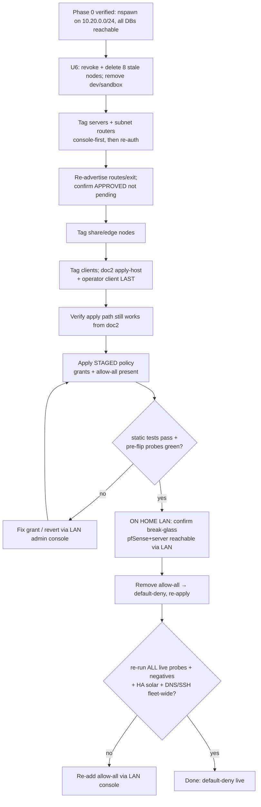

# feat: Tailscale least-privilege ACL + nspawn renumber

## Summary

Replace the default-allow tailnet with a repo-authoritative `grants`-based policy on four role tags (`server`/`client`/`share`/`edge`), applied self-hosted from doc2 via `gitops-pusher`. A pre-requisite renumber of the nspawn container network (`192.168.100.0/24 → 10.20.0.0/24`) clears the collision with the Cullen site route and must land + verify before the default-deny flip. The cutover is staged and **run from the home LAN** (so the LAN-only pfSense break-glass is reachable), with all preserve-or-die paths re-verified by live probes *after* the flip.

---

## Problem Frame

The tailnet is default-allow: every device reaches every port on every other device, and the whole fleet is user-owned (zero tags). `modules/nixos/profiles/base.nix:322-329` already justifies passwordless full-CLI `tailscale` with "the trust boundary is the tailnet ACL, not local sudo" — a boundary that was never written. The unique leverage of a tailnet ACL is at *device* granularity (a popped container already holds its host's identity — that is #232's job), so the policy constrains whole devices that should not be full-mesh peers: personal clients, exposed share sidecars, inbound-only edge nodes, and stale nodes.

The renumber is a hard pre-req, not scope creep: `192.168.100.0/24` is simultaneously the fleet's local nspawn service network *and* the Cullen site LAN reached over a tailnet route. Until that collides no more, the Cullen grant is fragile and a fleet host can never reach a real Cullen host (it resolves to its own nspawn bridge). See origin: `docs/brainstorms/2026-06-07-tailscale-acl-least-privilege-requirements.md`.

---

## Key Technical Decisions

- **`grants` syntax, not classic `acls`.** Tailscale recommends `grants` for all new policy as of 2026; classic `acls` are frozen. Authored in `grants`.
- **Self-hosted apply via `gitops-pusher` on doc2.** A standalone Go binary (not GitHub-specific) doing ETag-guarded `If-Match` apply against `api.tailscale.com`. doc2 already runs tailnet-share machinery, holds host-scoped secrets, and is the Gotify host. No GitHub Actions (repo runs none; deploys via `rolling-flake-update.service`).
- **OAuth scope is `policy_file`** (the `acl` name is gone), host-scoped in sops so it decrypts only on doc2. A leaked secret rewrites the whole policy → least-scope + one host + rotation + egress-restricted service + audit-log detection.
- **`tests {}` is static-only** (confirmed). It asserts policy accept/deny decisions, not on-wire reachability — so (a) write **precise** assertions (exact inverter `/32`s + an adjacent-IP *deny* test, exact DNS/SSH pairs) to catch grant typos statically, and (b) live probes are mandatory and must run **after** the flip, not only before.
- **Cullen is locked to wsl + the two inverters — nothing else.** The fleet's only reach into the Cullen site is `framework → wsl:22` (the deploy/dev path; wsl is the handler for Cullen-side mounts and everything else) and `HA → 192.168.100.139/32 + 192.168.100.133/32` (solar). No fleet node gets the broad `192.168.100.0/24`. The `/24` route stays *advertised* (required for the inverter `/32`s to be routable) but *access* is grant-gated to exactly those destinations. Deny-by-default for the Cullen subnet; new `/32`s added only on proven need. (Supersedes origin R10's "full /24 + optional host-firewall" framing — the `/32` pin lives in `acl.hujson`, no Windows-side firewall.)
- **wsl-SSH is `framework`-only, via a `hosts` alias — no new key.** Restricting who reaches wsl is an ACL `src` restriction, independent of SSH key auth. A `hosts` alias pins `framework` to its tailnet IP; `src:["framework"], dst:["wsl-router"], ip:["tcp:22"]`. wsl runs OpenSSH over the Windows portproxy (`:22`), so this is a `grants` rule, not the `ssh{}` block. Re-pin the alias only if framework is ever re-added (fails closed).
- **Tag live nodes admin-console-first, then re-auth.** CLI `--advertise-tags` on a live node without force-reauth expires/disconnects it (Tailscale #13572). Console-first; tag the apply host (doc2) and the operator's own client **last**.
- **Staged cutover, run from the home LAN.** Explicit grants land alongside allow-all (to test the *apply mechanism* non-destructively); grant *correctness* is proven by static `tests{}` on the final (allow-all-removed) policy; the flip is executed from the home LAN so the LAN-only pfSense/SSH break-glass is reachable; all live probes re-run after the flip gates irreversibility.
- **`autoApprovers` use tags, apply only at advertise time** — re-advertise routes/exit after the policy lands and confirm "approved" (not pending) before the flip.

---

## Requirements Trace

| Origin requirement | Covered by |
|---|---|
| R1–R3 nspawn renumber (Phase 0 pre-req) | U1, U2 |
| R4 four tags + tagOwners | U3 |
| R5 server mesh open | U3 |
| R6 client → server allowlist | U3 |
| R7 share inbound-443-only, no share→fleet | U3 |
| R8 edge no implicit fleet egress | U3 |
| R9 route grants (home/dad/Cullen/kerrynas) | U3 |
| R10 Cullen pinned — **plan supersedes origin: `/32` in-ACL + framework-only wsl, not full /24** | U3, U8 |
| R11 exit-node use (tower) | U3 |
| R12 DNS to pfSense:53 (tcp+udp) preserved | U3, U5 |
| R13 SSH preserved (ssh{} + :22) | U3, U5 |
| R14 roaming client → home LAN via tower route | U3, U5 |
| R15 repo-authoritative, self-hosted apply | U4 |
| R16 tests{} + live probes before AND after apply | U3, U4, U5, U7 |
| R17 policy_file OAuth in sops, host-scoped, rotatable | U4 |
| R18 tag all before flip; doc2 + self last | U7 |
| R19 revoke+delete 8 stale; remove dev/sandbox | U6 |
| R20 future joins tag-owned | U7 (config), U8 (doc) |
| R21 post-apply live verify + negative tests | U5, U7 |
| R22 tailnet-independent break-glass (home-LAN) | U7 |

---

## High-Level Technical Design

**Tag → access matrix (the policy in one view):**

| tag | reach (dst) | reachable by (src) |
|---|---|---|
| `server` | full mesh; `kerrynas` (backup ports only) | mesh; `client` (allowlist) |
| `client` | `server` {tcp 22, tcp 443}; pfSense {tcp+udp 53}; `192.168.0.0/23` (home via tower); `192.168.2.0/24` (dad via rpi); `autogroup:internet` (exit) | — |
| `share` | nothing in fleet (443-only inbound is sidecar-enforced) | shared-in users (other tailnet) |
| `edge` | HA only: `192.168.100.139/32`,`192.168.100.133/32` (inverters); none else | `server`/`client` on specific ports |
| host `framework` | `wsl-router:22` (the ONLY fleet→Cullen-node path) | — |

**Migration sequence (U6 → U7) — the high-risk path:**

---

## Implementation Units

### Phase 0 — nspawn renumber (hard pre-req)

### U1. Renumber the nspawn service network to `10.20.0.0/24`

- **Goal:** Change the nspawn address base fleet-wide; the `(hostNum*2)` formula is unchanged.
- **Requirements:** R1, R2.
- **Dependencies:** none.
- **Files:**
  - `modules/nixos/lib/mk-pg-container.nix` (addressing :71-72; comment :12; the `${hostAddress}/32` pg_hba rule moves automatically)
  - `modules/nixos/lib/mk-mariadb-container.nix` (addressing :36-37; comment :10-11; `'<user>'@'${hostAddress}'` grant moves automatically)
  - `modules/nixos/services/tailscale/subnet-priority.nix` (the `/24` CIDR + `label` :44; header comment :8)
  - `modules/nixos/services/probes/check-immich-sync.nix` (the `192.168.100.5` fallback default :38)
  - `modules/nixos/services/jellyfin.nix` (comments :37,39,54 — **including the `:54` pg_hba auth comment**, which would otherwise misdirect anyone debugging a `10.20.0.14` auth failure)
  - **Preserve unchanged:** `hosts.nix:86` `localIp = 192.168.100.128` (the one genuine Cullen literal in the Nix tree).
- **Approach:** Replace the `"192.168.100"` base with `"10.20.0"` in both helpers. The 10 consumers (atuin=1, immich=2, paperless=3, mealie=4, cratedigger=5, discogs=6, jellystat=7, meelo=8, youtarr=9/MariaDB, musicbrainz=10) derive their IPs from the helper return — verified zero hardcoded `192.168.100.x` literals among them — so they propagate automatically. The pg_hba/MariaDB grant is pinned to `${hostAddress}/32` and moves in lockstep. The subnet-priority `ip rule` (priority 2490) is the one place a stale CIDR silently breaks DB reachability — change it in the same commit.
- **Patterns to follow:** existing helper structure; `lib.boolToString` (never `toString`) for any bool in a generated bash guard.
- **Execution note:** Do NOT add `FailureAction`/`OnFailure=poweroff` to nspawn units — it wedges the PID namespace (host reboot to recover). Confirm each consumer already carries `restartTriggers = [config.systemd.units."container@<svc>-db.service".unit]`.
- **Test scenarios:**
  - `nix flake check` evaluates clean.
  - Built config shows each container on `10.20.0.x` (atuin `.2/.3`, youtarr `.18/.19`, musicbrainz `.20/.21`).
  - `subnet-priority.nix` renders the `ip rule` for `10.20.0.0/24`.
  - `grep -rn '192\.168\.100\.' modules/` returns **zero** hits (including comments) — only `hosts.nix:86` (the preserved Cullen literal) remains in the tree.

### U2. Deploy Phase 0 and verify every DB reachable on the new network

- **Goal:** Prove the renumber broke nothing before any ACL work (the R3 gate).
- **Requirements:** R2, R3.
- **Dependencies:** U1.
- **Files:** none (operational; record results in the U8 wiki).
- **Approach:** Deploy per host (`git push` then `ssh <host> "sudo nixos-rebuild switch --flake github:abl030/nixosconfig#<hostname> --refresh"`). The deploy restarts all nspawn containers near-simultaneously. Recovery if a DB won't accept TCP: `sudo machinectl shell <name>-db` → `sudo -u postgres psql`.
- **Verification (per host, in order — the rule and the addressing land in the same switch but the reconcile timer can lag):**
  1. `ip rule show` lists the `10.20.0.0/24` rule and **not** the stale `192.168.100.0/24` rule.
  2. Each of the 10 DBs reachable from its host on the new `10.20.0.x` host-veth IP; each consuming service healthy.
  3. The musicbrainz `pg_amqp` → RabbitMQ bridge on `10.20.0.20:5672` works (the one non-DB use of the host veth; confirm the amqp setup unit actually ran and self-healed the stored broker IP).
  4. `check-immich-sync` + immich/musicbrainz/kopia deepProbes green; no DB-connection errors in Loki over the window.
- **Test scenarios:** `Test expectation: none -- operational verification unit; coverage is the deploy + ordered checks above.`

### Phase 1 — ACL authoring + self-hosted apply

### U3. Author the `grants` policy file (staged: explicit grants + allow-all + precise tests)

- **Goal:** Write `tailscale/acl.hujson` with the full policy, route/exit grants, ssh block, autoApprovers, and **precise** `tests{}` — with `*:*` allow-all still present so the apply is non-breaking.
- **Requirements:** R4–R14, R16 (tests half).
- **Dependencies:** none (authored in parallel with Phase 0; applied in U7).
- **Files:** `tailscale/acl.hujson` (new).
- **Approach:**
  - `tagOwners`: `tag:{server,client,share,edge}` → `["autogroup:admin"]`.
  - `hosts`: `pfsense` → `100.123.61.111`; `framework` → `100.78.17.73`; `wsl-router` → laptop-btibh4ie `100.75.246.114`.
  - `grants`: server↔server `["*"]`; client→server `["tcp:22","tcp:443"]`; client→`pfsense` `["tcp:53","udp:53"]` (DNS — both protos, TCP is load-bearing here); client→`192.168.0.0/23` (home/cache/NFS via tower) and `192.168.2.0/24` (dad via rpi); client→`autogroup:internet` (exit); **`framework`→`wsl-router` `["tcp:22"]`** (the only fleet→Cullen-node path); **edge(HA)→`["192.168.100.139/32","192.168.100.133/32"]`** (Cullen inverters — port per Open Questions; widen-then-narrow if unknown at flip); server(doc2/pfsense)→`kerrynas` on the **backup ports only** (kopia repo port + tcp:22 for syncoid — confirm exact ports). Keep one `{src:["*"],dst:["*"],ip:["*"]}` allow-all (removed in U7).
  - `ssh {}`: `action:"check"`, src `tag:client`+`tag:server`, dst `tag:server`, users `autogroup:nonroot` (a curated policy with no ssh rule disables Tailscale SSH). Note: wsl uses OpenSSH on `:22`, governed by the `framework→wsl-router` grant above, NOT this block.
  - `autoApprovers`: `routes` { `192.168.0.0/23`→`tag:server`, `192.168.100.0/24`→`tag:client`, `192.168.2.0/24`+`192.168.4.0/23`→`tag:edge` }; `exitNode`→`["tag:server"]`. **Note:** the exit approver is tag-server-wide — only tower advertises exit today; if another server ever advertises exit it is auto-approved. Document this (U8); revisit with a dedicated `tag:exit` if more exit nodes appear.
  - `tests {}` (precise, so they catch grant typos statically despite allow-all): a fleet host *accepts* `pfsense:53` (proto tcp); client *accepts* `server:22`,`server:443` and *denies* a non-allowlisted server port; edge *accepts* `192.168.100.139:<port>` and *denies* `192.168.100.140:<port>` (adjacent IP) and *denies* a fleet node; share *denies* a server node; `framework` *accepts* `wsl-router:22` and a non-`framework` client *denies* `wsl-router:22`. `sshTests` for the admin SSH path.
  - **Share caveat (R7):** the ACL cannot name shared-in users (other tailnet); 443-only is sidecar-enforced. The ACL's share job is solely "no `tag:share`→fleet path."
- **Patterns to follow:** reference via `builtins.path` from U4; HuJSON (comments + trailing commas).
- **Test scenarios:**
  - `gitops-pusher test` / `POST /acl/validate` returns `{}` for the **final** (allow-all-removed) policy with all accept+deny assertions passing — this is the real grant-correctness gate, independent of allow-all.
  - `tailscale debug policy-file tailscale/acl.hujson` reports valid HuJSON.
  - The allow-all rule is present and clearly marked for U7 removal.

### U4. Self-hosted apply mechanism on doc2 (`gitops-pusher` + sops `policy_file` secret)

- **Goal:** A trusted-host module that validates and applies `acl.hujson` with ETag-guarded `If-Match`, with a defined credential lifecycle.
- **Requirements:** R15, R16 (apply half), R17.
- **Dependencies:** U3.
- **Files:**
  - `modules/nixos/services/tailscale/acl-apply.nix` (new) — imported by `modules/nixos/services/tailscale/default.nix`
  - `secrets/.sops.yaml` (new `path_regex` rule above the catch-all: Master Fleet Identity + doc2 only)
  - `secrets/hosts/doc2/tailscale-acl-oauth.env` (new sops secret: `policy_file` OAuth client id+secret + tailnet)
  - `hosts/doc2/configuration.nix` (enable)
- **Approach:** Mirror `modules/nixos/services/komga-sync.nix`: dedicated system user; sops secret (`config.homelab.secrets.sopsFile`, `format="dotenv"`, `mode="0400"`, owner = service user) auto-host-scoped via the `.sops.yaml` rule; `Type=oneshot` running `gitops-pusher apply --policy-file=${builtins.path acl.hujson} --fail-on-manual-edits=true`; hardened `serviceConfig` (NoNewPrivileges, ProtectSystem=strict, minimal BindReadOnlyPaths) **plus `IPAddressAllow` restricting egress to `api.tailscale.com`** so a compromised service user can't exfil the credential elsewhere; `unitConfig.OnFailure` → Gotify notify (a 401 = expired/revoked credential). No timer — invoke on deploy. **Store `version-cache.json` in a state dir on doc2** (`StateDirectory=tailscale-acl-apply`, cache at `/var/lib/tailscale-acl-apply/version-cache.json`), NOT in the repo — it is a per-apply operational artifact, not policy. Lock the admin-console policy editor so manual edits can't drift.
- **Credential lifecycle (R17):** create the `policy_file`-scoped OAuth client in the Tailscale "Trust credentials" page; store id/secret in the sops file. Rotation: create a new client, re-sops, redeploy doc2, delete the old client (no in-place secret reset). Revocation path on suspected doc2 compromise: delete the client in the console (instantly invalidates), then re-key. Do NOT reuse the orphaned authkey-scoped `secrets/tailscale-oauth.yaml`.
- **Patterns to follow:** `komga-sync.nix`; the two narrow `.sops.yaml` rules (`musicbrainz-pgpass.env`, `syncoid-pfsense-key`).
- **Test scenarios:**
  - `nix flake check` clean; secret `mode=0400` owned by the service user; decrypts only on doc2.
  - `gitops-pusher test` (validate-only) against the final policy succeeds from doc2.
  - A dry apply against the staged policy succeeds and writes the cache to `/var/lib/...`; a second run is a no-op (ETag match); `git status` stays clean (no cache file in the tree).
  - `Covers AE3.` A policy dropping the DNS or SSH grant fails `gitops-pusher test` → apply blocked.

### U5. Live reachability probes (run before AND after the flip)

- **Goal:** Continuous + cutover probes proving the preserve-or-die paths `tests{}` can't see.
- **Requirements:** R16, R21.
- **Dependencies:** U4.
- **Files:** `modules/nixos/services/probes/check-acl-paths.nix` (new); wired into `homelab.monitoring.deepProbes` for continuous health.
- **Approach:** Mirror `check-immich-sync.nix`. Probes a fleet host can run: pfSense `:53` (tcp) resolves; an `server:22` banner; home-LAN route (nix cache `192.168.1.29` / NFS `192.168.1.2`); `kerrynas` backup reachability; exit-node egress through tower. Honor the Kuma cadence gotcha (`intervalSecs` ~25-50% > probe cadence). The module is retained for **continuous post-cutover health**; the migration-time negative checks (client→non-allowlisted, edge→fleet, share→server) are run by hand in U7 (`tailscale ping`/`nc`), and the **HA→Cullen path is a permanent manual gap** (HA is HA OS, not a fleet probe host) — checked via HA's solar entities, documented as such, not an oversight.
- **Test scenarios:**
  - Each probe healthy against the staged policy (pre-flip) AND re-run green after the flip (U7 gates on this).
  - `Covers AE2.` HA solar entities still updating post-flip (out-of-band manual check).

### Phase 2 — migration & cutover

### U6. Tailnet hygiene: revoke + delete 8 stale nodes; remove `dev` + `sandbox`

- **Goal:** Cull stale attack surface (revoke keys first) and remove two dead host definitions entirely.
- **Requirements:** R19.
- **Dependencies:** none (the revoke is the first migration action).
- **Files:** `hosts.nix` (remove `dev`, `sandbox` entries); `hosts/dev/`, `hosts/sandbox/` (remove dirs if present); `secrets/.sops.yaml` (drop the now-dead `dev`/`sandbox` age-key anchors); check flake/CI references (`knownHosts` auto-derives from `allHosts`).
- **Approach:** Console — **revoke/expire keys then delete** the 8 stale nodes: `mailstore`, `epimetheus-vm`, `sandbox`, `dev`, `immich`, `invoices`, `caddy-1`, `jellyfin`. Repo — remove `dev` + `sandbox` from `hosts.nix`, delete their dirs, drop their `.sops.yaml` anchors.
- **Test scenarios:**
  - `nix flake check` passes (no dangling `allHosts.dev`/`allHosts.sandbox`).
  - No remaining `dev`/`sandbox` host definitions or sops anchors.
  - `tailscale status` no longer lists the 8 stale nodes.

### U7. Tag the live fleet, apply staged policy, verify, then flip to default-deny (from the home LAN)

- **Goal:** The lockout-safe cutover (see the HTD sequence).
- **Requirements:** R18, R20, R21, R22.
- **Dependencies:** U2, U3, U4, U5, U6.
- **Files:** none (operational; uses U3 policy + U4 apply + U5 probes).
- **Approach (ordered):**
  1. **Tag servers + subnet routers** (`tower`, `laptop-btibh4ie`/wsl, pfSense) **console-first then re-auth** (avoid #13572). wsl/laptop-btibh4ie → `tag:client`; confirm the `framework→wsl-router:22` grant covers the deploy path.
  2. **Re-advertise** each route + exit node (tower, laptop, rpi, kerrynas) and confirm each shows **approved** (not pending) in `tailscale status` — autoApprovers are not retroactive.
  3. **Tag share + edge nodes.**
  4. **Tag clients last**, with **doc2 (the apply host) and the operator's own client tagged at the very end**; after tagging doc2, **verify `gitops-pusher` still applies from doc2** before proceeding (the revert tool lives on the node being reconfigured).
  5. **Pre-flip verify (staged, allow-all present):** static `tests{}` pass on the final policy (the real grant gate); U5 probes green. **Verify the HA Gotify URL** (HA admin UI) — if it's a tailnet address, add `tag:edge → doc2:<gotify-port>` to U3 before flipping; if LAN/public, nothing to do.
  6. **On the home LAN:** confirm the break-glass is live — pfSense GUI/SSH and direct SSH to one server reachable over the **LAN** (pfSense admin is LAN-only as of 2026-06-07, so this step MUST be run from `192.168.1.0/24`).
  7. **Remove the allow-all grant** (flip to default-deny), re-apply.
  8. **Post-flip verify (gates irreversibility):** re-run ALL U5 probes; DNS + SSH fleet-wide (Loki `{host=~"doc2|igpu|framework"}`); exit egress; HA solar entities; negative checks (client→non-allowlisted denied, edge→fleet denied, share→server denied, non-framework client→wsl denied). If any fail, re-add allow-all via the **LAN admin console** (the true tailnet-independent revert).
  9. Set future joins (share authkeys, fleet OAuth) to mint tag-owned nodes (R20).
- **Execution note:** High-risk, interactive, **run from the home LAN**, break-glass confirmed before step 7. Every change is in the Tailscale audit log and console-revertible.
- **Test scenarios:**
  - `Covers AE5, AE6.` All negative checks deny; the operator session is never stranded (break-glass restores via LAN if it is).
  - DNS resolves fleet-wide immediately post-flip; no `context deadline exceeded` spike in Loki.

### Phase 3 — documentation

### U8. Wiki: ACL doc with LOUD Cullen footgun + renumber ref updates + future-join config

- **Goal:** Durable docs; make the Cullen-lockdown trap impossible to miss.
- **Requirements:** R10, R20.
- **Dependencies:** U7.
- **Files:**
  - `docs/wiki/infrastructure/tailscale-acl.md` (new)
  - `docs/wiki/infrastructure/pfsense-dns-resolver.md` (cross-link the `:53`-preserved grant + the home-LAN-break-glass dependency)
  - `docs/wiki/services/{meelo,musicbrainz,youtarr,jellyfin}.md`, `docs/wiki/infrastructure/tailscale-lan-priority.md`, `docs/wiki/nixos-service-modules.md:335` (renumber'd IPs + nspawn CIDR example)
  - issue #239 / #232 close-out notes
- **Approach:** New wiki doc covering the four-tag model + `framework`/`hosts`-alias scoping, the `gitops-pusher`/`policy_file`/ETag apply path **and credential rotation/revocation runbook**, **how future joins are configured tag-owned (R20)**, the migration runbook, the **home-LAN break-glass requirement**, and the tag-server-wide exit-approver note. **A LOUD, boxed warning** for the Cullen lockdown: *The fleet reaches ONLY `framework→wsl:22` and `HA→the two inverter /32s`. The `192.168.100.0/24` route existing is NOT enough — any new Cullen device the fleet must reach needs its `/32` added to a grant (and `framework`/wsl is the intended handler for Cullen-side resources). This will silently deny a future project that assumes the route grants LAN-wide access.* Sweep every renumber'd `192.168.100.x` doc reference to `10.20.0.x`.
- **Test scenarios:** `Test expectation: none -- documentation unit.`

---

## Scope Boundaries

- No server↔server microsegmentation — the mesh stays open (container blast radius is #232).
- No per-service `share-*` tags; no `tag:guest`.
- No GitHub Actions / third-party CI for apply.
- The nspawn renumber changes addressing only — not `mk-pg-container` auth design (#232).
- No Windows-side firewall for Cullen — the `/32` ACL grant + `framework`-only wsl access achieve it in-repo.
- No 5th tag for framework — a `hosts` alias scopes it (revisit only if alias re-pinning becomes a chore).

### Deferred to Follow-Up Work

- Per-key OAuth scoping beyond `policy_file` (Tailscale has no per-key source-IP binding today).
- A dedicated `tag:exit` (only if more exit nodes are added; today only tower advertises exit).
- `tower`'s non-NixOS mesh membership (no #232 compensating control) — separate hardening.
- Migrating `caddy`/`downloader` (un-nix legacy VMs in `tag:server`) into Nix — tracked residual.

---

## Risks & Dependencies

- **Hard dependency: Phase 0 before the flip (R3).** AE4 — applying the ACL while nspawn still shares `192.168.100.0/24` leaves the Cullen grant ambiguous.
- **#1 lockout risk: DNS on `:53`.** Fleet forwards DNS to pfSense over the tailnet via **TCP/53**; the client→`pfsense` grant must cover tcp+udp 53, guarded by a `tests{}` assertion. A miss darks resolution fleet-wide in seconds.
- **Break-glass requires home-LAN presence.** pfSense admin (GUI/SSH) is LAN-only as of 2026-06-07, so the flip MUST be run from `192.168.1.0/24` or the recovery path is unreachable.
- **Allow-all masks grant correctness** until removed — so grant validation relies on **precise static `tests{}` on the final policy** (exact IPs/ports + adjacent-deny), and ALL live probes re-run **after** the flip, not only before.
- **doc2 is apply host AND a tagged node** — tag it last among servers and re-verify the apply path before the flip; the LAN console revert (not doc2) is the true fallback.
- **Cullen inverter port is unverified** (HA OS, outside repo) — resolve before the flip or widen-then-narrow (see Open Questions); a wrong port silently darks solar after default-deny.
- **`autoApprovers` aren't retroactive** — re-advertise routes/exit and confirm approved before the flip (U7 step 2).
- **Tagging a live node can disconnect it** (#13572) — console-first, then re-auth.
- **nspawn restart on renumber** — `restartTriggers` present; never `FailureAction`/`OnFailure=poweroff` (pidns wedge).
- **Deploy discipline:** never rebuild from a stale local checkout; `git push` + `--refresh` per host.

---

## Open Questions

### Resolve Before the Flip

- **Cullen inverter port(s).** `pysmaplus`→SMA STP can use HTTPS (`tcp:443`), Speedwire (`udp:9522`), or Modbus (`tcp:502`) — not knowable from the repo. Capture on laptop-btibh4ie or read the HA integration config, then author the `edge→Cullen` grant to match (or widen the grant to all ports, flip, observe the real port, then narrow). The flip must not proceed until HA→Cullen is confirmed working through the narrow grant with allow-all removed.

### Deferred to Implementation

- Exact `gitops-pusher` packaging (nixpkgs attr vs `buildGoModule`).
- The exact `kerrynas` backup ports for the server→kerrynas grant (kopia repo port + syncoid `:22`).
- Whether any `tag:client`→`server` service beyond {22,443} surfaces during U7 (a direct port not behind caddy) — add to the allowlist only if a real gap appears.

---

## Sources & Research

- Origin: `docs/brainstorms/2026-06-07-tailscale-acl-least-privilege-requirements.md` (issue #239).
- Tailscale policy mechanics (2026): grants-recommended; `tests{}` static-only (confirmed via `gitops-pusher` source); `ssh{}` fail-closed-when-curated; `policy_file` OAuth scope; `If-Match`/ETag apply; `/32` `dst` valid inside a wider advertised route; autoApprovers non-retroactive — KB 1018/1337/1193/1019/1103/1068/1215/1204/1306 + `cmd/gitops-pusher`.
- Migration footguns: #13572 (tag-disconnect), approval≠access, exit `autogroup:internet`, key-expiry-fail-closed.
- Repo patterns: `modules/nixos/services/komga-sync.nix` (apply oneshot template), `modules/nixos/common/secrets.nix` (`homelab.secrets.sopsFile` host-scoping), `modules/nixos/lib/mk-{pg,mariadb}-container.nix` (renumber surface — auto-propagation verified, zero hardcoded consumer literals), `subnet-priority.nix`, `check-immich-sync.nix` (probe pattern).
- Learnings: `docs/wiki/infrastructure/{pfsense-dns-resolver,dns-saturation-incident-2026-05-22,tailscale-lan-priority,nfs-over-tailscale,wsl-tailscale-ssh,nspawn-failureaction-pidns-wedge}.md`; `docs/plans/2026-05-13-001-fix-meelo-postgres-isolation-plan.md` (prior nspawn-cutover precedent).
- Plan doc-review (2026-06-07): feasibility confirmed auto-propagation + `/32`-in-`/24`; adversarial surfaced the allow-all masking, home-LAN break-glass, doc2-apply-host, and route-pending risks now folded into U7 + Risks.
