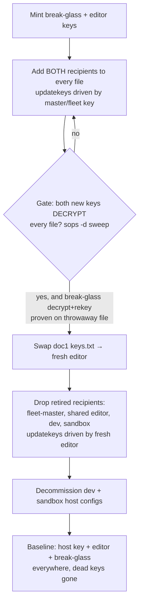

# refactor(secrets): least-privilege sops recipient scoping (#234)

## Summary

Shrink `secrets/.sops.yaml` from a catch-all that encrypts every secret to all fleet
host keys down to per-host scoping behind two new universal keys — a cold off-box
**break-glass** key and a warm doc1-only **editor** key. Mint break-glass first, then
scope the fleet key, the infra-control creds, and the service secrets across three
sequenced PRs, each landing its `.sops.yaml` re-key and its `.nix` consumer change in
one commit. Decommission the dead dev + sandbox hosts along the way.

## Problem Frame

The doc1 SSH bastion (#270) stopped lateral movement over SSH, but the secret layer
leaks straight through it: any host key can `sops -d` every secret, including
`ssh_key_abl030` (the fleet key). Full motivation, the two corrected audit assumptions
(master = the fleet key in age form, so no break-glass existed; the MCP infra-control
creds are deployed fleet-wide, not disabled), and the tier-by-tier recipient map live
in the origin doc (`docs/brainstorms/2026-06-08-sops-recipient-scoping-requirements.md`).

---

## Key Technical Decisions

- KTD1. **PR1 re-keying is driven by the fleet/master key, not the editor key.** Verified: doc1's editor key (`age1wnxn`) cannot decrypt the 3 already-scoped doc2 files (`musicbrainz-pgpass.env`, `syncoid-pfsense-key`, `gwm-trigger-key` — encrypted to `master + doc2` only), but the fleet key at `~/.ssh/id_ed25519` (symlink → `/run/secrets/ssh_key_abl030`, → `ssh-to-age` = `age1d30` = master) decrypts **every** file. All PR1 `sops updatekeys` runs use `SOPS_AGE_KEY=$(ssh-to-age -private-key -i ~/.ssh/id_ed25519)`. This corrects the origin doc's "editor key drives updatekeys" assumption.
- KTD2. **Two universal recipients; the fleet-key-as-master recipient is retired.** Every secret = `{ consuming host key(s) } + editor + break-glass`. break-glass (fresh age key, private half in Bitwarden, never on a host) is the cold recovery key; editor (fresh age key, doc1 `~/.config/sops/age/keys.txt` only) is the warm edit key. The fleet key (`age1d30`) has no sops decryption duty once these exist, so it is dropped from all recipient lists and reverts to an SSH-only key.
- KTD3. **A1 — location = scope.** Per-host-dir glob rules (`^hosts/<H>/.*` → `H + editor + break-glass`); single-host secrets loose in `secrets/` root are `git mv`'d into their host dir (`resolve()` keeps consumers working); genuinely-shared and multi-host secrets get explicit rules; the trailing `.*` fallback tightens to `editor + break-glass` only (fail-closed). Retrofit the 3 existing scoped rules to the anchored `^hosts/doc2/...` form for consistency.
- KTD4. **Atomic commits + rebuild-from-tip eliminate straddle; a migration-window discipline covers the unattended auto-deploy.** Each scoping change lands its re-key and `.nix` change in one commit; hosts rebuild from master *tip* (never an intermediate commit), so an offline host returning later jumps straight to a consistent state. The fleet-wide auto-deploy is **per-host `nixos-upgrade.service`** (`system.autoUpgrade` via `homelab.update`, `base.nix` `mkDefault true`), firing at each host's `updateDates` (~01:00–04:00 + 60-min jitter; doc1 03:00, doc2 04:00) and pulling master tip from GitHub — **not** `rolling-flake-update.service`, which runs only on doc1 at 23:00 AWST and merely bumps `flake.lock` + `git push`es (carrying any daytime commits forward). Migration-day discipline: `systemctl mask nixos-upgrade.timer` on every in-scope host before merging (or land + doc1-verify each PR before the earliest ~01:00 window), then unmask after verifying.
- KTD5. **The flake-check guard is equality + reachability, not "subset."** For each `secrets/hosts/<H>/` file, recipients must equal `{H, editor, break-glass}` exactly. Separately, for every secret a host consumes (`config.sops.secrets.*` resolving via `homelab.secrets.sopsFile`), that host's key must be among the file's recipients (reachability — a subset check would false-pass a secret encrypted to only `{editor, break-glass}`, which strands the host). Fleet-wide and multi-host groups get explicit allowlists asserted exactly. The check reads the **plaintext age-recipient stanzas** in each file's sops metadata (no decryption, no key needed), so it runs as a `pkgs.runCommand` like `bastionInvariantCheck`. Recipient *presence* is necessary but not sufficient for *decryptability* (a present-but-malformed stanza, or a host pubkey that drifted from its real host key, passes the eval check yet fails at activation) — the complementary correctness gate is a per-PR `sops -d` sweep on doc1, where keys exist (KTD9).
- KTD6. **Split the pfSense token.** A dedicated read-only pfSense user + API key (minted via the `pfsense` subagent) backs the doc2 exporter; the full-control key stays doc1-only.
- KTD7. **MCP via default-false + doc1 opt-in**, mirroring `deployIdentity`. Flip `homelab.mcp.enable` (and sub-enables) to `mkDefault false` in `base.nix`; bare-`true` opt-in in `hosts/proxmox-vm/configuration.nix`. Add an activation step that removes stale `/run/secrets/mcp` on hosts where MCP is now disabled.
- KTD8. **dev + sandbox are fully decommissioned** (not just key-dropped): remove both `hosts.nix` entries, delete `hosts/dev/` + `hosts/sandbox/` + `secrets/hosts/dev/`. They are no longer evaluated `nixosConfigurations`, so the flake-check guard needs no decommissioned-host skip-list.
- KTD9. **A hard gate precedes the editor-key swap, and the rollback path is break-glass-driven.** Before swapping doc1's `keys.txt`, prove both new keys actually **decrypt** every encrypted file — a `sops -d` sweep over `secrets/**`, not a recipient-presence grep. A present-but-malformed stanza passes a grep yet fails to decrypt, which would silently strand that file as break-glass-only once the master is retired in U3. Rollback is `git revert` **plus** `sops updatekeys` driven by the break-glass key restored from Bitwarden (revert alone restores rules but not the recipients already written into on-disk files); exercise this path once on a throwaway file during U1.

---

## High-Level Technical Design

PR1's ordering is the load-bearing safety sequence — additive and verified before anything destructive:

Recipient model after the migration (every scope implicitly `+ editor + break-glass`):

| Scope | Secrets |
|---|---|
| doc1 | `ssh_key_abl030`, `pfsense-mcp.env` (control), `unifi-`/`homeassistant-`/`slskd-`/`paperless-`/`audiobookshelf-`/`vinsight-mcp.env`, `meelo.env`, `meelo-pgpass.env` |
| doc2 | the `hosts/doc2/` set + `immich`/`kopia`/`loki`/`musicbrainz`/`slskd`/`soularr`/`uptime-kuma`/`uptime-kuma-api`.env + `pfsense-exporter.env` (RO, new) + `tailscale-oauth.yaml` |
| igpu | `jellyfin-tailscale-authkey.env` |
| epi | `komga-sync.env` (epi copy), `wayvnc.yaml` |
| per-host | each host's `syncthing-cert.pem` + `syncthing-key.pem` |
| fleet-wide (doc1,doc2,igpu,epi,framework,wsl,cache) | `nix-netrc`, `atuin-session`, `atuin-key`, `gotify.env` |
| {doc1,doc2,igpu,wsl} | `acme-cloudflare.env` |
| deleted | root `mealie.env`, `paperless.env`, `webdav.env` (stale dups); `secrets/hosts/dev/*` |

---

## Requirements

Requirement IDs R1–R18 are carried from the origin doc; R19 is plan-added. Refinements below supersede the origin text where noted.

### Recipient model
- R1. Every secret is encrypted to exactly `{ consuming host key(s) } + editor + break-glass`, except the fleet-wide (R12) and multi-host (R13) groups.
- R2. break-glass is a fresh age key, not SSH-derived, private half in Bitwarden, on no host.
- R3. editor is a fresh age key on doc1's `~/.config/sops/age/keys.txt` only, a recipient on every secret.
- R4. The fleet-key-as-master recipient (`age1d30`), the shared editor (`age1wnxn`), and the dev + sandbox host keys are removed from all recipient lists. (`age1nurxq4` is **not** a recipient anywhere — it is a dead key in igpu's user `keys.txt`, handled by R18, not a recipient removal. This corrects the origin doc.)

### Rule structure (A1)
- R5. `.sops.yaml` uses anchored per-host-dir glob rules `^hosts/<H>/.*`; no blanket to-everyone rule remains; the 3 existing scoped rules are retrofitted to the anchored form.
- R6. Single-host secrets loose in `secrets/` root are `git mv`'d into their host dir.
- R7. The trailing `.*` fallback is scoped to editor + break-glass only (fail-closed).
- R8. A `nix flake check` assertion enforces **equality** for `hosts/<H>/` files (recipients == `{H, editor, break-glass}`) and **reachability** for consumed secrets (every host's key is present on every secret it consumes), with explicit allowlists for the fleet-wide and multi-host groups.

### Tier scoping
- R9. `ssh_key_abl030` → doc1 only; Claude's autonomous sibling-deploy still works; siblings fail to decrypt it.
- R10. `pfsense-mcp.env` (control), `unifi-mcp.env`, `homeassistant-mcp.env` → doc1 only; `homelab.mcp.enable` defaults false, opt-in doc1.
- R11. App/service secrets scoped to their single consuming host.
- R12. Fleet-wide group (`nix-netrc`, `atuin-session`, `atuin-key`, `gotify.env`) → all live host keys + editor + break-glass.
- R13. `acme-cloudflare.env` → {doc1, doc2, igpu, wsl} (wsl via `cullen-dashboard` → `localProxy` → `nginx`).

### pfSense split
- R14. A read-only pfSense user + API key backs the doc2 exporter at `secrets/hosts/doc2/pfsense-exporter.env`; `loki.nix` resolves the new name.
- R15. The full-control pfSense key moves to `secrets/hosts/proxmox-vm/pfsense-mcp.env`, scoped doc1.

### Cleanup
- R16. Delete stale dead root duplicates `secrets/mealie.env`, `secrets/paperless.env`, `secrets/webdav.env`.
- R17. `tailscale-oauth.yaml` → doc2 (work-in-progress).
- R18. Remove igpu's vestigial `sops.age.keyFile` and dead user `keys.txt`; igpu decrypts via its host key through `sshKeyPaths`.
- R19. (plan-added) dev + sandbox fully decommissioned: `hosts.nix` entries, `hosts/dev/`, `hosts/sandbox/`, and `secrets/hosts/dev/` removed.

---

## Implementation Units

Units are grouped into the three PRs. Each PR is independently deployable and leaves the fleet in a consistent state. Within each scoping unit, the `.sops.yaml` re-key and its `.nix` consumer change land in **one commit** (KTD4).

### Phase 1 — PR1: Safety foundation

Driven entirely by the master/fleet key (KTD1). Additive first, destructive only after the gate.

### U1. Mint break-glass + editor keys and add both as universal recipients

- **Goal:** Establish the two new universal recipients on every secret, with break-glass proven recoverable from its Bitwarden copy, before anything is narrowed.
- **Requirements:** R2, R3, KTD1, KTD9.
- **Dependencies:** none.
- **Files:** `secrets/.sops.yaml` (add both pubkeys to **all four** rule groups — the catch-all and each of the 3 scoped doc2 rules, so the fresh editor can decrypt the previously master+doc2-only files); every encrypted file under `secrets/**` (re-keyed in place).
- **Approach:** **Precheck:** confirm `ssh-to-age -i ~/.ssh/id_ed25519` equals the master recipient `age1d30…` in `.sops.yaml` (the fleet key hasn't rotated since planning) before the first `updatekeys`. Generate both keys in a **direct terminal, not through the agent** — keep the break-glass `AGE-SECRET-KEY-1…` line out of agent stdout, shell history, and the journal (`age-keygen 2>/tmp/bg.key; chmod 600 /tmp/bg.key`); the operator pastes that line into a Bitwarden secure note (and the mandatory second offline copy — see Risks), records the public recipient, then `shred -u /tmp/bg.key`. The agent receives only the `age1…` pubkeys. Add both recipients (with `# break-glass` / `# editor (doc1)` label comments) to all four rule groups, then `sops updatekeys` across all of `secrets/**` driven by `SOPS_AGE_KEY=$(ssh-to-age -private-key -i ~/.ssh/id_ed25519)`. The sweep must cover extension-less secrets (`atuin-key`, `nix-netrc`, `ssh_key_abl030`, `*-deploy-key`, `paperless-admin-password`, `syncoid-pfsense-key`, `gwm-trigger-key`) — do not rely on a `*.env`/`*.yaml` glob.
- **Patterns to follow:** the 3 existing scoped rules in `secrets/.sops.yaml:4-26` (key_groups shape, inline label comments); the repo's documented `updatekeys` sweep in `secrets/readme.md` (broaden its `find` filter).
- **Execution note:** Prove recovery before trusting it — restore the break-glass key from Bitwarden into a temp file and confirm it both **decrypts and re-keys** a throwaway file (not just decrypts), then `shred` the temp. This exercises the rollback path (KTD9) before any destructive step.
- **Test scenarios / verification:** the identity precheck passes; then run an **exhaustive `sops -d` sweep** — every file under `secrets/**` must decrypt with the fresh editor key *and* (separately) with the break-glass key restored from Bitwarden. A recipient-presence grep is not sufficient (a malformed stanza passes presence yet fails to decrypt). Do not proceed to U2 until every file decrypts under both new keys.

### U2. Gate, then swap doc1's editor identity

- **Goal:** Promote the fresh editor to doc1's working key only after proving the additive step left no file un-re-keyed.
- **Requirements:** R3, KTD9.
- **Dependencies:** U1.
- **Files:** `~/.config/sops/age/keys.txt` on doc1 (operator action, not a repo file).
- **Approach:** The hard gate is the exhaustive `sops -d` sweep from U1 (both new keys decrypt **every** file), not a recipient-presence grep — a present-but-malformed stanza passes a grep yet fails to decrypt, and U3 retires the master next, so an undecryptable file would become break-glass-only. Only after the sweep is green, replace doc1's `~/.config/sops/age/keys.txt` with the fresh editor private key. doc1's *system* activation is unaffected (it decrypts via its host key, not `keys.txt`), so there is no rebuild risk from the swap.
- **Patterns to follow:** none (operator step).
- **Test scenarios / verification:** the gate fails loudly if any file fails to decrypt with either new key; after the swap, `sops -d` of a catch-all file and a pre-scoped doc2 file both succeed using only the new `keys.txt`.

### U3. Drop retired recipients

- **Goal:** Remove the fleet-master, shared-editor, and dev/sandbox keys now that break-glass + editor cover recovery and editing.
- **Requirements:** R4.
- **Dependencies:** U2 (re-key now driven by the fresh editor, which can decrypt everything post-U1).
- **Files:** `secrets/.sops.yaml` (remove `age1d30`, `age1wnxn`, dev, both sandbox keys from the catch-all; remove `age1d30` from the 3 scoped rules); every file under `secrets/**` (re-key).
- **Approach:** Edit `.sops.yaml`, then `sops updatekeys` across `secrets/**` driven by the fresh editor key. The vestigial duplicate `&sandbox` anchor and unused `&dev`/`&cache`/`&doc2` anchors are removed with their lines.
- **Patterns to follow:** `secrets/.sops.yaml` catch-all block.
- **Test scenarios / verification:** run an **exhaustive `sops -d` sweep** with the fresh editor over all of `secrets/**` and require it green **before the master-removal commit is pushed** — if any file fails, abort and `git revert` while the master is still a recipient. Then confirm: no file lists `age1d30`/`age1wnxn`/dev/sandbox recipients; the fleet key (`~/.ssh/id_ed25519` → master) can **no longer** decrypt a freshly re-keyed file (proves `age1d30` retirement); deploy doc1 and a live sibling (igpu or doc2) and confirm activation succeeds.

### U4. Decommission dev + sandbox

- **Goal:** Remove the two dead hosts entirely so they stop being evaluated configs and the flake-check guard needs no skip-list.
- **Requirements:** R19, R4.
- **Dependencies:** U3 (their keys already dropped from recipients).
- **Files:** `hosts.nix` (remove the `dev` and `sandbox` entries); delete `hosts/dev/`, `hosts/sandbox/`, `secrets/hosts/dev/`.
- **Approach:** Remove the entries and directories. Reference sweep confirmed clean (not syncthing peers — no `syncthingDeviceId`; pubkeys unreferenced outside `hosts.nix`), but re-grep for `dev`/`sandbox` host references before committing in case of drift.
- **Patterns to follow:** none.
- **Test expectation: none — config/host removal, no behavioral code.** Verification: `nix flake check` passes with dev + sandbox no longer in `nixosConfigurations`; no dangling references.

### Phase 2 — PR2: Critical creds

Each unit is one atomic commit (KTD4). Mask `nixos-upgrade.timer` on in-scope hosts before merging, or land + doc1-verify before the earliest ~01:00 auto-upgrade window (KTD4).

### U5. Scope the fleet key to doc1

- **Goal:** Make `ssh_key_abl030` decryptable only by doc1 (+ editor + break-glass).
- **Requirements:** R9.
- **Dependencies:** U3.
- **Files:** `git mv secrets/ssh_key_abl030 secrets/hosts/proxmox-vm/ssh_key_abl030`; `secrets/.sops.yaml` (anchored rule → doc1 host key + editor + break-glass); re-key the moved file. No change to `modules/nixos/services/ssh/default.nix` (it resolves the bare name via `homelab.secrets.sopsFile`).
- **Approach:** `resolve()` picks the host-dir copy on doc1; siblings (keyless, `deployIdentity = false`) never declare the secret. The `bastionInvariantCheck` already guarantees doc1 is the sole `deployIdentity = true` host.
- **Patterns to follow:** `modules/nixos/services/ssh/default.nix:84-91` (the `lib.mkIf cfg.deployIdentity` secret decl); the already-scoped `hosts/doc2/` rules.
- **Test scenarios / verification:** doc1 rebuilds and `~/.ssh/id_ed25519` still resolves; `doc1 → sibling` SSH still works (Claude autonomous deploy intact); from a sibling, decrypting the file with its host key **fails**; break-glass still decrypts it.

### U6. MCP → doc1-only

- **Goal:** Stop fleet-wide decryption of the seven MCP env files; keep them only on doc1.
- **Requirements:** R10 (enable flip + 6 of 7 envs; pfSense handled in U7), KTD7.
- **Dependencies:** U3.
- **Files:** `modules/nixos/profiles/base.nix:146-155` (flip `mcp.enable` + sub-enables to `mkDefault false`); `hosts/proxmox-vm/configuration.nix` (bare-`true` opt-in for `mcp.enable` + the 7 sub-enables, mirroring `ssh.deployIdentity = true` at line 26); `git mv` `unifi-`/`homeassistant-`/`slskd-`/`vinsight-`/`audiobookshelf-`/`paperless-mcp.env` → `secrets/hosts/proxmox-vm/`; `secrets/.sops.yaml` (these fall under the doc1 host-dir glob from U8, or get interim explicit rules in this commit); `modules/nixos/services/mcp.nix` (add an **unconditional** `!cfg.enable` cleanup that `rm -rf /run/secrets/mcp`); re-key the moved files.
- **Approach:** Because hosts rebuild from tip and the enable-flip + re-key land together, no sibling straddles "module on, secret gone." Make the `!enable` purge of `/run/secrets/mcp` **unconditional** — harmless on tmpfs (path already cleared), necessary on persistent `/run` (offline laptops keep stale plaintext infra-control creds otherwise). Do not gate it on resolving the tmpfs question. **U6 and U7 land in a single push** so `pfsense-mcp.env` is never left broadly-scoped after the other six narrow.
- **Patterns to follow:** `hosts/proxmox-vm/configuration.nix:26` (bare-true opt-in over a `mkDefault`); `modules/nixos/services/ssh/default.nix:102-109` (`purgeFleetKeyOnKeylessHost` activation-cleanup gated on `!deployIdentity`) as the model for the `/run/secrets/mcp` purge.
- **Test scenarios / verification:** doc1 has `/run/secrets/mcp/{unifi,homeassistant,slskd,vinsight,audiobookshelf,paperless}.env`; a live sibling (igpu/doc2) rebuilds and has **no** `/run/secrets/mcp` (cleaned or absent); sibling decrypt of a moved env **fails**.

### U7. Split the pfSense token

- **Goal:** Give the doc2 exporter a read-only key; keep the control key doc1-only.
- **Requirements:** R14, R15, KTD6.
- **Dependencies:** U6 (doc1 MCP opt-in includes `pfsense.enable = true`); **lands in the same push as U6** (the broadly-scoped full-control `pfsense-mcp.env` must narrow atomically with the enable-flip, not in a later commit).
- **Files:** new `secrets/hosts/doc2/pfsense-exporter.env` (RO key); `git mv secrets/pfsense-mcp.env secrets/hosts/proxmox-vm/pfsense-mcp.env` (control); `modules/nixos/services/loki.nix:651` (repoint `sopsFile` from `"pfsense-mcp.env"` to `"pfsense-exporter.env"`; the secret name `"pfsense-exporter/env"` is unchanged); `secrets/.sops.yaml` (doc2 rule for the new file, doc1 rule for the control file); re-key.
- **Approach:** The read-only pfSense user + API key is minted on pfSense via the `pfsense` subagent **before** the commit (the mint is a prerequisite, not an inter-commit dependency — see Open Questions for the exact privilege set). The exporter's `preStartScript` reads `PFSENSE_API_KEY` from `/run/secrets/pfsense-exporter/env` unchanged.
- **Patterns to follow:** `modules/nixos/services/loki.nix:650-654` (the `sops.secrets."pfsense-exporter/env"` decl); `hosts/doc2/configuration.nix:46` (`pfsenseExporter.enable = true`).
- **Test scenarios / verification:** doc2 exporter scrapes `/metrics` successfully with the RO key (Kuma monitor green); the RO key cannot mutate pfSense (spot-check a write call is rejected); doc1's pfSense control agent still works with the control key; doc2 cannot decrypt the control file.

### Phase 3 — PR3: Bulk sweep, guard, docs

### U8. Move + scope single-host service secrets

- **Goal:** Apply A1 to the remaining single-host secrets via per-host-dir globs.
- **Requirements:** R5, R6, R11.
- **Dependencies:** U4 (dev/sandbox gone), U6/U7 (doc1/doc2 MCP + pfSense already moved).
- **Files:** `git mv` the doc1 set (`meelo.env`) and doc2 set (`immich.env`, `kopia.env`, `loki.env`, `musicbrainz.env`, `slskd.env`, `soularr.env`, `uptime-kuma.env`, `uptime-kuma-api.env`) into their host dirs; `secrets/.sops.yaml` (anchored `^hosts/proxmox-vm/.*`, `^hosts/doc2/.*`, `^hosts/igpu/.*`, `^hosts/epimetheus/.*`, `^hosts/cache/.*`, `^hosts/framework/.*`, `^hosts/wsl/.*` rules; retrofit the 3 existing scoped rules to anchored form); re-key all moved + in-place host-dir files. **Verify the 14 syncthing pems' actual recipients first** (parse each file's plaintext sops metadata) — the origin called them "already placed," but placement ≠ recipient scope; re-key only those still carrying broad recipients to per-host scope.
- **Approach:** Consumers resolve bare names, so moves are transparent (KTD3). `meelo` is on doc1 (`hosts/proxmox-vm/configuration.nix:57`), not doc2.
- **Patterns to follow:** `modules/nixos/common/secrets.nix:37-51` (`resolve()` precedence); the `hosts/doc2/` rule shape.
- **Test scenarios / verification:** each moved secret's consuming host rebuilds and activates; each host-dir file's recipients == `{that host, editor, break-glass}`; a non-owning host cannot decrypt a sample (e.g. doc2 cannot decrypt `meelo.env`).

### U9. Fleet-wide, multi-host, and special-case rules + cleanup

- **Goal:** Scope the genuinely-shared secrets, the multi-host acme token, the epi/doc2 special cases, delete stale dups, and close the fallback.
- **Requirements:** R7, R12, R13, R16, R17.
- **Dependencies:** U8.
- **Files:** `secrets/.sops.yaml` (fleet-wide rule for `nix-netrc`/`atuin-session`/`atuin-key`/`gotify.env` → 7 live host keys + editor + break-glass; multi-host rule for `acme-cloudflare.env` → {doc1,doc2,igpu,wsl}; the epi `komga-sync.env` copy under the `^hosts/epimetheus/.*` glob; `wayvnc.yaml` → epi; `tailscale-oauth.yaml` → doc2; tighten `.*` → editor + break-glass only as the **last** rule); `git rm secrets/mealie.env secrets/paperless.env secrets/webdav.env`; re-key all affected.
- **Approach:** First-match-wins ordering — host-globs and explicit rules precede the `.*` fallback. `wayvnc.yaml` and `tailscale-oauth.yaml` are sops-YAML with per-value recipients; after re-keying, run a full `sops -d` of each (not a presence grep) with the editor and the target host's derived key and assert every value field returns plaintext — `updatekeys` must rewrite all encrypted values, not just the top level. Cross-check the full recipient-scope-map table against the U8+U9 file lists so no host-specific secret (e.g. `komga-sync.env`) falls through to the tightened `.*` fallback.
- **Patterns to follow:** existing catch-all key-group shape; `secrets/readme.md` updatekeys recipe.
- **Test scenarios / verification:** each fleet-wide secret decryptable by all 7 live host keys (verify by recipient-presence, since offline laptops can't be tested live); `acme-cloudflare.env` decryptable by exactly the 4 hosts; the 3 deleted dups are gone and no consumer referenced them; no file falls through to the `.*` fallback that a host needs (caught by U10).

### U10. Flake-check guard + igpu cleanup

- **Goal:** Make the invariant enforceable and remove igpu's vestigial keyFile.
- **Requirements:** R8, R18, KTD5.
- **Dependencies:** U8, U9 (structure must be in place for equality to pass).
- **Files:** `flake.nix` (new check mirroring `bastionInvariantCheck`); `hosts/igpu/configuration.nix:118-120` (remove the `keyFile` line, keep `sshKeyPaths`); igpu's `~/.config/sops/age/keys.txt` (operator deletes the dead `age1nurxq4` key).
- **Approach:** Two halves with different difficulty. **Equality** (each `hosts/<H>/` file's recipients == `{H, editor, break-glass}`) is tractable: parse the **plaintext age-recipient stanzas** in each file's sops metadata via `yq-go`/`jq` (no decryption, no Nix-eval crossing) and compare against the host pubkey **derived from `hosts.nix`** (`ssh-to-age` of the host's `publicKey`, not a hand-copied literal — this also catches pubkey drift). Lands here in PR3, once the structure is final. **Reachability** (every consumed secret carries its consuming host's key) needs the consumed-secret→file map, which is eval data; re-deriving the applicable `.sops.yaml` rule per consumed path means re-implementing sops first-match-wins ordering. Attempt it as a source-level check; if it proves fragile, **do not over-promise a PR1 backport** — fall back to the per-PR `sops -d` decrypt sweep on doc1 (which catches stranding *and* malformed stanzas, with keys present) plus the `nixos-upgrade.timer` masking discipline (KTD4) as the PR1/PR2 guard. Mirror `bastionInvariantCheck`'s `pkgs.runCommand` + exit-1 skeleton.
- **Patterns to follow:** `flake.nix:372-401` (`bastionInvariantCheck` runCommand + exit-1 + checks wiring); `flake.nix:306-329` (`errorPatternsCheck` per-file loop).
- **Test scenarios / verification:** the check passes on the migrated tree; a deliberately-stranded secret (recipients = editor+break-glass only, no host key) makes `nix flake check` fail; a `hosts/<H>/` file with an extra sibling recipient fails; igpu rebuilds and decrypts via its host key after the keyFile removal.

### U11. Recovery documentation

- **Goal:** Document break-glass recovery and the rollback runbook.
- **Requirements:** origin acceptance "documentation in docs/wiki/infrastructure/", KTD9.
- **Dependencies:** U1–U10.
- **Files:** new `docs/wiki/infrastructure/sops-break-glass-recovery.md`; cross-link from `docs/wiki/infrastructure/ssh-bastion-model.md` and `secrets/readme.md`.
- **Approach:** Cover: restoring the break-glass key from Bitwarden; `SOPS_AGE_KEY_FILE=<tmp> sops -d`/`updatekeys` recovery; the rollback runbook (`git revert` **+** break-glass-driven `updatekeys`, then `shred`); the editor-key reconstruction path if doc1 is lost; and the proven-once note from U1.
- **Test expectation: none — documentation.** Verification: a reader can recover a secret and roll back a bad re-key from the doc alone.

---

## Scope Boundaries

- **In scope (pulled in this effort):** full decommission of dev + sandbox (host entries, configs, secrets) — the user chose the clean end-state over deferring host removal to #239.
- **Deferred to follow-up work:** none — all origin items are addressed across the three PRs.
- **Outside this work:** rotating secret *values* (only the pfSense RO key and the two new age keys are new material); the tailnet ACL / nspawn renumber (#239); the step-ca / CA-signed-cert architecture (#241).

---

## Risks & Dependencies

- **Unattended per-host auto-deploy (highest operational risk).** The fleet-wide deploy is per-host `nixos-upgrade.service` (`system.autoUpgrade`) at ~01:00–04:00 + jitter pulling master tip — **not** `rolling-flake-update.service` (doc1, 23:00), which only bumps `flake.lock` + pushes. A mid-day mistake left on master auto-ships at the next per-host window. Mitigation: `systemctl mask nixos-upgrade.timer` on in-scope hosts before merging (or land + doc1-verify before ~01:00); the U10 equality guard fails a bad re-key at eval, but it only exists from PR3 — PR1/PR2 rely on the masking discipline + the per-PR `sops -d` sweep (KTD4, KTD5).
- **PR1 driving identity.** If run from a host without the fleet key, the 3 pre-scoped files can't be re-keyed. PR1 must run on doc1, where the fleet key is present, and U1's precheck confirms the fleet key still derives to `age1d30` (KTD1).
- **Offline laptops (framework, wsl) and epi.** Cannot be tested live. The proxy is recipient-presence of the **`hosts.nix`-derived** host key (so a drifted/typo'd pubkey is caught), not a hand-copied literal — but presence still can't prove the live host key matches; a one-time `ssh-to-age` of each host's current `ssh_host_ed25519_key.pub` byte-compared to its `hosts.nix` `publicKey` closes that gap before relying on presence.
- **igpu has no passwordless sudo.** Its keyFile contents stayed unread; U10 verifies igpu via deploy-and-activate rather than a host-side decrypt probe.
- **Break-glass single point of failure (mandatory mitigation).** Once U3 retires the master, break-glass is the sole off-fleet cold-recovery key. A Bitwarden lockout/corruption simultaneous with doc1 loss = permanent, irreversible loss of every secret. A second offline copy (printed QR/paper in a physical safe, or an encrypted USB in a separate location) is therefore **required, not optional**, and U1 proves it decrypts a throwaway file before PR1 merges. *(This strengthens the user's "Bitwarden notes for sure" decision — see the surfaced decision in the handoff.)*

---

## Open Questions

### Resolve before / during implementation
- The exact pfSense privilege set for the read-only exporter user (which API endpoints the exporter scrapes). Resolve via the `pfsense` subagent when minting the key in U7.

### Deferred to implementation
- The reachability half of the R8 guard: can each consumed secret's applicable `.sops.yaml` rule be re-derived deterministically (first-match-wins) at eval time, or is the per-PR `sops -d` sweep + masking discipline the accepted substitute? U10 decides; the equality half is committed (plaintext-metadata parse, no decryption).

---

## Sources / Research

- Origin requirements + tier map: `docs/brainstorms/2026-06-08-sops-recipient-scoping-requirements.md`.
- Patterns to mirror: `flake.nix:372-401` (`bastionInvariantCheck`), `secrets/.sops.yaml:4-26` (scoped rules), `modules/nixos/services/mcp.nix:126-191` (activation decrypt via host key), `modules/nixos/profiles/base.nix:146-155` (MCP defaults), `modules/nixos/services/loki.nix:617-698` (pfsense-exporter), `modules/nixos/services/ssh/default.nix:84-109` (fleet-key decl + keyless purge), `modules/nixos/common/secrets.nix:37-51` (`resolve()`).
- Verified empirically: editor key cannot decrypt the 3 pre-scoped files; fleet key decrypts everything; the fleet-wide deploy is per-host `nixos-upgrade.service`/`system.autoUpgrade` (`base.nix` `homelab.update` `mkDefault true`) at ~01:00–04:00, while `rolling-flake-update.service` (doc1, 23:00) only bumps `flake.lock` + pushes; dev + sandbox still carry `configurationFile`; dev/sandbox are not syncthing peers and their pubkeys are unreferenced outside `hosts.nix`.
- Prior art: `docs/wiki/infrastructure/ssh-bastion-model.md` (#270 break-glass = Proxmox console; per-secret scoping precedent), `secrets/readme.md` (updatekeys recipe + root-keyfile fallback), `docs/wiki/infrastructure/github-pat-and-private-inputs.md` ("scope is the protection, not the clock").
