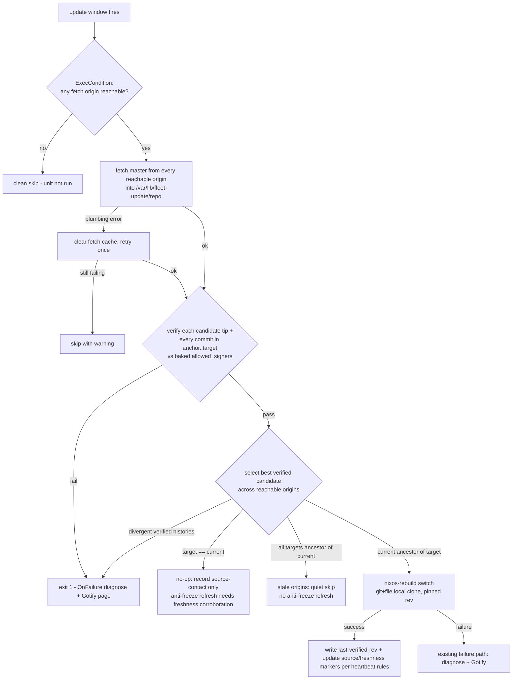
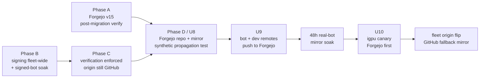

# feat: Signed fleet deploys + Forgejo flake cutover

## Summary

Every fleet host verifies that every new commit it is about to deploy is SSH-signed by a key we hold (allowed_signers rendered from `hosts.nix` into the running closure) and that the target rev descends from the currently deployed rev, then builds pinned to that verified rev from its own local clone. Once verification enforces, the flake's source of truth moves from GitHub to Forgejo on doc2 (`git.ablz.au`), with GitHub demoted to a push-mirror that keeps hosting issues. Work lands in four phases with a soak cycle between signing and enforcement, a bot/write-path soak on Forgejo, and then a canary host before the fleet origin flips.

---

## Problem Frame

Push access to master is RCE on every host within 24h (origin doc, #235). Server-side signing rules can't fix it (GitHub web-flow signs API commits); host-side verification can, and it also makes the forge untrusted — which is what lets the cutover to doc2-hosted Forgejo proceed without re-creating the lateral-movement path #270 closed.

**Changed fact since the brainstorm:** Forgejo on doc2 already jumped v11.0.12 → v15.0.2 unattended this morning (2026-06-10 04:00 nightly auto-update; the 00:00 dump predates the migration and is the v11 rollback artifact). Service is healthy (`/api/healthz` 200, running binary `forgejo-lts-15.0.2`). Phase A verifies that migration instead of staging it. v15 also adds repo-scoped access tokens, which the bot uses.

---

## Key Technical Decisions

- **allowed_signers is rendered from `hosts.nix` into `/etc/fleet-update/allowed_signers` on every host.** `hosts.nix` is already the fleet's single source of trust (authorized_keys precedent, #270); per-host `signingKeys` plus a reserved non-host `_signingPrincipals` attr for bot/service principals extend it. No top-level host-like bot entry, so existing `allHosts` consumers do not misread service principals as SSH hosts. No separately committed keyfile to drift; key add/rotate = signed commit + observed deploy propagation. A flake check validates shape.
- **Verify in a host-local clone; build from that same clone.** Each host keeps a root-owned full single-branch clone at `/var/lib/fleet-update/repo`. It fetches every configured origin, verifies each candidate tip and every commit in the deployment range (`git rev-list <anchor>..<target>`; each commit must pass `git -c gpg.ssh.allowedSignersFile=… verify-commit`, exit 0 only), then ancestry-checks and builds with `nixos-rebuild switch --flake "git+file:///var/lib/fleet-update/repo?ref=master&rev=<sha>#<host>"`. This closes the bot-laundering case where a signed lock bump sits on top of an unsigned pushed commit. No re-resolution between verify and build (R6), and fallback fetch origins become a pure fetch concern — fetching from the GitHub mirror stays safe because verification is origin-agnostic.
- **Three-way failure classification** (R8):
  - *Unreachable* (all fetch origins down) → unit cleanly skipped via `ExecCondition` (exit 1 = clean skip; note the existing `api.github.com` probe's "exit 0 = skip" is wrong — exit 0 from `ExecStartPre` proceeds into a loud rebuild failure; fixed in passing).
  - *Plumbing* (git/nix fetch-cache corruption, transient 5xx) → clear root's fetch cache, one retry, then skip-with-warning. Never routed to the tamper branch (the `failed to insert entry` corruption is documented-periodic).
  - *Tamper* (signature fail, ancestry divergence) → loud fail through the existing `OnFailure` diagnose + Gotify path.
- **Candidate selection across origins:** fetch all reachable configured origins, verify each advertised `master` tip and its deployment range, then pick a verified descendant of the current anchor if one exists. A normal deployable target must also be reachable from the protected `master` of the designated write root (Forgejo after cutover), or from a locally cached Forgejo-accepted `master` tip when using the GitHub mirror during a Forgejo outage. A signed side-branch commit, GitHub-only signed descendant, or arbitrary `--rev` is not normally deployable. Divergent verified histories are tamper; bad signatures from any reachable configured origin are loud tamper; quiet skip only happens when no reachable origin has a newer verified descendant.
- **Ancestry semantics:** target == current → no-op; target ancestor of current (all reachable origins stale / mirror lag) → quiet skip; current ancestor of target → verify the full range and proceed; divergent → tamper. Anchor = `system.configurationRevision` (newly set from `flake-root.rev` in `nix/lib.nix`) with `/var/lib/fleet-update/last-verified-rev` fallback, written only after successful activation. No anchor at all outside explicit bootstrap/re-anchor mode fails closed; bootstrap uses `fleet-update --accept-new-root <expected-sha>` so an old-but-signed replay cannot silently become the new root.
- **Staleness alert ships with enforcement:** hosts record separate source-contact and anti-freeze freshness markers. Source contact records reachable, signature-valid origins for diagnosis; the anti-freeze marker is driven by a signed bot heartbeat in the repo (for example `fleet/freshness.json`, carrying a monotonic epoch/timestamp and committed by the bot at least daily, including no-op nights). A host never refreshes anti-freeze merely because the target is newer than its local anchor; it refreshes only after verifying a target whose heartbeat is newer than the host's highest-seen heartbeat, or after a no-op where all reachable configured origins agree on the current verified target and that signed heartbeat is still fresh. Missing, unverifiable, older-than-highest-seen, or >72h stale heartbeat does not refresh anti-freeze and pages. Without it, quiet-skip or stale signed-descendant replay would let an attacker freeze the fleet on a vulnerable rev silently.
- **Signing config is declarative HM; per-machine keys never leave their machine.** `modules/home-manager/` module (auto-imported on all hosts incl. wsl, which skips `home/home.nix`) sets `programs.git.signing = { format = "ssh"; key = <private key path>; signByDefault = true; }` + declarative `user.name`/`user.email`, replacing the hand-managed `~/.gitconfig` (which silently overrides HM's `~/.config/git/config` — per-machine cleanup is a migration step). Agentless file-key signing confirmed working on git 2.54.
- **Bot signs with its own key; remote pinned in the module.** Both nightly commits (per-group + hash-baselines) signed via `git config` in the temp clone. The bot's clone/push URL moves from "inherit doc1 checkout origin" to an explicit module option. Bot identity `nix bot <acme@ablz.au>` keeps its email; the principal lives in `hosts.nix` beside the bot pubkey.
- **Dev push transport: per-machine Forgejo HTTPS tokens.** Signing pubkeys are NOT uploaded to Forgejo — uploaded keys grant SSH auth as the account (Forgejo auth/signing conflation, forgejo#4268). UI "Verified" badges are sacrificed; host-side verification is the control.
- **GitHub code mirror via doc1 timer** (`github-nixosconfig-mirror.timer`), authenticated by a repo-scoped GitHub deploy key. The mirror prunes GitHub heads/tags to match Forgejo. GitHub issues are disabled; Forgejo is the issue tracker. **GitHub master remains a read-only mirror surface:** updates are made only by doc1's repo-scoped GitHub deploy key through `github-nixosconfig-mirror.timer`; GitHub issues are disabled.
- **`refresh-access-tokens` stays.** Private inputs (`vinsight-mcp`, `cellar-manager`) still fetch from GitHub with the PAT on every host's eval; the config-source reachability gate becomes an all-origin probe and the private-input preflight keeps GitHub auth/fetch failures in the plumbing retry/skip path.
- **Accepted (from origin doc):** doc1-as-abl030 compromise stays fleet-write by design; flake inputs stay an unverified supply chain; a compromised dev machine signs with its own key. Recorded in the wiki doc, not mitigated in code.

---

## High-Level Technical Design

Nightly verify-then-switch decision flow (the same script backs the interactive `fleet-update` CLI):

Rollout sequencing (gated arrows are soak/verification gates; Phase A and Phase B can overlap):

---

## Implementation Units

### Phase A — Forgejo v15 aftermath

### U1. Verify the unattended v11→v15 migration and harden the forge for its new role

- **Goal:** Confirm Forgejo v15 is fully functional post-migration and the instance is ready to become the fleet's source of truth.
- **Requirements:** Dependencies for R9–R13; origin "Dependencies / Assumptions".
- **Dependencies:** none.
- **Files:** `modules/nixos/services/forgejo.nix`, `docs/wiki/services/forgejo.md` (new).
- **Approach:** Review v12/v13/v14/v15 breaking-change notes against our settings surface; verify `:2222` SSH still serves the beancount auto-commit flow and the agents repo; confirm the nightly dump ran green post-v15 and the dump format restores (test-unzip); audit SSH keys enrolled on the Forgejo profile — the pre-#270 fleet-identity key is expected there and must be removed/replaced. Write the missing Forgejo ops wiki page (restore procedure, dump location, healthz, version policy).
- **Test scenarios:** beancount `git push` over `:2222` succeeds; `git clone` of agents repo succeeds; post-v15 dump file unzips and contains `forgejo-db.sql`; profile key audit shows only intended keys.
- **Verification:** All checks green; wiki page committed; any breaking-change fallout fixed or explicitly noted.

### Phase B — Signing (soak before enforcement)

### U2. Per-machine signing keys + declarative git identity (HM module)

- **Goal:** Every machine that pushes (epimetheus, framework, wsl, doc1) signs commits by default with a local signing-only key; git identity becomes declarative.
- **Requirements:** R1, R3 (key side); AE4 (signing leg).
- **Dependencies:** none (parallel with U1).
- **Files:** `modules/home-manager/services/git-signing.nix` (new), `modules/home-manager/default.nix` (register), `hosts.nix` (new per-host `signingKeys` list + reserved `_signingPrincipals` attr for the bot principal), `docs/wiki/infrastructure/signed-fleet-deploys.md` (new, started here).
- **Approach:** Module sets `programs.git.signing` (`format = "ssh"`, `key` = private key path, `signByDefault`) and `user.name`/`user.email`, keyed off `hostConfig`. Manual per-machine step (documented): generate `~/.ssh/id_ed25519_git_sign` (no passphrase, owner-only permissions, never authorized anywhere, never backed up/synced), commit pubkey to `hosts.nix`. HM activation check warns when the key file is missing or a stray `~/.gitconfig` exists (it overrides HM's config — absorb the gh credential-helper lines into the module, then delete it per machine). Machines without `signingKeys` simply can't author fleet-valid commits.
- **Execution note:** Generate each machine's key *before* its HM config flips `signByDefault`, or every `git commit` on that machine fails. Key-introduction commits must be signed by a pre-existing key once enforcement is live; during Phase B this is moot.
- **Test scenarios:** Commit on each machine shows `%G?` = `G` against the rendered allowed_signers; commit with the signers file absent fails verification (exit 1); stray-`~/.gitconfig` warning fires when the file exists.
- **Verification:** `git log --format='%G? %GS' -1` on a fresh commit from each dev machine shows `G` + the right principal after U3 lands.

### U3. allowed_signers in every closure + configurationRevision + flake check

- **Goal:** The verification trust anchor exists in every host's running closure, and the ancestry anchor is populated.
- **Requirements:** R3, R4 (anchor side), R5 (anchor source).
- **Dependencies:** U2 (hosts.nix schema).
- **Files:** `modules/nixos/autoupdate/verify.nix` (new — anchor rendering half), `modules/nixos/autoupdate/default.nix`, `nix/lib.nix` (`system.configurationRevision = flake-root.rev or null`), `flake.nix` (new `allowedSignersCheck`).
- **Approach:** Render `/etc/fleet-update/allowed_signers` via `environment.etc` from `hosts.nix` (`<principal> namespaces="git" <keytype> <key>` per entry). Schema: host entries may define `signingKeys = [{principal = "..."; key = "ssh-ed25519 ...";} ...]`; non-host service principals live under `_signingPrincipals = [{principal = "nix bot <acme@ablz.au>"; key = "...";} ...]`; renderer/check reads both and ignores `_signingPrincipals` for host iteration. Renderer must quote/escape principals containing whitespace according to OpenSSH allowed-signers syntax, so `nix bot <acme@ablz.au>` verifies as one principal rather than three fields. Check follows the `bastionInvariantCheck` pattern but renders expected content from the imported `hosts.nix` and diffs — must stay in the always-run (non-`FULL_CHECK`) tier so wsl can validate. `configurationRevision` lands here so it soaks a cycle before enforcement reads it. Known cost: the bot builds the dirty pre-commit tree, so rev-stamped toplevels miss the cache by one small derivation layer — accepted.
- **Test scenarios:** `nix flake check` passes with valid hosts.nix; check fails loudly when a signingKeys entry is malformed or the bot entry is missing; fixture verifies the whitespace-bearing `nix bot <acme@ablz.au>` principal renders/validates correctly; `nixos-version --json | jq .configurationRevision` is non-null after next deploy.
- **Verification:** File present at `/etc/fleet-update/allowed_signers` on every `hosts.nix` entry with `configurationFile` after a nightly cycle; configurationRevision populated fleet-wide; flake check asserts every NixOS host renders the verifier trust anchor.

### U4. Bot signs both nightly commits

- **Goal:** The rolling-flake-update bot's commits verify against allowed_signers.
- **Requirements:** R2; AE4.
- **Dependencies:** U2 (bot key + hosts.nix entry), U3 deployed on doc1 before base-verification preflight is enforced.
- **Files:** `scripts/rolling_flake_update.sh`, `modules/nixos/ci/rolling-flake-update.nix`, `fleet/freshness.json` (new signed heartbeat file).
- **Approach:** Generate the bot key on doc1 (`/var/lib/rolling-flake-update/bot_signing_key`, distinct from the personal doc1 key) under `/var/lib/rolling-flake-update`, owned by the `rolling-flake-update.service` user (`abl030` today), mode `0400` or `0600`. Module passes the path via env; script sets `gpg.format ssh`, `user.signingkey`, `commit.gpgsign true` in the temp clone — covers per-group, hash-baselines, and heartbeat commits. Rollout gate: before enabling the bot base preflight, doc1 verifies current `origin/master` against `/etc/fleet-update/allowed_signers`; the U4 deployment commit itself must be signed by an allowed human key so the first preflight has a signed base. After the gate, the bot verifies the fetched base before committing and refuses to commit on top of an unsigned or wrong-key commit, so the bot cannot launder unsigned history. The bot writes/updates `fleet/freshness.json` with a monotonic epoch/timestamp at least daily; if no lock/hash changes land, it creates a signed heartbeat-only commit so hosts have a fresh signed source-of-truth signal. Pin the clone/push URL as an explicit module option instead of inheriting the interactive checkout's origin.
- **Test scenarios:** `NO_COMMIT=1 ONLY_GROUP=llm` dry-run produces a signed commit (`%G?` = `G`) and does not push (`NO_COMMIT` must be non-empty to suppress push); bot key is readable by the service user and not by others; current `origin/master` signed-base gate passes before bot preflight is enabled; bot preflight refuses an unsigned fetched base; no-change night produces a signed heartbeat commit; push with the pinned URL works; an unsigned commit authored deliberately in the temp clone fails the post-soak verify (negative control for Phase C).
- **Verification:** The first post-deploy nightly run's commits on master show `G` with the bot principal. **Soak gate: at least one fully green signed nightly cycle before Phase C merges.**

### Phase C — Verification enforcement (origin still GitHub)

### U5. `fleet-update`: the verify-then-switch path for nightly and interactive deploys

- **Goal:** No host deploys an unverified rev, with the failure semantics and recovery flags from the design.
- **Requirements:** R4–R8, R15; AE1, AE2, AE3, AE5 (pre-cutover leg).
- **Dependencies:** U3, U4 soaked one cycle.
- **Files:** `modules/nixos/autoupdate/verify.nix` (verifier half), `modules/nixos/autoupdate/update.nix` (smartUpgrade integration, gate fix, `ExecCondition`), `hosts/doc2/configuration.nix` (comment/assertion: doc2's window stays latest in fleet), `CLAUDE.md`, `.claude/skills/service-deploy/SKILL.md`.
- **Approach:** `writeShellApplication` `fleet-update` installed fleet-wide: maintains `/var/lib/fleet-update/repo` (full single-branch clone — ancestry and range verification need the graph; never reuse nix's shallow fetcher cache), fetches all configured `homelab.update.verify.origins` (Phase C default `[github]`, Phase D `[forgejo, github]`), verifies every reachable candidate tip and every commit in the chosen deployment range against the baked signers file, ancestry-checks, confirms the target is contained in protected `master` of the designated write root (or a cached Forgejo-accepted `master` tip for GitHub fallback during Forgejo outage), then builds from the local clone pinned to the verified sha. Decision flow exactly as the HTD diagram, three-way error classification, `install -m 0644` for any failure artifact the diagnose unit reads. Flags: `--rev <sha>` is still range-verified and must be reachable from protected `master`; arbitrary non-master revs require an explicit break-glass flag that stops timers, logs/pages the bypass, and is excluded from nightly paths. `--branch` prints consequences and refuses non-master by default. `--accept-new-root <expected-sha>` is signature-verified explicit bootstrap/re-anchor and required when no anchor exists. Before enforcement flips on, run a trust-root ceremony: freeze writes, collect each signing pubkey fingerprint out-of-band from the generating machine, diff the rendered `/etc/fleet-update/allowed_signers` for the exact enforcement rev, record the expected root SHA, and enable verification only from that manually validated rev. Nightly path: reachability probe moves to `ExecCondition` and checks all configured fetch origins (or delegates to `fleet-update`'s origin probe), skipping only when none is reachable; verify logic runs inside smartUpgrade before the rebuild; unit PATH gains `git` + `openssh` (verify shells out to `ssh-keygen`). After `refresh-access-tokens` and before activation, run a bounded metadata/eval preflight of the verified local flake; classify GitHub private-input 401/403/timeouts/5xx as plumbing, clear `/root/.cache/nix`, retry once, then exit 0 with a warning before `nixos-rebuild`. U7's runbooks gate enforcement enablement: U5 implementation can land first, but the full-fleet enforced nightly soak does not start until U7 exists. When `homelab.update.verify.enable` is true, the nightly unit executes the verified path unconditionally; `system.autoUpgrade.flake` becomes a dormant compatibility value (updated to Forgejo in U10 for R9 consistency, but not used by normal nightly updates), and the standard deploy docs move to `ssh <host> "sudo fleet-update"` in this unit so the interactive path is verified during the Phase C soak.
- **Test scenarios (staged on one host against a scratch branch/repo before fleet merge):**
  - Covers AE1: unsigned tip → exit 1, Gotify fired, generation unchanged.
  - Covers AE1: tip signed by a key not in allowed_signers → same loud fail.
  - Covers AE1: signed tip on top of an unsigned ancestor in `anchor..target` → exit 1, Gotify fired, generation unchanged.
  - Covers AE2: all origins serving an older signed rev (tip ancestor of current) → quiet skip, no page, anti-freeze marker not refreshed.
  - Forgejo serves stale current while GitHub mirror serves a newer verified descendant → host selects the newer verified descendant and deploys.
  - Signed side-branch commit not reachable from protected `master` → refused outside explicit break-glass mode.
  - GitHub-only signed descendant not cached as Forgejo-accepted master → refused/skip-with-warning rather than deployed.
  - Divergent history (force-pushed scratch branch) → loud fail; then `--accept-new-root` re-anchors and the next run is green.
  - Covers AE3: all origins unreachable (firewall the host) → `ExecCondition` skip, no failure state, no page.
  - Corrupted `/root/.cache/nix` fetch cache → cache cleared, retry succeeds, warning logged, no page.
  - GitHub private-input 401/403/timeout during eval preflight → refresh/retry once, then skip-with-warning before activation, no tamper page.
  - No anchor (delete marker, configurationRevision null) → fail closed unless `--accept-new-root <expected-sha>` is supplied.
  - Trust-root ceremony with an unexpected signer in rendered allowed_signers → enforcement blocked as tamper before U5 ships.
  - `fleet-update --branch test-branch` refused without override; works with override and prints the redeploy-from-master reminder.
- **Verification:** One full fleet nightly cycle green with enforcement on; a deliberate unsigned commit anywhere in the target deployment range never deploys anywhere; grep/check standard deploy docs no longer point agents at raw remote `nixos-rebuild --flake github:...` except in break-glass sections.

### U6. Staleness alerting

- **Goal:** Quiet-skip can't silently freeze the fleet (DoS-of-forge or current-rev-replay attack).
- **Requirements:** Hardens R8; success criterion "no silent freeze".
- **Dependencies:** U5 (ships in the same PR).
- **Files:** `modules/nixos/autoupdate/verify.nix` (source-contact + freshness markers), `modules/nixos/autoupdate/update.nix` or `verify.nix` (local `fleet-update-freshness` timer/service), `homelab.monitoring.errorPatterns` wiring in the autoupdate module for doc2 Grafana/Loki alerting.
- **Approach:** Maintain two markers: `last-source-contact` for "a configured origin was reachable and signature-valid" diagnostics, and `last-verified-freshness` for the anti-freeze alert. `fleet-update` reads `fleet/freshness.json` from the selected verified target after range verification. Freshness authentication is commit-based: find the last commit touching `fleet/freshness.json`, verify that commit with allowed_signers, require its signature principal to equal the bot principal, then parse and monotonic-check the heartbeat from that commit. Missing, malformed, unverifiable, non-bot-signed, older-than-host-highest-seen, or stale heartbeat never refreshes freshness and emits an alert marker. Thresholds are host-classed: always-on NixOS hosts page after one missed expected heartbeat/update window (target 26-30h); laptops keep a 72h AC/offline grace. `last-verified-freshness` updates only when the selected target's verified heartbeat is newer than the host's highest-seen heartbeat or when a no-op target has a still-fresh heartbeat matching all reachable configured origins. Quiet-skips, stale-primary fallbacks, bare `target == current` replays, and stale signed descendants do not refresh it. Alert transport is local logging plus `homelab.monitoring.errorPatterns`, not Kuma push monitors, so no fleet-wide Kuma secret is needed.
- **Test scenarios:** Hold a test host's freshness marker stale → alert fires; normal nightly heartbeat/update keeps it quiet; quiet-skip night does not refresh the marker; replay an always-on server's current or older signed rev past one missed heartbeat window → alert fires; replay a laptop past 72h → alert fires; serve an old signed descendant with an old heartbeat to a lagging host → deploy may proceed if range-valid but freshness alert fires and highest-seen heartbeat does not move backward.
- **Verification:** Alert visible in the monitoring path after a forced-stale test, then quiet for a week of normal operation.

### U7. Runbooks: break-glass, key rotation, history rewrite

- **Goal:** The recovery paths exist as written procedure before anyone needs them (R15).
- **Requirements:** R15; origin Key Decision "accepted residuals" documentation.
- **Dependencies:** U5 verifier implementation; blocks U5 enforcement enablement and full-fleet enforced nightly soak.
- **Files:** `docs/wiki/infrastructure/signed-fleet-deploys.md` (trust model + the three runbooks + accepted residuals), comment breadcrumbs from `verify.nix`/`update.nix`.
- **Approach:** Break-glass exact order: stop the timer FIRST (`systemctl disable --now nixos-upgrade.timer`), fix + deploy from local checkout, push the signed fix, re-run `fleet-update` to re-anchor, re-enable timer — the timer-stop is load-bearing because a dirty local deploy is otherwise reverted by the next nightly. Key rotation is observation-gated, not time-gated: add = key-introduction commit signed by an existing key, new key signs no fleet commits until every NixOS host reports the new allowed_signers in its running closure or laggards have an explicit manual re-anchor plan; remove = keep old key valid until laggards are accounted for, then remove and sweep. Revocation / active signing-key compromise: freeze writes, revoke every push credential for that identity across Forgejo and GitHub, land an exact key-removal rev signed by another trusted key, run `fleet-update --rev <sha>` fleet-wide, verify `/etc/fleet-update/allowed_signers` no longer contains the stolen key on every NixOS host, then unfreeze. If the trusted key set itself is suspect, use the local break-glass removal path instead of relying on the old signers list. History rewrite / bootstrap = `--accept-new-root <expected-sha>` loop from doc1, never implicit trust-on-first-verify.
- **Test scenarios:** none — documentation unit; correctness exercised by U5's `--accept-new-root` scenario and a tabletop walk-through of break-glass on the canary.
- **Verification:** Wiki page exists, all three procedures walked through once on igpu.

### Phase D — Forgejo cutover

### U8. Forge prep: anonymous read, repo, machine accounts, GitHub code mirror

- **Goal:** `git.ablz.au/abl030/nixosconfig` exists, fetchable anonymously, mirrored to GitHub, with the bot's least-privilege push identity.
- **Requirements:** R10, R11, R13; AE4 (mirror leg), AE5.
- **Dependencies:** U1; U5 enforced (cutover must not precede verification — origin doc Key Decision).
- **Files:** `modules/nixos/services/forgejo.nix` (`REQUIRE_SIGNIN_VIEW = false`), `secrets/hosts/proxmox-vm/forgejo-nixbot-token` (doc1/proxmox-vm-scoped bot push token), `secrets/hosts/proxmox-vm/github-nixosconfig-mirror-deploy-key` (doc1-only GitHub mirror deploy key), `hosts/proxmox-vm/configuration.nix` (`github-nixosconfig-mirror.timer`), `docs/wiki/services/forgejo.md`.
- **Approach:** Flip `REQUIRE_SIGNIN_VIEW` off (other repos stay private per-repo — anonymous smart-HTTP/archive for public repos only). Push full history from doc1; repo explicitly public. Create dedicated Forgejo accounts/tokens for the write path: `nixbot` for the nightly bot plus per-machine writer accounts. Personal accounts are not ordinary `master` writers. Configure Forgejo branch protection for `master`: only the writer accounts can push ordinary updates; force-push/delete are disabled. Configure the GitHub code mirror from doc1, not Forgejo: `github-nixosconfig-mirror.timer` mirrors/prunes heads and tags to `git@github.com:abl030/nixosconfig.git` using a repo-scoped GitHub deploy key stored as a doc1-only sops secret. GitHub issues are disabled; all issue tracking lives on Forgejo.
- **Test scenarios:** Anonymous `git clone https://git.ablz.au/abl030/nixosconfig` from a fleet host succeeds; anonymous access to a private repo (agents) still 404s; nixbot token pushes to nixosconfig but cannot touch other repos or repo settings; dedicated Forgejo writer accounts can push ordinary signed updates while personal accounts cannot force-push/delete `master`; after the doc1 mirror runs, Forgejo and GitHub refs match exactly.
- **Verification:** Mirror setup passes the synthetic propagation test: Forgejo and GitHub refs match after the doc1 mirror runs.

### U9. Bot, doc1, and dev checkouts repoint to Forgejo

- **Goal:** The nightly lock-bump pipeline and all declared pushing machines push signed commits to Forgejo; GitHub receives them only via the mirror.
- **Requirements:** R9 (bot leg), R11; AE4.
- **Dependencies:** U8.
- **Files:** `scripts/rolling_flake_update.sh` (token plumbing → Forgejo URL + token file), `modules/nixos/ci/rolling-flake-update.nix` (origin option, `tokenFile` → sops path), `hosts/proxmox-vm/configuration.nix`, doc1/epimetheus/framework/wsl working-tree remotes (host state, documented operational steps).
- **Approach:** Replace the `GH_TOKEN_FILE`/`oauth2:` URL rewrite with a non-URL credential mechanism for the Forgejo token (credential helper, `GIT_ASKPASS`, or equivalent token-file handoff) against the pinned `git.ablz.au` URL. Dev-machine Forgejo HTTPS tokens are per-machine and account-separated: each pushing machine uses its dedicated Forgejo writer account/token, repo-scoped to `abl030/nixosconfig`, excluding repo settings/admin scopes, with named owner/device and expiry, stored only in that machine's user credential store, and never appearing in remotes/logs. Repoint doc1, epimetheus, framework, and wsl checkouts to `https://git.ablz.au/abl030/nixosconfig`; verify `git remote get-url origin` and a signed push path from each pushing machine. `populate_cache.sh`/`hash-capture.sh` build from the local checkout — unaffected.
- **Test scenarios:** `ONLY_GROUP=llm` run end-to-end: clone from Forgejo, signed commit, push to Forgejo, mirror propagates to GitHub; bot token absent → push fails loudly with the night flagged (existing exit-1 semantics); `git remote -v`, process arguments, journald, failure artifacts, and triage logs never contain the Forgejo token; one dev token revoke-and-reissue tabletop proves per-machine recovery; personal GitHub direct push to master is rejected.
- **Verification:** First real nightly lands on Forgejo master and mirrors to GitHub; mirror stays green for 48h with real bot commits before U10 begins.

### U10. Origin flip: canary then fleet

- **Goal:** Hosts fetch from Forgejo first, GitHub mirror as verified fallback; GitHub-specific gates retargeted.
- **Requirements:** R9, amended R12, R14; AE3, AE4, AE5.
- **Dependencies:** U9 plus 48h real-bot mirror soak green.
- **Files:** `modules/nixos/autoupdate/verify.nix` (origins default), `modules/nixos/autoupdate/update.nix` (`ExecCondition` delegates to all-origin reachability probe; keep `refresh-access-tokens` ExecStartPre untouched), `hosts/igpu/configuration.nix` (canary override first), `modules/nixos/profiles/base.nix` (fleet default after canary).
- **Approach:** igpu sets `origins = [forgejo, github]` and runs ≥1 full nightly cycle under amended R12; hosts continue fetching GitHub until U9's Forgejo write-path and mirror soak are green, so moving the bot/dev write path before the host-origin canary is intentional and bounded by verification. Then the same becomes the fleet default and igpu's override is removed. R9 is implemented by `fleet-update`'s `homelab.update.verify.origins` plus the bot/dev remote changes; `system.autoUpgrade.flake` is updated to the Forgejo URL for documentation/compatibility consistency but remains dormant when verification is enabled. The config-source reachability probe checks all configured fetch origins and skips only when none is reachable, so Forgejo healthz is one origin signal rather than the sole `ExecCondition` gate. The pre-rebuild gate still checks GitHub input fetch reachability while GitHub-backed private inputs remain in `flake.lock`; GitHub input fetch/auth outages route through plumbing retry then skip-with-warning, not tamper and not a late loud rebuild failure. GitHub stays a hot fallback origin ≥30 days (it's permanent anyway as the mirror — "fallback removal" is a non-event). Candidate selection fetches all reachable origins so a stale Forgejo primary cannot suppress a newer verified GitHub mirror.
- **Test scenarios:** Canary nightly deploys from Forgejo (journal shows forgejo URL fetch); stop forgejo.service mid-window on a test run → host falls back to the GitHub mirror and still deploys the same verified rev; Forgejo reachable but stale while GitHub mirror has a newer verified descendant → host deploys the GitHub candidate; both config origins blocked → clean skip; GitHub private-input fetch auth fails while Forgejo is healthy → retry then skip-with-warning.
- **Verification:** Fleet-wide nightly cycle green on Forgejo origin; AE4 end-to-end observed: bot bump → Forgejo → mirror → every `hosts.nix` NixOS host deploys the same verified rev.

### U11. Runbook and docs cutover

- **Goal:** Every written Forgejo/GitHub workflow instruction matches the new reality after the origin flip (R9 doc leg; R7 deploy-command leg moved to U5).
- **Requirements:** R7, R14, R15; origin Scope Boundaries (issues now live on Forgejo — documented).
- **Dependencies:** U10.
- **Files:** `CLAUDE.md` (origin/stale-checkout warnings updated for Forgejo), `.claude/skills/service-deploy/SKILL.md` (Forgejo-origin wording only; deploy command already changed in U5), `.claude/agents/pfsense.md`, `docs/wiki/agent-operations.md`, `readme.md`, `docs/wiki/infrastructure/github-pat-and-private-inputs.md` (R14 revision), opportunistic wiki deploy-command sweeps (komga, kopia).
- **Approach:** Document the post-cutover lifecycle explicitly: open/review/comment with `gh` on GitHub; never use `gh pr merge`; integrate PRs locally as signed squash/rebase commits from a signed checkout; ordinary merge commits are allowed only when every introduced PR commit verifies against allowed_signers; push signed commits to Forgejo; wait for the mirror; then close/update the GitHub PR with the mirrored commit. Also documents per-machine Forgejo token issuance/revocation and adds a short operator-facing warning that signed deploys do not cover doc1 user compromise, compromised dev signing keys before revocation propagates, or flake/private-input supply chain compromise; point to `docs/wiki/infrastructure/signed-fleet-deploys.md` for the full trust model.
- **Test scenarios:** Throwaway GitHub PR dogfood: fetch the PR locally, create the signed squash/rebase commit from a signed checkout, push to Forgejo, wait for the mirror, close/update the GitHub PR with the mirrored commit, and confirm `gh pr merge` remains blocked. Add a negative dogfood case with an unsigned PR branch commit: a signed merge commit that retains the unsigned commit in the deployment range must fail verification, while signed squash/rebase passes. Grep for `github:abl030/nixosconfig` after the sweep returns only intentional references (fallback origin, historical docs).
- **Verification:** A fresh agent session following CLAUDE.md alone deploys a change to a sibling correctly via `fleet-update`; a fresh agent session following the PR docs completes the throwaway PR lifecycle without using GitHub merge.

---

## Risks & Dependencies

- **Forgejo v15 latent migration fallout** (it ran unattended this morning): U1 front-loads detection; v11 dump from 00:00 is the rollback. Risk window is now, regardless of this plan.
- **One unsigned commit anywhere in the deployment range after enforcement = fleet-wide loud fail next night.** Mitigated by: bot base preflight (U4), range verification (U5), signByDefault on all dev machines (U2), break-glass runbook (U7). This failure mode is *fail-closed by design* — noisy, not dangerous.
- **doc2 down = no fetch origin for its own fix** (chicken-and-egg): GitHub mirror fallback keeps the fleet (including doc2) deployable; break-glass local-checkout path covers total forge loss. doc2's update window staying latest in fleet is asserted (U5).
- **Mirror PAT expiry or leakage silently rots the fallback / GitHub lock**: U8's `last_error`/staleness poller, SOPS sourcing, backup-exposure note, and rotation runbook are the dedicated controls; calendar note at PAT creation.
- **`hosts.nix` schema change ripples** (consumed by flake.nix, lib.nix, modules, populate_cache.sh): additive field only; flake check + `nix flake check` gate every step.
- **Accepted residuals** (origin doc): doc1 compromise, input supply chain, compromised dev machine — documented in U7's wiki page, not mitigated.

---

## Scope Boundaries

- Issues, PRs, wiki workflow stay on GitHub (origin Scope Boundaries).
- No Forgejo Actions/CI; no per-host read tokens (anonymous read decided, R13); no GitHub ruleset/protection work beyond the single approved mirror-writer lock.
- Private inputs keep the GitHub PAT netrc mechanism unchanged.

### Scope Changes Since Origin

- Origin requirements said "no GitHub branch-protection or ruleset work." This plan explicitly amends that boundary for one control only: after Forgejo becomes the write root, GitHub `master` gets a repository ruleset / protected-branch control that prevents normal direct pushes and permits only the dedicated mirror actor. The scope amendment is the 2026-06-10 approval recorded in the plan's Key Technical Decisions.
- Origin R12 put the host-origin canary before the bot/fleet cutover. This plan amended R12 deliberately: the Forgejo write path moved first (U9) while hosts still fetched GitHub, then the fleet flipped to Forgejo. The later GitHub mirror leg is code-only; issue tracking moved fully to Forgejo.
- Origin R8/AE3 described "forge down" as a clean skip. After GitHub becomes a verified mirror fallback, the semantics become "all configured fetch origins down" = clean skip; Forgejo-only outage should use the verified GitHub mirror fallback when the candidate is cached as Forgejo-accepted or otherwise passes the protected-master containment rules.

### Deferred to Follow-Up Work

- Forgejo UI "Verified" badges (needs signing-key upload — blocked on Forgejo's auth/signing key conflation, forgejo#4268; revisit if upstream adds signing-only keys).
- Tarball-fetch optimization for the build step (Forgejo implements Nix's lockable-tarball protocol; `git+file` from the verification clone is simpler and sufficient).
- Migrating the two private GitHub inputs to Forgejo (separate decision, separate token model).

---

## Sources & Research

- Origin: `docs/brainstorms/2026-06-10-signed-fleet-deploys-forgejo-cutover-requirements.md` (R1–R15, AE1–AE5).
- Repo research: HM hooks that cover wsl (`modules/home-manager/default.nix` + `profiles/base.nix`); `bastionInvariantCheck`/`sopsRecipientScopeCheck` shapes in `flake.nix`; beancount module as the forge-credential precedent; full `github:abl030/nixosconfig` reference grep (U11 list).
- Learnings (`docs/wiki/`): #210 PAT incident → soak-before-enforce + ExecStartPre placement + bootstrap hole; nixos-upgrade-diagnose log-mode trap (`install -m 0644`); nix-mirror-failover → signature verification makes untrusted origins safe (the GitHub-fallback rationale); ssh-bastion-model → keyless siblings forbid SSH fetch, hosts.nix-rendered trust is the template.
- External (verified empirically on doc1, nix 2.34.7 / git 2.54.0, plus Forgejo v11 source + v15 docs): `verify-commit` exit-code matrix fails closed; `%G?`=G for good SSH sigs; `merge-base --is-ancestor` exit 0/1/128; Forgejo sets `uploadpack.allowAnySHA1InWant` (pinned-rev fetch works); push-mirror API surface incl. `last_error`; v15 repo-scoped tokens; `REQUIRE_SIGNIN_VIEW` semantics confirmed against both live states; HM `programs.git.signing` current option shape.
- Live verification 2026-06-10: doc2 runs `forgejo-lts-15.0.2` (deployed 04:00 unattended), healthz 200, pre-migration dump exists (Jun 10 00:00).
