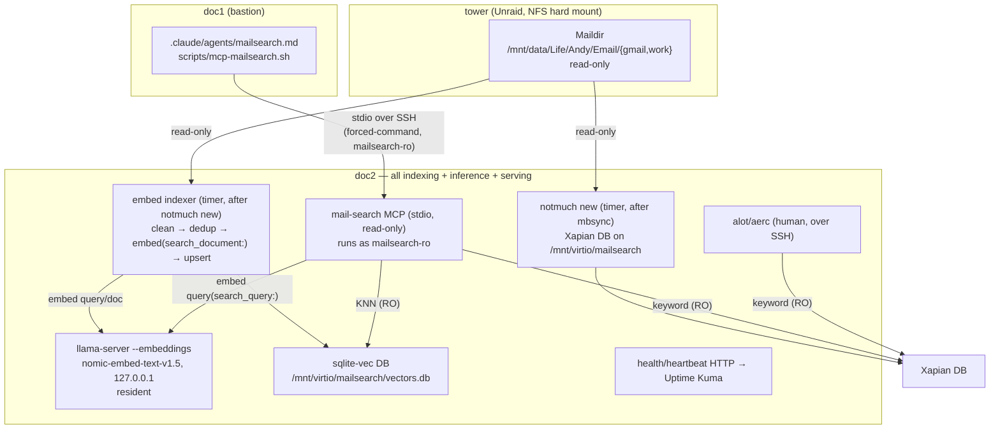

# feat: Mail-archive hybrid search (notmuch + embeddings + read-only MCP)

## Summary

Build one NixOS service on **doc2** that makes the live Maildir archive searchable two ways over a shared spine: a **notmuch** keyword index plus a **nomic-embed / sqlite-vec** semantic index. Humans search keyword via an off-the-shelf TUI over SSH; the agents the user drives on doc1 search via a **read-only, doc1-only MCP tool** (`search_mail` + gated `get_message`) that fuses keyword and semantic results. Everything — corpus, indexes, embedding model, inference — stays local to doc2; nothing leaves the fleet.

---

## Problem Frame

The mail archive (`homelab.services.mailarchive`) is live on doc2 but cold — `mutt -f` browse-only, no search (see origin: `docs/brainstorms/2026-06-23-mailarchive-search-requirements.md`). Gmail/O365 web search is unusable, and the archive holds the only durable copy (incl. 4,148 recovered deleted-history messages in `work/INBOX`). The agent fleet can't log into Gmail/O365 at all, so a local index is the only way an agent can use the mail as context. This plan delivers that index and both query surfaces in one build.

---

## Requirements

Carried from origin (`*-requirements.md`); R-IDs preserved.

**Corpus & indexing**
- R1. Index the live `gmail/` and `work/` Maildirs on doc2; exclude legacy `Mailstore/` (being deleted).
- R2. Index body, headers, and attachment **filenames**; do not extract attachment contents.
- R3. Keep the index current incrementally off the existing mbsync cycle, no manual rebuild; append-only (never delete).
- R4. Read the Maildir read-only; never write to or mutate the archive.

**Keyword surface (human)**
- R5. Keyword/tag/header/date search via an off-the-shelf terminal client on doc2 over the bastion SSH path; no custom UI code.
- R6. Searching an attachment filename surfaces the email that carried it.

**Semantic + agent surface**
- R7. A read-only MCP tool to the agents the user drives on doc1; hybrid (semantic + keyword) ranked retrieval.
- R8. Default results = metadata + short snippet (no bodies); a separate gated call returns one full body (HTML stripped, attachment filenames listed) under a content-length cap.
- R9. Read-only — no compose/send/tag/delete; filter by folder/date/sender.
- R10. Embeddings computed by a local model on doc2 CPU; no content to any third party.

**Security & exposure**
- R11. Index + vector store as sensitive as the Maildir: unprivileged owner, not world-readable, same secrecy class.
- R12. MCP tool/credential deploys to doc1 only; not to any other host, explicitly not hermes or any Telegram/always-on agent.
- R13. Tailnet-only under default-deny ACL; no LAN/WAN listener serves mail.
- R14. Search query strings never shipped to Loki or any fleet-readable log.

**Operations**
- R15. One-time bootstrap embed runs nice'd/off-peak; must not starve doc2's other services.
- R16. NixOS-native module under `modules/nixos/services/`, sops for any secrets, signed deploy, no image pinning.

---

## Key Technical Decisions

- **KTD1 — Three local roles over two local indexes, all on doc2.** (a) a `notmuch new` indexer (write-locks the Xapian DB), (b) a resident `llama-server` embeddings endpoint on `127.0.0.1`, (c) a read-only MCP/TUI query path. Co-locate compute with data (origin Key Decision: local, CPU-only on doc2).

- **KTD2 — Indexes live on `/mnt/virtio/mailsearch`, NOT on the NFS Maildir, and NOT in the offsite backup.** The Xapian DB cannot live on the `hard` NFS mount — Xapian's `flintlock` is unreliable over NFS and a hard mount makes `notmuch new` hang if tower stalls (CLAUDE.md NFS note). `/mnt/virtio` is local-to-VM on prom ZFS. Both indexes are rebuildable from the Maildir, so they are excluded from the `kopia-mum` offsite set (resolves origin open question; trade = a restore re-runs the bootstrap embed). Mode `0750`, owned by the index user, group-readable by the read-only query user (R11).

- **KTD3 — Maildir stays strictly read-only.** notmuch config sets `maildir.synchronize_flags=false` (never renames Maildir files) and the Xapian DB path is split out via `database.path`/`database.mail_root` (notmuch ≥0.32). The index user gets **read+traverse** on the Maildir via the `users` group (matching how `mailarchive` writes it) — no mode change to the archive. The MCP/TUI open notmuch in `Mode.READ_ONLY` (R4).

- **KTD4 — `llama-server --embeddings` (not ollama) serving `nomic-embed-text-v1.5` GGUF, resident on `127.0.0.1`.** ollama auto-unloads the model after 5 min, hazardous for a multi-hour bootstrap. Mandatory flags: `--pooling mean` (nomic-text is silently wrong without it), `-c 8192 --rope-scaling yarn --rope-freq-scale .75` (default context is 2048; long emails truncate otherwise), `-ngl 0`, `-t 12`. Mirrors the existing `whisper-server.nix` local-inference pattern.

- **KTD5 — `nomic` task prefixes are mandatory and asymmetric.** Index every document with `search_document: ` and every query with `search_query: ` (silent retrieval-quality loss otherwise). The same model version must serve index and query — pin it; re-embed on model change.

- **KTD6 — sqlite-vec store with an integer-rowid companion table; DELETE+INSERT upsert.** nixpkgs ships sqlite-vec 0.1.6, which has no UPSERT and a text-PK insert bug — so map `Message-ID` → integer rowid in a `messages` companion table and DELETE-then-INSERT the vector (idempotent, R3). KNN uses `AND k = ?` (not `LIMIT`), float32-cast vectors, `account` as a `PARTITION KEY`, `folder`/`date` as filterable metadata cols. The Python runtime must be `python3.override { enableLoadableSqliteExtensions = true; }` (stock NixOS python3 cannot load the extension).

- **KTD7 — Hybrid fusion via Reciprocal Rank Fusion in Python, keyed by Message-ID.** notmuch is the keyword leg (not FTS5), sqlite-vec the semantic leg; over-fetch each (~top 50), fuse with RRF (`k=60`), truncate. Scale-free, avoids comparing BM25 vs cosine (R7).

- **KTD8 — Cross-host path = stdio-over-SSH on a dedicated read-only doc2 user (forced-command key).** doc1's MCP wrapper `exec`s `ssh` to a `mailsearch-ro` account on doc2 whose forced command is the MCP binary; JSON-RPC flows over the SSH pipe. No network listener, no secret, reuses the audited bastion path (resolves origin open question; R12/R13). The MCP binary opens notmuch + sqlite read-only.

- **KTD9 — `mail-parser-reply` (not talon) for quote/signature stripping.** talon is abandoned (2017 PyPI, won't build on modern Python); `mail-parser-reply` is maintained and pure-Python (`regex` only), packaged as a small `buildPythonPackage`. HTML bodies go through `html2text` first.

- **KTD10 — No secret required; MCP needs no `homelab.mcp` block.** notmuch reads the already-fetched Maildir, llama-server is localhost, sqlite-vec is a local file. The doc1 agent wiring is just an agent file + an SSH wrapper. Query strings are logged nowhere (R14): the indexer and MCP log only counts/Message-IDs/timings to stderr→journal, never raw query text.

---

## High-Level Technical Design

All components run on **doc2** except the agent definition + SSH wrapper (doc1).



**Query path (`search_mail`):** build a notmuch query from filters → keyword-rank Message-IDs; embed the query (`search_query:`) → sqlite-vec KNN with metadata pre-filter; RRF-fuse by Message-ID; return ranked metadata + snippet (no bodies). **`get_message`:** `notmuch show --format=json --entire-thread=false --include-html id:<mid>`, prefer text/plain, list attachment filenames only, cap length.

---

## Output Structure

```
modules/nixos/services/mailsearch.nix      # the homelab.services.mailsearch module (services, users, tmpfiles, monitoring)
nix/pkgs/mail-parser-reply.nix             # buildPythonPackage (pure-python)
nix/pkgs/mailsearch-indexer.nix            # writePython3Bin: embed indexer
nix/pkgs/mailsearch-mcp.nix                # writePython3Bin: read-only MCP server
nix/pkgs/mailsearch-health.nix             # writePython3Bin: heartbeat HTTP (stdlib only)
scripts/mcp-mailsearch.sh                   # doc1 wrapper: exec ssh doc2 forced-command
.claude/agents/mailsearch.md                # doc1 subagent definition (model: sonnet)
docs/wiki/services/mailsearch.md            # runbook
# modified: hosts/doc2/configuration.nix, hosts/proxmox-vm/configuration.nix, hosts.nix
```

Per-unit `Files` lists are authoritative; the implementer may adjust layout (e.g. inline a Python program into the module instead of a `nix/pkgs/` file).

---

## Implementation Units

### Phase A — Keyword spine

### U1. Python runtime + `mail-parser-reply` packaging
- **Goal:** Provide the build inputs the indexer and MCP need: a sqlite-extension-capable Python and the `mail-parser-reply` library.
- **Requirements:** R9, R10 (enablers).
- **Dependencies:** none.
- **Files:** `nix/pkgs/mail-parser-reply.nix` (create); `modules/nixos/services/mailsearch.nix` (create — let-bindings for `pythonEnv`).
- **Approach:** Define `pythonEnv = pkgs.python3.override { packageOverrides = ...; }` with `enableLoadableSqliteExtensions = true` (stock python3 can't `enable_load_extension`). Package `mail-parser-reply` as a `buildPythonPackage` (pure-Python; sole dep `regex`). Expose a `withPackages` set including `notmuch2`, `sqlite-vec`, `mcp`, `html2text`, `mail-parser-reply`, `requests`/`httpx`. Confirm `python3Packages.{notmuch2,sqlite-vec,mcp,html2text}` resolve (verified present in nixpkgs).
- **Patterns to follow:** `nix/pkgs/oauth2-helper.nix` (standalone pkg imported into a module); `writePython3Bin { libraries = [...]; }` in `modules/nixos/services/podcast.nix:15`.
- **Test scenarios:** `Test expectation: none — packaging unit.` Verification covers it.
- **Verification:** `nix flake check` evaluates; a scratch `nix shell` of `pythonEnv` can `import sqlite_vec; sqlite_vec.load(sqlite3.connect(':memory:'))` and `import mailparser_reply, notmuch2, mcp, html2text`.

### U2. notmuch keyword index service
- **Goal:** A read-only notmuch index of `gmail/` + `work/`, Xapian DB on `/mnt/virtio`, refreshed incrementally after each mbsync.
- **Requirements:** R1, R2, R3, R4, R6.
- **Dependencies:** U1.
- **Files:** `modules/nixos/services/mailsearch.nix` (notmuch config via `writeText`, `mailsearch-index` oneshot + timer, `mailsearch-index` user, tmpfiles); `hosts/doc2/configuration.nix` (enable).
- **Approach:** Generate a notmuch config (`database.mail_root = /mnt/data/Life/Andy/Email`, `database.path = /mnt/virtio/mailsearch/xapian`, `maildir.synchronize_flags=false`, `new.ignore=.uidvalidity;.mbsyncstate`, `new.tags=` empty). `mailsearch-index` user is `isSystemUser`, `extraGroups=["users"]` (read+traverse the 0700 Maildir, like `mailarchive`). Oneshot runs `notmuch new` with `NOTMUCH_CONFIG`/`NOTMUCH_DATABASE` env; `ExecStartPost` touches `…/index.heartbeat`. Timer fires `OnUnitActiveSec` shortly after the mbsync interval (or `after`/`wants` the `mailarchive-*.service` units). Hardened sandbox: `ProtectSystem=strict`, `ReadOnlyPaths=[Maildir]`, `ReadWritePaths=[/mnt/virtio/mailsearch]`, `RequiresMountsFor` both mounts, `Nice=10`.
- **Patterns to follow:** `modules/nixos/services/mailarchive.nix` oneshot+timer+heartbeat (lines ~298–397); `mealie.nix` `RequiresMountsFor` + static user for virtiofs ownership; `cratedigger.nix` tmpfiles for `/mnt/virtio` dirs.
- **Test scenarios:**
  - Covers R1. After one run, `notmuch count` is non-zero and `notmuch search folder:gmail/INBOX` and `folder:work/INBOX` both return; `Mailstore/` paths are absent.
  - Covers R4. Maildir file count + a sampled message filename/flags are **unchanged** after `notmuch new` (synchronize_flags off).
  - Covers R6. A message with attachment `Barrel Repair Quote.pdf` is returned by `notmuch search 'attachment:"Barrel Repair Quote.pdf"'` and by `notmuch search barrel repair`.
  - Covers R3. A second `notmuch new` with no new mail reports 0 added and exits fast; heartbeat mtime advances only on success.
  - Edge: Xapian DB is on `/mnt/virtio` (not under the Maildir); `notmuch new` does not error on the hard NFS mount when tower is up.
- **Verification:** `notmuch search` returns expected hits; the Maildir is provably untouched; the index DB sits on virtiofs at `0750 mailsearch-index`.

### Phase B — Semantic index

### U3. llama-server embeddings service
- **Goal:** A resident CPU embeddings endpoint serving `nomic-embed-text-v1.5` on `127.0.0.1`.
- **Requirements:** R10, R15.
- **Dependencies:** none (parallel to U2).
- **Files:** `modules/nixos/services/mailsearch.nix` (`mailsearch-embed` service + options + model provisioning); `hosts/doc2/configuration.nix` (no firewall port — localhost only).
- **Approach:** Port `whisper-server.nix` almost verbatim: `pkgs.llama-cpp` running `llama-server -m <gguf> --embeddings --pooling mean -c 8192 --rope-scaling yarn --rope-freq-scale .75 -ngl 0 -t <threads> --host 127.0.0.1 --port <p>`. Provision the F16 (~274 MB) GGUF in `preStart` (download into `dataDir/models`, guarded by an existence check) or via a pinned fetch. Long-lived `Type=simple`, full hardening block, bind loopback only. `Nice`/`IOSchedulingClass` to protect co-tenants (R15).
- **Patterns to follow:** `modules/nixos/services/whisper-server.nix` (package, systemd, preStart model download, hardening, tmpfiles, localhost bind).
- **Test scenarios:**
  - Happy path: `curl 127.0.0.1:<p>/v1/embeddings -d '{"input":["search_query: barrel repair"],"model":"nomic"}'` returns a 768-float vector.
  - Edge: an input >2048 tokens is embedded without truncation error (yarn context confirmed).
  - Covers R10/R13: the port is bound to `127.0.0.1` only — not reachable from the LAN or tailnet.
- **Verification:** service is `active`, model resident, `/v1/embeddings` returns 768-dim vectors; `ss -tlnp` shows loopback bind only.

### U4. Embedding indexer
- **Goal:** Embed new, cleaned, deduped message bodies into sqlite-vec incrementally, idempotent by Message-ID.
- **Requirements:** R1, R2, R3, R10.
- **Dependencies:** U1, U2, U3.
- **Files:** `nix/pkgs/mailsearch-indexer.nix` (create); `modules/nixos/services/mailsearch.nix` (`mailsearch-embed-index` oneshot + timer ordered after `mailsearch-index`).
- **Approach:** Python (`writePython3Bin` with `pythonEnv`). Find candidates via `notmuch search --output=messages --format=json` for messages newer than the last watermark (or not yet in `messages`). Read each with `mailbox.Maildir(path, create=False)` + `email` `policy.default`; prefer `text/plain`, else `text/html`→`html2text`; collect attachment **filenames** only (`part.get_filename()`), set `has_attachments`. Clean with `mail-parser-reply` (quotes+signatures). Dedup: normalized `Message-ID`, fallback cleaned-body SHA-256. Embed with `search_document: ` prefix via llama-server (batch arrays). Upsert: resolve Message-ID→rowid in `messages`, DELETE-then-INSERT the `vec0` row (account PARTITION KEY; folder/date/has_attachments metadata cols; `+subject` aux). Cast vectors to float32. `ExecStartPost` touches `embed.heartbeat`. **Log only counts/Message-IDs/timings — never body or query text** (R14). Run `Nice`'d (R15).
- **Patterns to follow:** `nix/pkgs/oauth2-helper.nix` (standalone writePython3Bin); `mailarchive.nix` oneshot+heartbeat shape.
- **Execution note:** Implement the dedup + idempotent-upsert path test-first — re-running must never create duplicate vectors.
- **Test scenarios:**
  - Covers R3. Run twice with no new mail → second run embeds 0 and inserts 0 duplicate vectors (`SELECT count(*)` stable).
  - Happy path: a known email's body becomes one `vec0` row whose `messages.message_id` matches; metadata cols (account/folder/date) populated.
  - Edge — Gmail "All Mail" dup: the same Message-ID present under two folders embeds once.
  - Edge — HTML-only mail: body is extracted via html2text; quoted reply chain stripped by mail-parser-reply.
  - Edge — very long body (>~7500 tokens): chunked into `(message_id, chunk_index)` rows, not truncated.
  - Covers R2: a body referencing an attachment folds the filename into the embedded text; attachment payload bytes are never read.
  - Error: llama-server down → indexer fails the run cleanly (non-zero, no partial/corrupt rows), retries next timer; heartbeat does not advance.
- **Verification:** vector count tracks message count after a bootstrap; a second run is a no-op; sqlite file is `0640 mailsearch-index`, group-readable by `mailsearch-ro`.

### Phase C — Query surfaces

### U5. Read-only MCP server (hybrid search)
- **Goal:** A stdio MCP server exposing `search_mail` (ranked metadata, no bodies) and `get_message` (gated body), read-only.
- **Requirements:** R7, R8, R9, R11, R14.
- **Dependencies:** U2, U3, U4.
- **Files:** `nix/pkgs/mailsearch-mcp.nix` (create); `modules/nixos/services/mailsearch.nix` (install the binary into the system path for the SSH forced command; create `mailsearch-ro` user).
- **Approach:** Python `mcp.server.fastmcp.FastMCP`, `mcp.run(transport="stdio")`. `search_mail(query, top_k≤50, folder?, date_from?, date_to?, sender?)`: build a notmuch query from filters → keyword Message-IDs (`notmuch search`, opened `Mode.READ_ONLY`); embed query (`search_query: `) → sqlite-vec KNN (`?mode=ro`, `AND k=?`, pre-filtered); RRF-fuse by Message-ID; return `{results:[{message_id,date,from,subject,snippet,score}]}` — **no body**. `get_message(message_id)`: `notmuch show --format=json --entire-thread=false --include-html id:<mid>`, prefer text/plain, list attachment filenames only, cap content length. All tools `readOnlyHint=True`; **register no write tools**. **All logging → stderr; nothing to stdout; never log raw query text** (R14). Wrap list returns in a dict for structured output. `from` field → alias `sender`.
- **Patterns to follow:** `github.com/igor47/notmuchproxy` (read-only CLI-shell-out shape); official `modelcontextprotocol/python-sdk` FastMCP stdio skeleton.
- **Test scenarios:**
  - Covers R8/AE2. `search_mail` returns metadata + snippet and **no body**; a body appears only via a subsequent `get_message`.
  - Covers R7/AE3. `"invoice 4471"` returns the exact-string hit via the keyword leg; `"that argument about the corked vintage"` returns a semantically-related, differently-worded message via the embedding leg; fused order is RRF.
  - Covers R9. No `compose`/`send`/`tag`/`delete` tool is exposed; notmuch + sqlite handles are read-only (a write attempt is impossible by construction).
  - Covers R8. `top_k` is capped (≤50); `get_message` truncates an over-long body to the cap and lists attachment filenames only.
  - Error: malformed query → helpful error, no traceback on stdout; llama-server down → keyword-only results with a logged (stderr) degradation note, never the query text.
  - Filters: `folder`/`date_from..date_to`/`sender` narrow results correctly.
- **Verification:** the binary runs read-only against the live indexes; a scripted MCP `tools/list` shows exactly two read tools; stdout carries only JSON-RPC.

### U6. doc1 agent wiring (stdio over SSH, read-only doc2 user)
- **Goal:** Make `search_mail`/`get_message` available to the agents the user drives on doc1, and nowhere else.
- **Requirements:** R7, R12, R13.
- **Dependencies:** U5.
- **Files:** `scripts/mcp-mailsearch.sh` (create); `.claude/agents/mailsearch.md` (create); `hosts.nix` and/or `hosts/doc2/configuration.nix` (forced-command authorized key + `mailsearch-ro` login shell); `hosts/proxmox-vm/configuration.nix` (no secret needed).
- **Approach:** `scripts/mcp-mailsearch.sh` does `exec ssh -T mailsearch-ro@doc2` (no PTY; stdio piped). On doc2, `mailsearch-ro` is a locked-down account whose authorized key carries `command="mailsearch-mcp",no-pty,no-port-forwarding,...` (forced command = the MCP binary only). `mailsearch-ro` has read-only group access to the indexes and read+traverse on the Maildir (for `get_message`). `.claude/agents/mailsearch.md` declares the stdio MCP server `command: ./scripts/mcp-mailsearch.sh`, `model: sonnet`. **No `homelab.mcp` block** (KTD10) — no secret. hermes and every other host get nothing (R12); doc1 reaches doc2 over the existing bastion key, restricted by the forced command.
- **Patterns to follow:** `.claude/agents/unifi.md` front-matter; `scripts/mcp-slskd.sh` wrapper shape (minus the secret-sourcing); fleet forced-command keys (e.g. `fleet-deploy`) for the `command=`/`no-pty` restriction.
- **Test scenarios:**
  - Covers R7. From doc1, the `mailsearch` subagent lists and calls `search_mail`/`get_message` end-to-end over SSH.
  - Covers R12/AE4. No mailsearch MCP file/credential exists on doc2, igpu, hermes, or any non-doc1 host; hermes has no tool.
  - Security: SSHing `mailsearch-ro@doc2` runs only the MCP binary (forced command) — an interactive shell or arbitrary command is refused; no port-forwarding.
  - Covers R13: no new listening port anywhere; transport is the SSH pipe.
- **Verification:** the agent works from doc1; `ssh mailsearch-ro@doc2 id` (or any non-MCP command) is rejected by the forced command; no `/run/secrets/mcp/mailsearch*` exists.

### U7. Human keyword TUI
- **Goal:** Let the user keyword-search at a keyboard over SSH with no owned code.
- **Requirements:** R5, R6.
- **Dependencies:** U2.
- **Files:** `modules/nixos/services/mailsearch.nix` or `hosts/doc2/configuration.nix` (`environment.systemPackages = [pkgs.alot];` + a shared read-only notmuch config pointer); `docs/wiki/services/mailsearch.md` (workflow).
- **Approach:** Install `alot` (primary; `aerc` acceptable) on doc2 and point it at the same notmuch config (read-only DB). The user runs it over the bastion SSH path. No service, no daemon — a package + config. Decide alot-vs-aerc at implementation (alot is purpose-built for notmuch).
- **Patterns to follow:** repo `environment.systemPackages` conventions; the notmuch config from U2.
- **Test scenarios:**
  - Covers R5/R6. Over SSH, `alot` (or `notmuch search` directly) finds a known message by keyword and by attachment filename.
  - Read-only: TUI use does not modify the Maildir (synchronize_flags off) — tags, if any, write only to the local Xapian DB.
  - `Test expectation: none for the package install itself` — behavioral check is the search above.
- **Verification:** keyword search works interactively over SSH; Maildir untouched.

### Phase D — Operations & assembly

### U8. Monitoring, module assembly, and runbook
- **Goal:** Wire health/monitoring, enable the module on doc2, document the bootstrap and recovery.
- **Requirements:** R11, R15, R16.
- **Dependencies:** U2, U4, U5.
- **Files:** `nix/pkgs/mailsearch-health.nix` (create); `modules/nixos/services/mailsearch.nix` (health service + `homelab.monitoring.monitors`/`errorPatterns`); `hosts/doc2/configuration.nix` (enable `homelab.services.mailsearch`); `docs/wiki/services/mailsearch.md` (create).
- **Approach:** A stdlib-only `mailsearch-health` HTTP server (loopback) returns 200/503 on `index.heartbeat` + `embed.heartbeat` freshness; register an Uptime Kuma monitor; set `errorPatterns=[]` (transient model/NFS flakiness is normal, mirror whisper/mailarchive). Enable the module on doc2. Runbook documents: the one-time bootstrap embed (`nice`'d/off-peak, ~hours; benchmark on ~1k messages first), the rebuild-from-Maildir recovery (KTD2: indexes not backed up — re-run `notmuch new` + re-embed), the read-only/least-privilege model, and that indexes are sensitive (same class as mail). Wire the module assembly so all units compose under `homelab.services.mailsearch`.
- **Patterns to follow:** `mailarchive.nix` health server (lines ~30–103) + `homelab.monitoring.monitors` (lines ~408–413); `whisper-server.nix` `errorPatterns=[]`; `docs/wiki/services/mailarchive.md` runbook shape.
- **Test scenarios:**
  - Covers R15. Bootstrap embed runs `nice`'d; doc2's other services stay responsive during it (spot-check immich/paperless liveness).
  - Health: stale heartbeat → 503 → Kuma flips DOWN; fresh → 200.
  - Recovery: deleting `/mnt/virtio/mailsearch` and re-running rebuilds both indexes from the Maildir with no data loss.
  - `Test expectation: none for the wiki page.`
- **Verification:** Kuma monitor reports healthy after a sync; `nix flake check` passes; the module is enabled on doc2 and the bootstrap completes.

---

## Scope Boundaries

**Deferred for later** (origin):
- Searching inside attachment text (PDF/docx extraction).
- Ambient / standing-memory agent (continuous life model the agents draw on unprompted).
- A standalone web search UI (revisit only if "ask an agent" proves insufficient for mobile).
- GPU-accelerated embedding (the idle prom 1080).

**Outside this product's identity** (origin):
- Access for hermes or any always-on / Telegram / lower-trust agent.
- Any third-party / cloud embedding or search API.
- Re-indexing or preserving the legacy `Mailstore/` tree.
- A webmail / read-write mail client (Roundcube etc.).

**Deferred to Follow-Up Work** (plan-local):
- Switching the keyword leg to true FTS5-in-sqlite (only if mixing keyword+vector in one SQL query becomes worth it).
- Migrating sqlite-vec → pgvector via `mk-pg-container` (only if the corpus outgrows brute-force, ~100k+ vectors).
- Pinning sqlite-vec ≥0.1.9 to collapse DELETE+INSERT into `INSERT OR REPLACE` (when nixpkgs updates).

---

## Risks & Dependencies

- **Hard NFS mount.** `notmuch new` and the indexer read the Maildir over tower's `hard` NFS mount — they hang (don't fail fast) if tower/prom is down. Mitigation: indexes on local `/mnt/virtio` (never on NFS); `RequiresMountsFor`; single-writer only; transient failures are expected (errorPatterns off).
- **doc2 RAM pressure.** doc2 is RAM-tight and shared. The bootstrap embed and resident llama-server compete with immich/paperless/etc. Mitigation: `Nice`/`IOSchedulingClass`, F16 model (~274 MB), benchmark before the full run (R15).
- **Silent embedding failure modes.** Missing `--pooling mean` or the `search_document:`/`search_query:` prefixes degrade retrieval with no error (KTD4/KTD5). Mitigation: encode flags/prefixes in the module + indexer; a smoke test asserting known-pair similarity.
- **sqlite-vec 0.1.6 footguns.** No UPSERT, text-PK insert bug, stock python3 can't load the extension. Mitigations in KTD6 (companion rowid table, DELETE+INSERT, `enableLoadableSqliteExtensions`).
- **MCP-over-SSH transport.** stdio over SSH must keep stdout clean (JSON-RPC only) and the forced command tight. Mitigation: stderr-only logging; `command=…,no-pty` key restriction; read-only `mailsearch-ro` user.
- **Dependencies:** `homelab.services.mailarchive` live on doc2 (Maildir source + mbsync timer); `/mnt/virtio` (prom ZFS) for indexes; nixpkgs packages `notmuch`/`notmuch2`/`sqlite-vec`/`llama-cpp`/`python3Packages.mcp`/`html2text`/`alot` (all verified present); `mail-parser-reply` packaged locally (U1); the bastion SSH path doc1→doc2.

---

## Sources & Research

- **Origin:** `docs/brainstorms/2026-06-23-mailarchive-search-requirements.md` (settled product/scope decisions; 4 prior research agents).
- **Repo patterns:** `modules/nixos/services/whisper-server.nix` (local-inference template), `modules/nixos/services/mailarchive.nix` (oneshot+timer+heartbeat, NFS-write via `users` group, health server + Kuma), `modules/nixos/services/mealie.nix` (virtiofs static-user ownership + `RequiresMountsFor`), `modules/nixos/services/cratedigger.nix` (tmpfiles for `/mnt/virtio`), `modules/nixos/services/mcp.nix` + `scripts/mcp-slskd.sh` + `.claude/agents/unifi.md` (subagent MCP shape), `nix/pkgs/oauth2-helper.nix` + `modules/nixos/services/podcast.nix` (`writePython3Bin`).
- **External (implementation-guidance):** notmuch split DB / read-only config + JSON output (notmuchmail.org man pages; `database.path`/`mail_root` ≥0.32); `github.com/igor47/notmuchproxy` (read-only notmuch MCP reference); `modelcontextprotocol/python-sdk` FastMCP stdio; `llama-server --embeddings` README + `nomic-ai/nomic-embed-text-v1.5(-GGUF)` (pooling + prefixes + yarn context); `alexgarcia.xyz` sqlite-vec metadata/KNN/hybrid/stable posts (companion table, `k=?`, RRF, ~100k×768 <75 ms); `github.com/alfonsrv/mail-parser-reply` (talon replacement); Python `mailbox`/`email` docs (`create=False`).
- **Known nixpkgs friction:** sqlite-vec is 0.1.6 (behind 0.1.9 UPSERT fix); stock python3 needs `enableLoadableSqliteExtensions`; `mail-parser-reply` not yet packaged (pure-Python, trivial).
